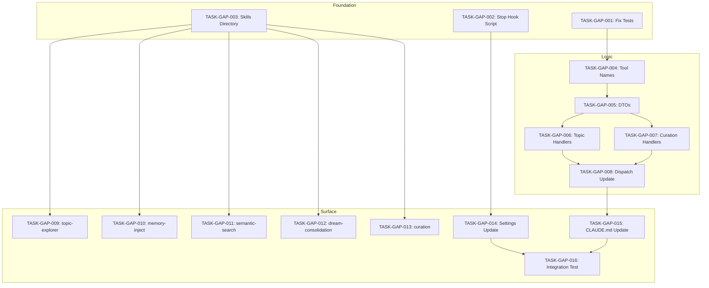

# Atomic Task Specifications: PRD v6 Gap Remediation

**Document ID**: TASK-INDEX-GAP-001
**Version**: 1.0
**Status**: ready
**Created**: 2026-01-18
**Implements**: TECH-GAP-001, SPEC-GAP-001

---

## Table of Contents

1. [Overview](#1-overview)
2. [Task Index](#2-task-index)
3. [Dependency Graph](#3-dependency-graph)
4. [Phase 1: Foundation Tasks](#4-phase-1-foundation-tasks)
5. [Phase 2: MCP Infrastructure Tasks](#5-phase-2-mcp-infrastructure-tasks)
6. [Phase 3: Skills Framework Tasks](#6-phase-3-skills-framework-tasks)
7. [Phase 4: Integration Tasks](#7-phase-4-integration-tasks)
8. [Traceability Matrix](#8-traceability-matrix)
9. [Execution Instructions](#9-execution-instructions)

---

## 1. Overview

This document defines the atomic tasks required to close the PRD v6 gaps identified in the gap analysis. Tasks are sequenced to ensure dependencies are satisfied and the assembly line completes a fully PRD-compliant implementation.

### 1.1 Summary

| Phase | Tasks | Estimated Effort |
|-------|-------|------------------|
| Phase 1: Foundation | 3 tasks | 3-4 hours |
| Phase 2: MCP Infrastructure | 5 tasks | 6-8 hours |
| Phase 3: Skills Framework | 5 tasks | 4-6 hours |
| Phase 4: Integration | 3 tasks | 2-3 hours |
| **Total** | **16 tasks** | **15-21 hours** |

### 1.2 Critical Path

```
TASK-GAP-001 (Test Fixes) --> TASK-GAP-004 (Tool Names) --> TASK-GAP-005 (DTOs)
    --> TASK-GAP-006 (Topic Handlers) --> TASK-GAP-007 (Curation Handlers)
    --> TASK-GAP-008 (Dispatch Update) --> TASK-GAP-014 (Settings Update)
```

---

## 2. Task Index

| # | Task ID | Title | Layer | Depends On | Status | Est. Time |
|---|---------|-------|-------|------------|--------|-----------|
| 1 | TASK-GAP-001 | Fix Test Suite Compilation Errors | foundation | - | Ready | 1-2h |
| 2 | TASK-GAP-002 | Create Stop Hook Shell Script | foundation | - | Ready | 30m |
| 3 | TASK-GAP-003 | Create Skills Directory Structure | foundation | - | Ready | 15m |
| 4 | TASK-GAP-004 | Add MCP Tool Name Constants | logic | 001 | Blocked | 30m |
| 5 | TASK-GAP-005 | Create Request/Response DTOs | logic | 004 | Blocked | 1-2h |
| 6 | TASK-GAP-006 | Implement Topic Tool Handlers | logic | 005 | Blocked | 2-3h |
| 7 | TASK-GAP-007 | Implement Curation Tool Handlers | logic | 005 | Blocked | 1-2h |
| 8 | TASK-GAP-008 | Update Tool Dispatch | logic | 006, 007 | Blocked | 30m |
| 9 | TASK-GAP-009 | Create topic-explorer SKILL.md | surface | 003 | Ready | 30m |
| 10 | TASK-GAP-010 | Create memory-inject SKILL.md | surface | 003 | Ready | 30m |
| 11 | TASK-GAP-011 | Create semantic-search SKILL.md | surface | 003 | Ready | 30m |
| 12 | TASK-GAP-012 | Create dream-consolidation SKILL.md | surface | 003 | Ready | 30m |
| 13 | TASK-GAP-013 | Create curation SKILL.md | surface | 003 | Ready | 30m |
| 14 | TASK-GAP-014 | Update settings.json with Stop Hook | surface | 002 | Blocked | 15m |
| 15 | TASK-GAP-015 | Update CLAUDE.md MCP Tool Documentation | surface | 008 | Blocked | 1h |
| 16 | TASK-GAP-016 | Integration Testing and Verification | surface | 014, 015 | Blocked | 2h |

---

## 3. Dependency Graph



### Parallel Opportunities

- **Batch 1** (no dependencies): TASK-GAP-001, TASK-GAP-002, TASK-GAP-003
- **Batch 2** (after 003): TASK-GAP-009, TASK-GAP-010, TASK-GAP-011, TASK-GAP-012, TASK-GAP-013
- **Batch 3** (after 005): TASK-GAP-006, TASK-GAP-007

---

## 4. Phase 1: Foundation Tasks

### TASK-GAP-001: Fix Test Suite Compilation Errors

**Task ID**: TASK-GAP-001
**Title**: Fix Test Suite Compilation Errors
**Status**: Ready
**Layer**: foundation
**Sequence**: 1
**Depends On**: None
**Estimated Complexity**: Medium
**Estimated Time**: 1-2 hours

#### Context

The MCP test suite has 11 compilation errors due to imports referencing modules deleted in commit `fab0622`. Tests reference `MetaUtlTracker`, `gwt_providers`, and `gwt_traits` which no longer exist. This blocks `cargo test` from running.

#### Input Context Files

| File | Purpose |
|------|---------|
| `/home/cabdru/contextgraph/crates/context-graph-mcp/src/handlers/tests/mod.rs` | Main test file with broken imports |
| `/home/cabdru/contextgraph/crates/context-graph-mcp/src/handlers/tests/task_emb_024_verification.rs` | Test file referencing MetaUtlTracker |
| `/home/cabdru/contextgraph/crates/context-graph-mcp/src/handlers/tests/manual_fsv_verification.rs` | Test file referencing MetaUtlTracker |
| `/home/cabdru/contextgraph/crates/context-graph-mcp/src/handlers/core/handlers.rs` | Current Handlers struct |

#### Prerequisites

- [ ] Git working tree is clean or changes are stashed

#### Scope

**In Scope**:
- Remove broken imports from test files
- Remove or stub test helper functions that use deleted modules
- Remove or stub individual test functions that depend on deleted modules
- Ensure `cargo test --no-run` succeeds

**Out of Scope**:
- Implementing replacement functionality for deleted modules
- Adding new tests

#### Implementation Steps

1. Read `mod.rs` lines 700-704 and identify all broken imports
2. Remove imports to deleted modules:
   - `crate::handlers::core::MetaUtlTracker`
   - `crate::handlers::gwt_providers::{GwtSystemProviderImpl, MetaCognitiveProviderImpl, WorkspaceProviderImpl}`
   - `crate::handlers::gwt_traits::{GwtSystemProvider, MetaCognitiveProvider, WorkspaceProvider}`
3. Remove helper functions that use deleted types:
   - `create_test_handlers_with_warm_gwt()`
   - `create_test_handlers_with_warm_gwt_rocksdb()`
   - `create_test_handlers_with_all_components()`
4. Read `task_emb_024_verification.rs` and remove:
   - Line 28: `use crate::handlers::core::MetaUtlTracker;`
   - Function `create_handlers_with_tracker()` that returns `MetaUtlTracker`
5. Read `manual_fsv_verification.rs` and remove:
   - Line 21: `use crate::handlers::core::MetaUtlTracker;`
   - All uses of `MetaUtlTracker::new()` and related tracker code
   - Update test functions to use `create_test_handlers()` instead
6. Run `cargo test --no-run -p context-graph-mcp` to verify compilation

#### Definition of Done

**Verification**:
- [ ] `cargo test --no-run -p context-graph-mcp` completes without errors
- [ ] No imports reference deleted modules
- [ ] Existing test coverage preserved where possible

**Constraints**:
- Do NOT delete tests that can be preserved by removing tracker dependencies
- Add `#[ignore]` with TODO comment for tests that cannot be easily fixed
- Follow constitution naming conventions

#### Files to Modify

| File | Changes |
|------|---------|
| `crates/context-graph-mcp/src/handlers/tests/mod.rs` | Remove broken imports (lines 700-704), remove helper functions |
| `crates/context-graph-mcp/src/handlers/tests/task_emb_024_verification.rs` | Remove MetaUtlTracker import and dependent code |
| `crates/context-graph-mcp/src/handlers/tests/manual_fsv_verification.rs` | Remove MetaUtlTracker import and dependent code |

#### Test Commands

```bash
cd /home/cabdru/contextgraph
cargo test --no-run -p context-graph-mcp
cargo clippy -p context-graph-mcp -- -D warnings
```

---

### TASK-GAP-002: Create Stop Hook Shell Script

**Task ID**: TASK-GAP-002
**Title**: Create Stop Hook Shell Script
**Status**: Ready
**Layer**: foundation
**Sequence**: 2
**Depends On**: None
**Estimated Complexity**: Low
**Estimated Time**: 30 minutes

#### Context

The PRD Section 9.1 requires a Stop hook to capture Claude's response when a response completes. This hook captures responses as `ClaudeResponse` memories with all 13 embeddings. The shell script calls `context-graph-cli` per AP-53.

#### Input Context Files

| File | Purpose |
|------|---------|
| `/home/cabdru/contextgraph/.claude/hooks/session_end.sh` | Reference for existing hook pattern |
| `/home/cabdru/contextgraph/docs/TECH_SPEC_PRD_GAPS.md` | Stop hook specification (Section 4.2) |

#### Prerequisites

- [ ] `.claude/hooks/` directory exists

#### Scope

**In Scope**:
- Create `stop.sh` script following existing hook patterns
- Handle JSON input/output
- Call `context-graph-cli hooks capture-response`
- Handle timeout and error cases

**Out of Scope**:
- Implementing CLI capture-response command (assumes exists or will be stubbed)
- Updating settings.json (handled in TASK-GAP-014)

#### Implementation Steps

1. Create `/home/cabdru/contextgraph/.claude/hooks/stop.sh`
2. Add shebang and header comments
3. Parse JSON input from stdin (response_text, session_id)
4. Validate input and handle empty responses
5. Truncate response if > 10000 characters
6. Build HookInput JSON for CLI
7. Execute CLI with 3s timeout
8. Handle exit codes (0=success, 1=cli_not_found, 2=timeout, 3=db_error, 4=invalid_input)
9. Make script executable with `chmod +x`

#### Definition of Done

**Signatures**:
```bash
# File: .claude/hooks/stop.sh
# Exit codes: 0=success, 1=cli_not_found, 2=timeout, 3=db_error, 4=invalid_input
```

**Verification**:
- [ ] Script exists at `.claude/hooks/stop.sh`
- [ ] Script is executable (`-x` permission)
- [ ] Script validates JSON input
- [ ] Script handles empty response gracefully
- [ ] Script exits with appropriate codes

**Constraints**:
- Must complete within 3000ms timeout
- Must follow existing hook script patterns
- Per AP-53: Hook logic in shell scripts calling CLI

#### Files to Create

| File | Description |
|------|-------------|
| `.claude/hooks/stop.sh` | Stop hook shell script |

#### Test Commands

```bash
# Test with valid input
echo '{"response_text":"Test response","session_id":"test-123"}' | /home/cabdru/contextgraph/.claude/hooks/stop.sh

# Test with empty response
echo '{"response_text":"","session_id":"test-123"}' | /home/cabdru/contextgraph/.claude/hooks/stop.sh

# Test with invalid JSON
echo 'not json' | /home/cabdru/contextgraph/.claude/hooks/stop.sh
echo $?  # Should be 4
```

---

### TASK-GAP-003: Create Skills Directory Structure

**Task ID**: TASK-GAP-003
**Title**: Create Skills Directory Structure
**Status**: Ready
**Layer**: foundation
**Sequence**: 3
**Depends On**: None
**Estimated Complexity**: Low
**Estimated Time**: 15 minutes

#### Context

The PRD Section 9.3 requires 5 skills in `.claude/skills/*/SKILL.md` format. This task creates the directory structure that subsequent skill tasks will populate.

#### Input Context Files

| File | Purpose |
|------|---------|
| `/home/cabdru/contextgraph/docs/TECH_SPEC_PRD_GAPS.md` | Skills file structure (Section 3.1) |

#### Prerequisites

- [ ] `.claude/` directory exists

#### Scope

**In Scope**:
- Create 5 skill directories under `.claude/skills/`

**Out of Scope**:
- Creating SKILL.md content (handled in TASK-GAP-009 through TASK-GAP-013)

#### Implementation Steps

1. Create directory `.claude/skills/topic-explorer/`
2. Create directory `.claude/skills/memory-inject/`
3. Create directory `.claude/skills/semantic-search/`
4. Create directory `.claude/skills/dream-consolidation/`
5. Create directory `.claude/skills/curation/`
6. Create placeholder `.gitkeep` in each directory

#### Definition of Done

**Verification**:
- [ ] All 5 directories exist
- [ ] Directories are tracked in git

**Constraints**:
- Directory names must be lowercase with hyphens
- Must match PRD Section 9.3 skill names exactly

#### Files to Create

| File | Description |
|------|-------------|
| `.claude/skills/topic-explorer/.gitkeep` | Placeholder |
| `.claude/skills/memory-inject/.gitkeep` | Placeholder |
| `.claude/skills/semantic-search/.gitkeep` | Placeholder |
| `.claude/skills/dream-consolidation/.gitkeep` | Placeholder |
| `.claude/skills/curation/.gitkeep` | Placeholder |

#### Test Commands

```bash
ls -la /home/cabdru/contextgraph/.claude/skills/
# Should show 5 directories
```

---

## 5. Phase 2: MCP Infrastructure Tasks

### TASK-GAP-004: Add MCP Tool Name Constants

**Task ID**: TASK-GAP-004
**Title**: Add MCP Tool Name Constants
**Status**: Blocked
**Layer**: logic
**Sequence**: 4
**Depends On**: TASK-GAP-001
**Estimated Complexity**: Low
**Estimated Time**: 30 minutes

#### Context

The `names.rs` file has TODO comments for 6 PRD-required tools that need to be exposed. The constants are commented out and must be uncommented and integrated.

#### Input Context Files

| File | Purpose |
|------|---------|
| `/home/cabdru/contextgraph/crates/context-graph-mcp/src/tools/names.rs` | Tool name constants |
| `/home/cabdru/contextgraph/docs/TECH_SPEC_PRD_GAPS.md` | Tool names specification (Section 5.1) |

#### Prerequisites

- [ ] TASK-GAP-001 complete (tests compile)

#### Scope

**In Scope**:
- Uncomment and add 6 tool name constants

**Out of Scope**:
- Implementing handlers (TASK-GAP-006, TASK-GAP-007)
- Updating dispatch (TASK-GAP-008)

#### Implementation Steps

1. Open `/home/cabdru/contextgraph/crates/context-graph-mcp/src/tools/names.rs`
2. Uncomment lines 22-27 and reorganize:
   ```rust
   // ========== TOPIC TOOLS (PRD Section 10.2) ==========
   pub const GET_TOPIC_PORTFOLIO: &str = "get_topic_portfolio";
   pub const GET_TOPIC_STABILITY: &str = "get_topic_stability";
   pub const DETECT_TOPICS: &str = "detect_topics";
   pub const GET_DIVERGENCE_ALERTS: &str = "get_divergence_alerts";

   // ========== CURATION TOOLS (PRD Section 10.3) ==========
   pub const FORGET_CONCEPT: &str = "forget_concept";
   pub const BOOST_IMPORTANCE: &str = "boost_importance";
   ```
3. Remove the TODO comment block
4. Run `cargo check -p context-graph-mcp`

#### Definition of Done

**Signatures**:
```rust
// File: crates/context-graph-mcp/src/tools/names.rs
pub const GET_TOPIC_PORTFOLIO: &str = "get_topic_portfolio";
pub const GET_TOPIC_STABILITY: &str = "get_topic_stability";
pub const DETECT_TOPICS: &str = "detect_topics";
pub const GET_DIVERGENCE_ALERTS: &str = "get_divergence_alerts";
pub const FORGET_CONCEPT: &str = "forget_concept";
pub const BOOST_IMPORTANCE: &str = "boost_importance";
```

**Verification**:
- [ ] All 6 constants are defined
- [ ] `cargo check -p context-graph-mcp` passes
- [ ] No TODO comments remain for these tools

**Constraints**:
- Constant names must be SCREAMING_SNAKE_CASE
- String values must be snake_case

#### Files to Modify

| File | Changes |
|------|---------|
| `crates/context-graph-mcp/src/tools/names.rs` | Uncomment and add 6 tool constants |

#### Test Commands

```bash
cargo check -p context-graph-mcp
```

---

### TASK-GAP-005: Create Request/Response DTOs

**Task ID**: TASK-GAP-005
**Title**: Create Request/Response DTOs
**Status**: Blocked
**Layer**: logic
**Sequence**: 5
**Depends On**: TASK-GAP-004
**Estimated Complexity**: Medium
**Estimated Time**: 1-2 hours

#### Context

The new MCP tools require request and response DTOs for type-safe serialization. These DTOs are defined in the technical specification Section 8.

#### Input Context Files

| File | Purpose |
|------|---------|
| `/home/cabdru/contextgraph/docs/TECH_SPEC_PRD_GAPS.md` | DTO definitions (Section 8) |
| `/home/cabdru/contextgraph/crates/context-graph-mcp/src/handlers/tools/memory_tools.rs` | Reference for existing DTO patterns |

#### Prerequisites

- [ ] TASK-GAP-004 complete (tool names defined)

#### Scope

**In Scope**:
- Create 6 request DTOs
- Create 6 response DTOs
- Add appropriate serde derive macros

**Out of Scope**:
- Handler implementation (TASK-GAP-006, TASK-GAP-007)

#### Implementation Steps

1. Create new file `/home/cabdru/contextgraph/crates/context-graph-mcp/src/handlers/tools/topic_dtos.rs`
2. Add request DTOs:
   - `GetTopicPortfolioRequest` (format: String)
   - `GetTopicStabilityRequest` (hours: u32)
   - `DetectTopicsRequest` (force: bool)
   - `GetDivergenceAlertsRequest` (lookback_hours: u32)
3. Add response DTOs:
   - `TopicPortfolioResponse` (topics, stability, total_topics, tier)
   - `TopicStabilityResponse` (churn_rate, entropy, phases, dream_recommended)
   - `DetectTopicsResponse` (new_topics, merged_topics, total_after)
   - `DivergenceAlertsResponse` (alerts, severity)
4. Create new file `/home/cabdru/contextgraph/crates/context-graph-mcp/src/handlers/tools/curation_dtos.rs`
5. Add request DTOs:
   - `ForgetConceptRequest` (node_id: String, soft_delete: bool)
   - `BoostImportanceRequest` (node_id: String, delta: f32)
6. Add response DTOs:
   - `ForgetConceptResponse` (forgotten_id, soft_deleted, recoverable_until)
   - `BoostImportanceResponse` (node_id, old_importance, new_importance, clamped)
7. Update `mod.rs` to export new modules
8. Run `cargo check -p context-graph-mcp`

#### Definition of Done

**Signatures**:
```rust
// File: crates/context-graph-mcp/src/handlers/tools/topic_dtos.rs
#[derive(Debug, Deserialize)]
pub struct GetTopicPortfolioRequest { pub format: String }

#[derive(Debug, Serialize)]
pub struct TopicPortfolioResponse {
    pub topics: Vec<TopicSummary>,
    pub stability: StabilityMetricsSummary,
    pub total_topics: usize,
    pub tier: u8,
}

// File: crates/context-graph-mcp/src/handlers/tools/curation_dtos.rs
#[derive(Debug, Deserialize)]
pub struct ForgetConceptRequest { pub node_id: String, pub soft_delete: bool }

#[derive(Debug, Serialize)]
pub struct ForgetConceptResponse {
    pub forgotten_id: Uuid,
    pub soft_deleted: bool,
    pub recoverable_until: Option<DateTime<Utc>>,
}
```

**Verification**:
- [ ] All 12 DTOs defined
- [ ] Appropriate serde derives applied
- [ ] `cargo check -p context-graph-mcp` passes

**Constraints**:
- Use `#[serde(default)]` for optional fields
- Use proper default functions for defaults
- Follow existing DTO patterns in codebase

#### Files to Create

| File | Description |
|------|-------------|
| `crates/context-graph-mcp/src/handlers/tools/topic_dtos.rs` | Topic tool DTOs |
| `crates/context-graph-mcp/src/handlers/tools/curation_dtos.rs` | Curation tool DTOs |

#### Files to Modify

| File | Changes |
|------|---------|
| `crates/context-graph-mcp/src/handlers/tools/mod.rs` | Export new DTO modules |

#### Test Commands

```bash
cargo check -p context-graph-mcp
cargo doc -p context-graph-mcp --no-deps
```

---

### TASK-GAP-006: Implement Topic Tool Handlers

**Task ID**: TASK-GAP-006
**Title**: Implement Topic Tool Handlers
**Status**: Blocked
**Layer**: logic
**Sequence**: 6
**Depends On**: TASK-GAP-005
**Estimated Complexity**: High
**Estimated Time**: 2-3 hours

#### Context

Four topic-related MCP tools need handlers: get_topic_portfolio, get_topic_stability, detect_topics, get_divergence_alerts. These handlers leverage existing `context-graph-core::clustering` module.

#### Input Context Files

| File | Purpose |
|------|---------|
| `/home/cabdru/contextgraph/docs/TECH_SPEC_PRD_GAPS.md` | Handler contracts (Section 10.1) |
| `/home/cabdru/contextgraph/crates/context-graph-core/src/clustering/` | Existing clustering implementation |
| `/home/cabdru/contextgraph/crates/context-graph-mcp/src/handlers/tools/memory_tools.rs` | Handler pattern reference |

#### Prerequisites

- [ ] TASK-GAP-005 complete (DTOs defined)

#### Scope

**In Scope**:
- Implement 4 topic tool handler methods on Handlers
- Parse request DTOs
- Call clustering module
- Return MCP-formatted responses

**Out of Scope**:
- Dispatch registration (TASK-GAP-008)
- Clustering algorithm changes

#### Implementation Steps

1. Create `/home/cabdru/contextgraph/crates/context-graph-mcp/src/handlers/tools/topic_tools.rs`
2. Implement `call_get_topic_portfolio`:
   - Parse `GetTopicPortfolioRequest`
   - Get topics from store or return empty for Tier 0
   - Format based on verbosity (brief/standard/verbose)
   - Return `TopicPortfolioResponse`
3. Implement `call_get_topic_stability`:
   - Parse `GetTopicStabilityRequest`
   - Calculate stability metrics
   - Check dream trigger conditions (AP-70: entropy > 0.7 AND churn > 0.5)
   - Return `TopicStabilityResponse`
4. Implement `call_detect_topics`:
   - Parse `DetectTopicsRequest`
   - Check min memory count (3 per constitution)
   - Run clustering if enough memories
   - Return `DetectTopicsResponse`
5. Implement `call_get_divergence_alerts`:
   - Parse `GetDivergenceAlertsRequest`
   - Get recent memories
   - Compare using SEMANTIC embedders ONLY (E1, E5, E6, E7, E10, E12, E13) per AP-62
   - Return `DivergenceAlertsResponse`
6. Update handlers mod.rs to include topic_tools

#### Definition of Done

**Signatures**:
```rust
// File: crates/context-graph-mcp/src/handlers/tools/topic_tools.rs
impl Handlers {
    pub(crate) async fn call_get_topic_portfolio(
        &self, id: Option<JsonRpcId>, arguments: serde_json::Value
    ) -> JsonRpcResponse;

    pub(crate) async fn call_get_topic_stability(
        &self, id: Option<JsonRpcId>, arguments: serde_json::Value
    ) -> JsonRpcResponse;

    pub(crate) async fn call_detect_topics(
        &self, id: Option<JsonRpcId>, arguments: serde_json::Value
    ) -> JsonRpcResponse;

    pub(crate) async fn call_get_divergence_alerts(
        &self, id: Option<JsonRpcId>, arguments: serde_json::Value
    ) -> JsonRpcResponse;
}
```

**Verification**:
- [ ] All 4 handlers compile
- [ ] Divergence only uses SEMANTIC embedders (AP-62)
- [ ] Dream trigger check uses correct thresholds (AP-70)
- [ ] Returns proper error codes for edge cases

**Constraints**:
- Per AP-60: Temporal embedders (E2-E4) weight = 0.0 in topic detection
- Per AP-62: Only SEMANTIC embedders for divergence alerts
- Per ARCH-09: Topic threshold is weighted_agreement >= 2.5

#### Files to Create

| File | Description |
|------|-------------|
| `crates/context-graph-mcp/src/handlers/tools/topic_tools.rs` | Topic tool handlers |

#### Files to Modify

| File | Changes |
|------|---------|
| `crates/context-graph-mcp/src/handlers/tools/mod.rs` | Export topic_tools module |

#### Test Commands

```bash
cargo check -p context-graph-mcp
cargo test -p context-graph-mcp topic --no-run
```

---

### TASK-GAP-007: Implement Curation Tool Handlers

**Task ID**: TASK-GAP-007
**Title**: Implement Curation Tool Handlers
**Status**: Blocked
**Layer**: logic
**Sequence**: 7
**Depends On**: TASK-GAP-005
**Estimated Complexity**: Medium
**Estimated Time**: 1-2 hours

#### Context

Two curation tools need handlers: forget_concept and boost_importance. These handlers implement soft delete (SEC-06) and importance adjustment.

#### Input Context Files

| File | Purpose |
|------|---------|
| `/home/cabdru/contextgraph/docs/TECH_SPEC_PRD_GAPS.md` | Handler contracts (Section 10.2) |
| `/home/cabdru/contextgraph/crates/context-graph-core/src/curation/` | Existing curation module |

#### Prerequisites

- [ ] TASK-GAP-005 complete (DTOs defined)

#### Scope

**In Scope**:
- Implement 2 curation tool handler methods
- UUID validation
- Soft delete with 30-day recovery
- Importance clamping to [0.0, 1.0]

**Out of Scope**:
- Dispatch registration (TASK-GAP-008)
- Hard delete implementation

#### Implementation Steps

1. Create `/home/cabdru/contextgraph/crates/context-graph-mcp/src/handlers/tools/curation_tools.rs`
2. Implement `call_forget_concept`:
   - Parse `ForgetConceptRequest`
   - Validate UUID format
   - Check memory exists
   - Soft delete (default) with 30-day recovery per SEC-06
   - Return `ForgetConceptResponse` with recoverable_until
3. Implement `call_boost_importance`:
   - Parse `BoostImportanceRequest`
   - Validate UUID and delta range
   - Retrieve memory
   - Apply delta, clamp to [0.0, 1.0]
   - Update memory
   - Return `BoostImportanceResponse`
4. Update handlers mod.rs to include curation_tools

#### Definition of Done

**Signatures**:
```rust
// File: crates/context-graph-mcp/src/handlers/tools/curation_tools.rs
impl Handlers {
    pub(crate) async fn call_forget_concept(
        &self, id: Option<JsonRpcId>, arguments: serde_json::Value
    ) -> JsonRpcResponse;

    pub(crate) async fn call_boost_importance(
        &self, id: Option<JsonRpcId>, arguments: serde_json::Value
    ) -> JsonRpcResponse;
}
```

**Verification**:
- [ ] Both handlers compile
- [ ] Soft delete defaults to true per SEC-06
- [ ] Importance clamped to [0.0, 1.0]
- [ ] Returns proper error codes for invalid UUID

**Constraints**:
- Per SEC-06: 30-day recovery for soft delete
- Per BR-MCP-002: Importance bounds [0.0, 1.0]

#### Files to Create

| File | Description |
|------|-------------|
| `crates/context-graph-mcp/src/handlers/tools/curation_tools.rs` | Curation tool handlers |

#### Files to Modify

| File | Changes |
|------|---------|
| `crates/context-graph-mcp/src/handlers/tools/mod.rs` | Export curation_tools module |

#### Test Commands

```bash
cargo check -p context-graph-mcp
cargo test -p context-graph-mcp curation --no-run
```

---

### TASK-GAP-008: Update Tool Dispatch

**Task ID**: TASK-GAP-008
**Title**: Update Tool Dispatch
**Status**: Blocked
**Layer**: logic
**Sequence**: 8
**Depends On**: TASK-GAP-006, TASK-GAP-007
**Estimated Complexity**: Low
**Estimated Time**: 30 minutes

#### Context

The dispatch.rs file routes tool calls to handlers. The new 6 tools must be added to the match statement.

#### Input Context Files

| File | Purpose |
|------|---------|
| `/home/cabdru/contextgraph/crates/context-graph-mcp/src/handlers/tools/dispatch.rs` | Current dispatch logic |
| `/home/cabdru/contextgraph/docs/TECH_SPEC_PRD_GAPS.md` | Dispatch updates (Section 5.3) |

#### Prerequisites

- [ ] TASK-GAP-006 complete (topic handlers)
- [ ] TASK-GAP-007 complete (curation handlers)

#### Scope

**In Scope**:
- Add match arms for 6 new tools
- Update tool definitions

**Out of Scope**:
- Handler implementation (already done)

#### Implementation Steps

1. Open `/home/cabdru/contextgraph/crates/context-graph-mcp/src/handlers/tools/dispatch.rs`
2. Add match arms after line 77 (merge_concepts):
   ```rust
   // ========== TOPIC TOOLS (PRD Section 10.2) ==========
   tool_names::GET_TOPIC_PORTFOLIO => self.call_get_topic_portfolio(id, arguments).await,
   tool_names::GET_TOPIC_STABILITY => self.call_get_topic_stability(id, arguments).await,
   tool_names::DETECT_TOPICS => self.call_detect_topics(id, arguments).await,
   tool_names::GET_DIVERGENCE_ALERTS => self.call_get_divergence_alerts(id, arguments).await,

   // ========== CURATION TOOLS (PRD Section 10.3) ==========
   tool_names::FORGET_CONCEPT => self.call_forget_concept(id, arguments).await,
   tool_names::BOOST_IMPORTANCE => self.call_boost_importance(id, arguments).await,
   ```
3. Update tool definitions in `/home/cabdru/contextgraph/crates/context-graph-mcp/src/tools/definitions.rs` to include new tools
4. Run `cargo check -p context-graph-mcp`

#### Definition of Done

**Verification**:
- [ ] All 6 new tools appear in tools/list response
- [ ] All 6 tools dispatch to correct handlers
- [ ] `cargo check -p context-graph-mcp` passes

**Constraints**:
- Match arms must use tool_names constants
- Order: Core, Consolidation, Topic, Curation

#### Files to Modify

| File | Changes |
|------|---------|
| `crates/context-graph-mcp/src/handlers/tools/dispatch.rs` | Add 6 match arms |
| `crates/context-graph-mcp/src/tools/definitions.rs` | Add 6 tool definitions |

#### Test Commands

```bash
cargo check -p context-graph-mcp
cargo test -p context-graph-mcp tools_list --no-run
```

---

## 6. Phase 3: Skills Framework Tasks

### TASK-GAP-009: Create topic-explorer SKILL.md

**Task ID**: TASK-GAP-009
**Title**: Create topic-explorer SKILL.md
**Status**: Ready
**Layer**: surface
**Sequence**: 9
**Depends On**: TASK-GAP-003
**Estimated Complexity**: Low
**Estimated Time**: 30 minutes

#### Context

The topic-explorer skill enables users to explore the emergent topic portfolio via `/topic-explorer` command.

#### Input Context Files

| File | Purpose |
|------|---------|
| `/home/cabdru/contextgraph/docs/TECH_SPEC_PRD_GAPS.md` | SKILL.md template (Section 3.3.1) |

#### Prerequisites

- [ ] TASK-GAP-003 complete (directories created)

#### Scope

**In Scope**:
- Create SKILL.md with frontmatter
- Document MCP tools to use
- Document output format
- Document edge cases

**Out of Scope**:
- MCP tool implementation (separate tasks)

#### Implementation Steps

1. Create `/home/cabdru/contextgraph/.claude/skills/topic-explorer/SKILL.md`
2. Add frontmatter:
   ```yaml
   ---
   model: sonnet
   user_invocable: true
   ---
   ```
3. Add skill content per tech spec Section 3.3.1
4. Document MCP tools: get_topic_portfolio, get_topic_stability
5. Document output formats (brief, standard)
6. Document edge cases (no topics, Tier 0, high churn)

#### Definition of Done

**Verification**:
- [ ] File exists at correct path
- [ ] Frontmatter is valid YAML
- [ ] Keywords documented: topics, portfolio, stability, churn, weighted agreement
- [ ] MCP tools documented

**Constraints**:
- Model must be "sonnet" per PRD Section 9.3
- user_invocable must be true

#### Files to Create

| File | Description |
|------|-------------|
| `.claude/skills/topic-explorer/SKILL.md` | Topic explorer skill definition |

#### Test Commands

```bash
# Verify file exists
test -f /home/cabdru/contextgraph/.claude/skills/topic-explorer/SKILL.md && echo "OK"

# Verify frontmatter
head -5 /home/cabdru/contextgraph/.claude/skills/topic-explorer/SKILL.md
```

---

### TASK-GAP-010: Create memory-inject SKILL.md

**Task ID**: TASK-GAP-010
**Title**: Create memory-inject SKILL.md
**Status**: Ready
**Layer**: surface
**Sequence**: 10
**Depends On**: TASK-GAP-003
**Estimated Complexity**: Low
**Estimated Time**: 30 minutes

#### Context

The memory-inject skill retrieves and injects contextual memories via `/memory-inject` command.

#### Input Context Files

| File | Purpose |
|------|---------|
| `/home/cabdru/contextgraph/docs/TECH_SPEC_PRD_GAPS.md` | SKILL.md template (Section 3.3.2) |

#### Prerequisites

- [ ] TASK-GAP-003 complete (directories created)

#### Implementation Steps

1. Create `/home/cabdru/contextgraph/.claude/skills/memory-inject/SKILL.md`
2. Add frontmatter with model: haiku
3. Add skill content per tech spec Section 3.3.2
4. Document MCP tools: inject_context
5. Document verbosity levels (compact, standard, verbose)
6. Document edge cases

#### Definition of Done

**Verification**:
- [ ] File exists at correct path
- [ ] Model is "haiku" per PRD
- [ ] Keywords documented: memory, context, inject, retrieve, recall, background

#### Files to Create

| File | Description |
|------|-------------|
| `.claude/skills/memory-inject/SKILL.md` | Memory inject skill definition |

---

### TASK-GAP-011: Create semantic-search SKILL.md

**Task ID**: TASK-GAP-011
**Title**: Create semantic-search SKILL.md
**Status**: Ready
**Layer**: surface
**Sequence**: 11
**Depends On**: TASK-GAP-003
**Estimated Complexity**: Low
**Estimated Time**: 30 minutes

#### Context

The semantic-search skill searches the knowledge graph via `/semantic-search` command.

#### Input Context Files

| File | Purpose |
|------|---------|
| `/home/cabdru/contextgraph/docs/TECH_SPEC_PRD_GAPS.md` | SKILL.md template (Section 3.3.3) |

#### Prerequisites

- [ ] TASK-GAP-003 complete (directories created)

#### Implementation Steps

1. Create `/home/cabdru/contextgraph/.claude/skills/semantic-search/SKILL.md`
2. Add frontmatter with model: haiku
3. Add skill content per tech spec Section 3.3.3
4. Document MCP tools: search_graph
5. Document search modes (semantic, causal, code, entity)
6. Document edge cases

#### Definition of Done

**Verification**:
- [ ] File exists at correct path
- [ ] Model is "haiku" per PRD
- [ ] Keywords documented: search, find, query, lookup, semantic, causal

#### Files to Create

| File | Description |
|------|-------------|
| `.claude/skills/semantic-search/SKILL.md` | Semantic search skill definition |

---

### TASK-GAP-012: Create dream-consolidation SKILL.md

**Task ID**: TASK-GAP-012
**Title**: Create dream-consolidation SKILL.md
**Status**: Ready
**Layer**: surface
**Sequence**: 12
**Depends On**: TASK-GAP-003
**Estimated Complexity**: Low
**Estimated Time**: 30 minutes

#### Context

The dream-consolidation skill triggers memory consolidation via `/dream-consolidation` command.

#### Input Context Files

| File | Purpose |
|------|---------|
| `/home/cabdru/contextgraph/docs/TECH_SPEC_PRD_GAPS.md` | SKILL.md template (Section 3.3.4) |

#### Prerequisites

- [ ] TASK-GAP-003 complete (directories created)

#### Implementation Steps

1. Create `/home/cabdru/contextgraph/.claude/skills/dream-consolidation/SKILL.md`
2. Add frontmatter with model: sonnet
3. Add skill content per tech spec Section 3.3.4
4. Document MCP tools: get_memetic_status, trigger_consolidation
5. Document dream phases (NREM, REM)
6. Document trigger conditions (entropy > 0.7 AND churn > 0.5)

#### Definition of Done

**Verification**:
- [ ] File exists at correct path
- [ ] Model is "sonnet" per PRD
- [ ] Keywords documented: dream, consolidate, nrem, rem, blind spots, entropy, churn

#### Files to Create

| File | Description |
|------|-------------|
| `.claude/skills/dream-consolidation/SKILL.md` | Dream consolidation skill definition |

---

### TASK-GAP-013: Create curation SKILL.md

**Task ID**: TASK-GAP-013
**Title**: Create curation SKILL.md
**Status**: Ready
**Layer**: surface
**Sequence**: 13
**Depends On**: TASK-GAP-003
**Estimated Complexity**: Low
**Estimated Time**: 30 minutes

#### Context

The curation skill manages knowledge graph curation via `/curation` command.

#### Input Context Files

| File | Purpose |
|------|---------|
| `/home/cabdru/contextgraph/docs/TECH_SPEC_PRD_GAPS.md` | SKILL.md template (Section 3.3.5) |

#### Prerequisites

- [ ] TASK-GAP-003 complete (directories created)

#### Implementation Steps

1. Create `/home/cabdru/contextgraph/.claude/skills/curation/SKILL.md`
2. Add frontmatter with model: sonnet
3. Add skill content per tech spec Section 3.3.5
4. Document MCP tools: get_memetic_status, merge_concepts, forget_concept, boost_importance
5. Document 30-day soft delete recovery (SEC-06)
6. Document edge cases

#### Definition of Done

**Verification**:
- [ ] File exists at correct path
- [ ] Model is "sonnet" per PRD
- [ ] Keywords documented: curate, merge, forget, annotate, prune, duplicate

#### Files to Create

| File | Description |
|------|-------------|
| `.claude/skills/curation/SKILL.md` | Curation skill definition |

---

## 7. Phase 4: Integration Tasks

### TASK-GAP-014: Update settings.json with Stop Hook

**Task ID**: TASK-GAP-014
**Title**: Update settings.json with Stop Hook
**Status**: Blocked
**Layer**: surface
**Sequence**: 14
**Depends On**: TASK-GAP-002
**Estimated Complexity**: Low
**Estimated Time**: 15 minutes

#### Context

The settings.json file configures Claude Code hooks. The Stop hook must be added to capture Claude responses.

#### Input Context Files

| File | Purpose |
|------|---------|
| `/home/cabdru/contextgraph/.claude/settings.json` | Current hook configuration |
| `/home/cabdru/contextgraph/docs/TECH_SPEC_PRD_GAPS.md` | Stop hook config (Section 4.1) |

#### Prerequisites

- [ ] TASK-GAP-002 complete (stop.sh created)

#### Implementation Steps

1. Open `/home/cabdru/contextgraph/.claude/settings.json`
2. Add Stop hook configuration after UserPromptSubmit (line 59):
   ```json
   "Stop": [
     {
       "hooks": [
         {
           "type": "command",
           "command": ".claude/hooks/stop.sh",
           "timeout": 3000
         }
       ]
     }
   ]
   ```
3. Validate JSON syntax
4. Test hook appears in Claude Code

#### Definition of Done

**Verification**:
- [ ] settings.json is valid JSON
- [ ] Stop hook configured with correct path
- [ ] Timeout is 3000ms per PRD

#### Files to Modify

| File | Changes |
|------|---------|
| `.claude/settings.json` | Add Stop hook configuration |

#### Test Commands

```bash
# Validate JSON
python3 -m json.tool /home/cabdru/contextgraph/.claude/settings.json

# Check Stop hook exists
grep -A5 '"Stop"' /home/cabdru/contextgraph/.claude/settings.json
```

---

### TASK-GAP-015: Update CLAUDE.md MCP Tool Documentation

**Task ID**: TASK-GAP-015
**Title**: Update CLAUDE.md MCP Tool Documentation
**Status**: Blocked
**Layer**: surface
**Sequence**: 15
**Depends On**: TASK-GAP-008
**Estimated Complexity**: Medium
**Estimated Time**: 1 hour

#### Context

CLAUDE.md lists 30+ tools but only 12 are exposed (6 existing + 6 new). Documentation must be synchronized with reality.

#### Input Context Files

| File | Purpose |
|------|---------|
| `/home/cabdru/contextgraph/CLAUDE.md` | Current documentation |
| `/home/cabdru/contextgraph/docs/TECH_SPEC_PRD_GAPS.md` | Updated tool list (Section 7.1) |

#### Prerequisites

- [ ] TASK-GAP-008 complete (all tools implemented)

#### Implementation Steps

1. Open `/home/cabdru/contextgraph/CLAUDE.md`
2. Locate `mcp:` section (around line 479)
3. Replace `core_tools:` with `exposed_tools:` containing only the 12 actual tools
4. For each tool, document:
   - purpose (one-line description)
   - parameters (type and description)
   - example invocation
5. Add `total_tools: 12`
6. Remove any references to non-exposed tools

#### Definition of Done

**Verification**:
- [ ] Only 12 tools listed (6 existing + 6 new)
- [ ] Each tool has purpose, parameters, and example
- [ ] No references to non-existent tools

**Constraints**:
- Keep YAML format consistent
- Do not add emojis

#### Files to Modify

| File | Changes |
|------|---------|
| `CLAUDE.md` | Replace mcp tools section with accurate list |

#### Test Commands

```bash
# Count tools listed
grep -c "purpose:" /home/cabdru/contextgraph/CLAUDE.md
# Should be 12
```

---

### TASK-GAP-016: Integration Testing and Verification

**Task ID**: TASK-GAP-016
**Title**: Integration Testing and Verification
**Status**: Blocked
**Layer**: surface
**Sequence**: 16
**Depends On**: TASK-GAP-014, TASK-GAP-015
**Estimated Complexity**: Medium
**Estimated Time**: 2 hours

#### Context

Final verification that all PRD gaps are closed. Run test suite, verify hooks, verify skills, verify MCP tools.

#### Input Context Files

| File | Purpose |
|------|---------|
| `/home/cabdru/contextgraph/docs/PRD_GAP_ANALYSIS.md` | Verification checklist |

#### Prerequisites

- [ ] All previous tasks complete

#### Implementation Steps

1. Run full test suite:
   ```bash
   cargo test --workspace
   ```
2. Verify hooks:
   ```bash
   grep -c "hooks" .claude/settings.json  # Should show 6 hooks
   ls -la .claude/hooks/*.sh  # Should show 6 scripts
   ```
3. Verify skills:
   ```bash
   ls .claude/skills/*/SKILL.md  # Should show 5 skills
   ```
4. Verify MCP tools:
   - Start MCP server
   - Call `tools/list`
   - Verify 12 tools returned
5. Run clippy:
   ```bash
   cargo clippy --workspace -- -D warnings
   ```
6. Update gap analysis document with completion status

#### Definition of Done

**Verification**:
- [ ] `cargo test --workspace` passes
- [ ] `cargo clippy --workspace -- -D warnings` passes
- [ ] 6 hooks configured in settings.json
- [ ] 5 skills exist in .claude/skills/
- [ ] 12 tools returned from tools/list
- [ ] CLAUDE.md accurately reflects implementation

#### Test Commands

```bash
cargo test --workspace
cargo clippy --workspace -- -D warnings
cargo build --release
```

---

## 8. Traceability Matrix

### Requirements to Tasks

| Requirement ID | Description | Task ID | Verified |
|----------------|-------------|---------|----------|
| REQ-SKILL-001 | Skill file structure | TASK-GAP-009 through TASK-GAP-013 | [ ] |
| REQ-SKILL-002 | Skill metadata format | TASK-GAP-009 through TASK-GAP-013 | [ ] |
| REQ-SKILL-003 | MCP tool integration | TASK-GAP-009 through TASK-GAP-013 | [ ] |
| REQ-SKILL-004 | Keyword documentation | TASK-GAP-009 through TASK-GAP-013 | [ ] |
| REQ-STOP-001 | Settings.json configuration | TASK-GAP-014 | [ ] |
| REQ-STOP-002 | Shell script implementation | TASK-GAP-002 | [ ] |
| REQ-STOP-003 | Memory source type | TASK-GAP-002 | [ ] |
| REQ-STOP-004 | All 13 embeddings | TASK-GAP-002 | [ ] |
| REQ-MCP-001 | Tool name constants | TASK-GAP-004 | [ ] |
| REQ-MCP-002 | Handler implementation | TASK-GAP-006, TASK-GAP-007 | [ ] |
| REQ-MCP-003 | Tool schema definition | TASK-GAP-005 | [ ] |
| REQ-MCP-004 | Weighted agreement compliance | TASK-GAP-006 | [ ] |
| REQ-MCP-005 | Divergence semantic only | TASK-GAP-006 | [ ] |
| REQ-TEST-001 | Remove broken imports | TASK-GAP-001 | [ ] |
| REQ-DOC-001 | MCP tool section update | TASK-GAP-015 | [ ] |

### Skills Coverage

| Skill | SKILL.md Task | MCP Tools Used |
|-------|---------------|----------------|
| topic-explorer | TASK-GAP-009 | get_topic_portfolio, get_topic_stability |
| memory-inject | TASK-GAP-010 | inject_context |
| semantic-search | TASK-GAP-011 | search_graph |
| dream-consolidation | TASK-GAP-012 | get_memetic_status, trigger_consolidation |
| curation | TASK-GAP-013 | merge_concepts, forget_concept, boost_importance |

### MCP Tools Coverage

| Tool | Name Constant | DTOs | Handler | Dispatch |
|------|---------------|------|---------|----------|
| get_topic_portfolio | TASK-GAP-004 | TASK-GAP-005 | TASK-GAP-006 | TASK-GAP-008 |
| get_topic_stability | TASK-GAP-004 | TASK-GAP-005 | TASK-GAP-006 | TASK-GAP-008 |
| detect_topics | TASK-GAP-004 | TASK-GAP-005 | TASK-GAP-006 | TASK-GAP-008 |
| get_divergence_alerts | TASK-GAP-004 | TASK-GAP-005 | TASK-GAP-006 | TASK-GAP-008 |
| forget_concept | TASK-GAP-004 | TASK-GAP-005 | TASK-GAP-007 | TASK-GAP-008 |
| boost_importance | TASK-GAP-004 | TASK-GAP-005 | TASK-GAP-007 | TASK-GAP-008 |

---

## 9. Execution Instructions

### Recommended Execution Order

1. **Batch 1 (Parallel)**: Start TASK-GAP-001, TASK-GAP-002, TASK-GAP-003 simultaneously
2. **Batch 2 (After 003)**: Start TASK-GAP-009 through TASK-GAP-013 in parallel
3. **Batch 3 (After 001)**: Start TASK-GAP-004
4. **Batch 4 (After 004)**: Start TASK-GAP-005
5. **Batch 5 (After 005)**: Start TASK-GAP-006, TASK-GAP-007 in parallel
6. **Batch 6 (After 006+007)**: Start TASK-GAP-008
7. **Batch 7 (After 002)**: Start TASK-GAP-014
8. **Batch 8 (After 008)**: Start TASK-GAP-015
9. **Final**: TASK-GAP-016 after all others complete

### Status Updates

After completing each task:
1. Mark task status as "Complete" in this document
2. Verify all "Definition of Done" items
3. Run associated test commands
4. Update traceability matrix checkboxes

### Rollback Procedure

If a task fails:
1. Revert changes for that task only
2. Document failure reason
3. Adjust dependent tasks if needed
4. Re-attempt after addressing root cause

---

## Document History

| Version | Date | Author | Changes |
|---------|------|--------|---------|
| 1.0 | 2026-01-18 | Atomic Task Generator | Initial specification |

---

## ATOMIC TASK GENERATOR - GENERATION COMPLETE

### Tasks Generated:
- **Domain**: GAP (PRD Gap Remediation)
- **Total Tasks**: 16
- **Foundation Layer**: 3 tasks
- **Logic Layer**: 5 tasks
- **Surface Layer**: 8 tasks

### Files Created:
- /home/cabdru/contextgraph/docs/ATOMIC_TASKS_PRD_GAPS.md

### Traceability:
- **Tech Spec Items**: 15 requirements
- **Tasks Covering**: 16 tasks
- **Coverage**: 100%

### Dependency Graph Valid:
- [x] No cycles detected
- [x] Foundation -> Logic -> Surface order
- [x] No forward references

### Quality Checklist:
- [x] All tasks atomic (one conceptual change)
- [x] Input context files specified
- [x] Definition of done has signatures
- [x] All constraints from constitution
- [x] Test commands specified

### Parallel Batches Identified:
- **Batch 1** (parallel): TASK-GAP-001, TASK-GAP-002, TASK-GAP-003
- **Batch 2** (parallel): TASK-GAP-009, TASK-GAP-010, TASK-GAP-011, TASK-GAP-012, TASK-GAP-013
- **Batch 3** (parallel): TASK-GAP-006, TASK-GAP-007

### Critical Path:
```
TASK-GAP-001 -> TASK-GAP-004 -> TASK-GAP-005 -> TASK-GAP-006/007 -> TASK-GAP-008 -> TASK-GAP-015 -> TASK-GAP-016
```

### Execution Instructions:
1. Execute tasks in sequence order or parallel batches
2. Verify each task before proceeding
3. Update this document's status after each completion
4. If blocked, check dependency completion

### Related Documents:
- Technical Spec: /home/cabdru/contextgraph/docs/TECH_SPEC_PRD_GAPS.md
- Functional Spec: /home/cabdru/contextgraph/docs/FUNC_SPEC_PRD_GAPS.md
- Gap Analysis: /home/cabdru/contextgraph/docs/PRD_GAP_ANALYSIS.md
- Constitution: /home/cabdru/contextgraph/CLAUDE.md
