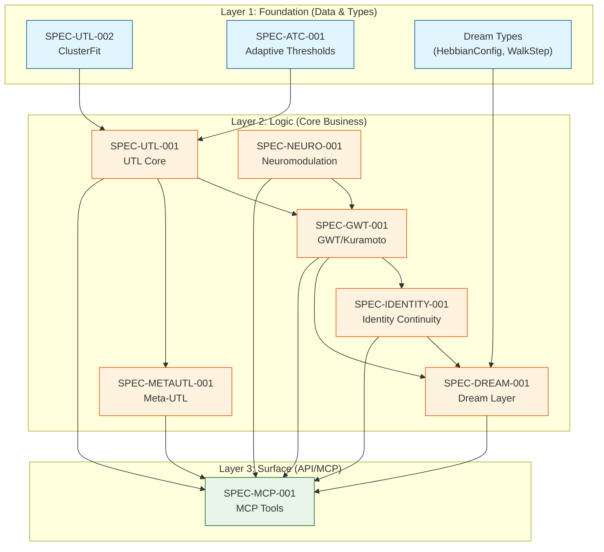

# Specification Index: ContextGraph Consciousness System

## Version: 5.0.0
## Last Updated: 2026-01-12
## Status: Active Development

---

## 1. Specification Hierarchy

```
Level 1: Constitution (docs2/constitution.yaml) - Immutable Rules
Level 2: Functional Specs (SPEC-*-001) - What to Build
Level 3: Technical Specs (TECH-*-001) - How to Build
Level 4: Task Specs (TASK-*-###) - Atomic Work Units
Level 5: Context Files (docs/specs/.agent_memory/) - Live State
```

---

## 2. Active Specifications

### 2.1 Core Domain Specs

| Spec ID | Title | Status | Layer | Priority |
|---------|-------|--------|-------|----------|
| SPEC-DREAM-001 | Dream Layer Protocol | PARTIAL | foundation | P0 |
| SPEC-IDENTITY-001 | Identity Continuity Loop | PARTIAL | logic | P0 |
| SPEC-GWT-001 | Global Workspace Theory Implementation | PARTIAL | logic | P0 |
| SPEC-MCP-001 | MCP Protocol and Tool Registry | PARTIAL | surface | P0 |
| SPEC-UTL-001 | Unified Theory of Learning | COMPLIANT | logic | P1 |
| SPEC-UTL-002 | ClusterFit Coherence Component | COMPLIANT | foundation | P2 |
| SPEC-METAUTL-001 | Meta-UTL Self-Correction Protocol | PARTIAL | logic | P1 |
| SPEC-NEURO-001 | Direct Dopamine Feedback Loop | PARTIAL | logic | P1 |
| SPEC-ATC-001 | Adaptive Threshold Calibration | COMPLIANT | foundation | P2 |

### 2.2 Compliance Summary

| Domain | Total Requirements | Implemented | Compliance % |
|--------|-------------------|-------------|--------------|
| Dream Layer | 5 | 2 | 40% |
| Identity | 7 | 5 | 71% |
| GWT | 6 | 4 | 67% |
| MCP Tools | 39 | 36 | 92% |
| UTL | 5 | 5 | 100% |
| Meta-UTL | 5 | 4 | 80% |
| Neuromodulation | 3 | 2 | 67% |

---

## 3. Dependency Graph



---

## 4. Implementation Gaps by Priority

### 4.1 P0 Critical (Must Fix - Blocking Core Functionality)

| Gap ID | Spec | Description | Constitution Rule | Layer |
|--------|------|-------------|-------------------|-------|
| GAP-DREAM-001 | SPEC-DREAM-001 | Wire HyperbolicExplorer to REM phase | DREAM-002, AP-35 | logic |
| GAP-DREAM-002 | SPEC-DREAM-001 | Integrate MemoryStore with NREM replay | DREAM-001, AP-36 | logic |
| GAP-DREAM-003 | SPEC-DREAM-001 | Complete amortized edge creation | DREAM-005 | logic |
| GAP-IDENTITY-001 | SPEC-IDENTITY-001 | Fix dual monitor desync in GwtSystemProviderImpl | IDENTITY-004, AP-40 | logic |
| GAP-MCP-001 | SPEC-MCP-001 | Add dispatch for get_meta_learning_status | METAUTL-005 | surface |
| GAP-MCP-002 | SPEC-MCP-001 | Add dispatch for trigger_lambda_recalibration | METAUTL-005 | surface |
| GAP-MCP-003 | SPEC-MCP-001 | Add dispatch for get_meta_learning_log | METAUTL-005 | surface |

### 4.2 P1 High (Should Fix - Degraded Experience)

| Gap ID | Spec | Description | Constitution Rule | Layer |
|--------|------|-------------|-------------------|-------|
| GAP-NEURO-001 | SPEC-NEURO-001 | Wire steering handler to invoke on_goal_progress() | N/A | surface |
| GAP-MCP-004 | SPEC-MCP-001 | Implement alias discover_goals -> discover_sub_goals | N/A | surface |
| GAP-MCP-005 | SPEC-MCP-001 | Implement alias consolidate_memories -> trigger_consolidation | N/A | surface |
| GAP-METAUTL-001 | SPEC-METAUTL-001 | Verify MCP tool wiring, implement per-domain accuracy tracking | METAUTL-004 | logic |

### 4.3 P2 Medium (Could Fix - Polish/Completeness)

| Gap ID | Spec | Description | Constitution Rule | Layer |
|--------|------|-------------|-------------------|-------|
| GAP-UTL-001 | SPEC-UTL-002 | Add sklearn reference validation tests for silhouette | UTL-002 | foundation |
| GAP-UTL-002 | SPEC-UTL-002 | Add ClusterFit benchmark (<2ms p95) | N/A | foundation |
| GAP-METAUTL-002 | SPEC-METAUTL-001 | Add persistence for lambda_override field | METAUTL-005 | logic |

---

## 5. Execution Order (Inside-Out, Bottom-Up)

### Phase 1: Foundation Layer Tasks

```
TASK-UTL-P2-001: Add sklearn reference tests ........................... SPEC-UTL-002
TASK-UTL-P2-002: Add ClusterFit benchmark .............................. SPEC-UTL-002
```

### Phase 2: Logic Layer Tasks (Core)

```
TASK-DREAM-P0-001: Wire HyperbolicExplorer to REM phase ................ SPEC-DREAM-001
TASK-DREAM-P0-002: Integrate MemoryStore with NREM replay .............. SPEC-DREAM-001
TASK-DREAM-P0-003: Complete amortized edge creation .................... SPEC-DREAM-001
TASK-IDENTITY-P0-001: Fix GwtSystemProviderImpl dual monitor desync .... SPEC-IDENTITY-001
TASK-METAUTL-P1-001: Implement per-domain accuracy tracking ............ SPEC-METAUTL-001
TASK-METAUTL-P2-001: Add lambda_override persistence ................... SPEC-METAUTL-001
```

### Phase 3: Surface Layer Tasks (API/MCP)

```
TASK-MCP-P0-001: Add Meta-UTL tool dispatch (3 tools) .................. SPEC-MCP-001
TASK-MCP-P1-001: Implement tool aliases module ......................... SPEC-MCP-001
TASK-NEURO-P1-001: Wire steering handler to on_goal_progress() ......... SPEC-NEURO-001
```

---

## 6. Constitution Enforcement Rules Reference

### DREAM Domain

| Rule ID | Description | Anti-Pattern |
|---------|-------------|--------------|
| DREAM-001 | NREM implements Hebbian replay: delta_w = eta * phi_i * phi_j | AP-35, AP-36 |
| DREAM-002 | REM implements Poincare ball hyperbolic walk | AP-35, AP-41 |
| DREAM-003 | Trigger on entropy > 0.7 for 5min | AP-42 |
| DREAM-004 | Wake latency < 100ms | N/A |
| DREAM-005 | Amortized shortcuts for 3+ hop paths traversed 5+ times | N/A |

### IDENTITY Domain

| Rule ID | Description | Anti-Pattern |
|---------|-------------|--------------|
| IDENTITY-001 | IC = cos(PV_t, PV_{t-1}) * r(t) | N/A |
| IDENTITY-002 | Thresholds: Healthy>0.9, Warning[0.7,0.9], Degraded[0.5,0.7), Critical<0.5 | N/A |
| IDENTITY-003 | PurposeVectorHistory uses FIFO eviction (max 1000) | N/A |
| IDENTITY-004 | IdentityContinuityMonitor struct required | N/A |
| IDENTITY-005 | cosine_similarity_13d must be public | AP-39 |
| IDENTITY-006 | IdentityContinuityListener subscribes to workspace events | AP-40 |
| IDENTITY-007 | IC < 0.5 -> auto-trigger dream | AP-26, AP-38 |

### GWT Domain

| Rule ID | Description | Anti-Pattern |
|---------|-------------|--------------|
| GWT-001 | C(t) = I(t) * R(t) * D(t) - all 3 factors required | AP-24 |
| GWT-002 | Kuramoto network = exactly 13 oscillators | AP-25 |
| GWT-003 | IC < 0.5 -> dream consolidation | AP-26 |
| GWT-004 | ConsciousnessState derived from C(t) only | N/A |
| GWT-005 | WorkspaceEventBroadcaster needs 3 listeners: Dream, Neuromod, MetaCognitive | N/A |
| GWT-006 | KuramotoStepper wired to MCP lifecycle (10ms step) | N/A |

### META-UTL Domain

| Rule ID | Description | Anti-Pattern |
|---------|-------------|--------------|
| METAUTL-001 | prediction_error > 0.2 -> lambda adjustment | AP-29 |
| METAUTL-002 | accuracy < 0.7 for 100 ops -> BayesianLambdaOptimizer | N/A |
| METAUTL-003 | dream_triggered -> lambda_adjustment | N/A |
| METAUTL-004 | Domain-specific accuracy tracking required | N/A |
| METAUTL-005 | SelfCorrectingLambda trait must be implemented | N/A |

### UTL Domain

| Rule ID | Description | Anti-Pattern |
|---------|-------------|--------------|
| UTL-001 | compute_delta_sc MCP tool MUST exist | AP-32 |
| UTL-002 | delta_C = 0.4*Connectivity + 0.4*ClusterFit + 0.2*Consistency | AP-33 |
| UTL-003 | Each embedder uses constitution-specified delta_S method | N/A |
| UTL-004 | Multi-embedding aggregation formula required | N/A |
| UTL-005 | Johari->action mapping must be correct | N/A |

---

## 7. Task Status Overview

| Task ID | Title | Layer | Status | Blocked By |
|---------|-------|-------|--------|------------|
| TASK-DREAM-P0-001 | Wire HyperbolicExplorer to REM | logic | READY | None |
| TASK-DREAM-P0-002 | Integrate MemoryStore with NREM | logic | READY | None |
| TASK-DREAM-P0-003 | Complete amortized edge creation | logic | READY | None |
| TASK-IDENTITY-P0-001 | Fix dual monitor desync | logic | READY | None |
| TASK-MCP-P0-001 | Add Meta-UTL tool dispatch | surface | READY | None |
| TASK-MCP-P1-001 | Implement tool aliases | surface | READY | None |
| TASK-NEURO-P1-001 | Wire steering to on_goal_progress | surface | READY | None |
| TASK-METAUTL-P1-001 | Per-domain accuracy tracking | logic | READY | None |
| TASK-METAUTL-P2-001 | lambda_override persistence | logic | READY | None |
| TASK-UTL-P2-001 | sklearn reference tests | foundation | READY | None |
| TASK-UTL-P2-002 | ClusterFit benchmark | foundation | READY | None |

**Progress: 0/14 tasks completed (0%)**

---

## 8. Related Documents

| Document | Path | Purpose |
|----------|------|---------|
| Constitution | `/home/cabdru/contextgraph/docs2/constitution.yaml` | Immutable rules |
| PRD to Spec Guide | `/home/cabdru/contextgraph/docs2/prdtospec.md` | Spec development methodology |
| Traceability Matrix | `/home/cabdru/contextgraph/docs/specs/_traceability.md` | Requirement coverage |
| Sherlock Dream Report | `/home/cabdru/contextgraph/docs/sherlock-dream-layer-report.md` | Investigation findings |
| Sherlock MCP Report | `/home/cabdru/contextgraph/docs/sherlock-mcp-tools-report.md` | Investigation findings |
| Sherlock Meta-UTL Report | `/home/cabdru/contextgraph/docs/sherlock-meta-utl-report.md` | Investigation findings |
| Sherlock Identity Report | `/home/cabdru/contextgraph/docs/sherlock-identity-continuity-report.md` | Investigation findings |
| Sherlock UTL delta_sc Report | `/home/cabdru/contextgraph/docs/sherlock-utl-delta-sc-report.md` | Investigation findings |
| Sherlock ClusterFit Report | `/home/cabdru/contextgraph/docs/sherlock-clusterfit-report.md` | Investigation findings |
| Sherlock Neuromod Report | `/home/cabdru/contextgraph/docs/sherlock-neuromodulation-report.md` | Investigation findings |

---

## 9. Validation Checklist

Before marking any spec as COMPLETE:

- [ ] All requirements have tasks
- [ ] Traceability matrix shows 100% coverage
- [ ] All tests pass (cargo test)
- [ ] No TODO/STUB markers remain
- [ ] Constitution rules verified
- [ ] Anti-patterns avoided
- [ ] Integration tests verify data flow
- [ ] MCP tools discoverable and functional

---

*Generated by Specification Architect Agent*
*Framework: prdtospec.md v1.0*
