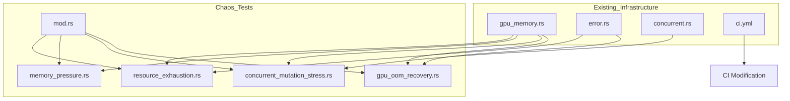

# TASK-TEST-P2-001: Implement Chaos Testing Suite

## Task Specification

```xml
<task_spec id="TASK-TEST-P2-001" version="1.0">
<metadata>
  <title>Implement Chaos Testing Suite for Resilience Validation</title>
  <status>ready</status>
  <layer>surface</layer>
  <sequence>1</sequence>
  <implements>
    <item>GPU OOM recovery validation</item>
    <item>Concurrent mutation stress testing (100 writers)</item>
    <item>Memory pressure scenario testing</item>
    <item>Resource exhaustion recovery testing</item>
    <item>CI pipeline integration for chaos tests</item>
  </implements>
  <depends_on>
    <!-- Foundation dependencies already exist -->
    <task_ref>Existing GPU memory management (gpu_memory.rs)</task_ref>
    <task_ref>Existing error types (error.rs, types.rs)</task_ref>
    <task_ref>Existing concurrent tests (concurrent.rs)</task_ref>
  </depends_on>
  <estimated_complexity>high</estimated_complexity>
  <priority>P2</priority>
  <source>Sherlock-10 Gap Analysis</source>
</metadata>

<context>
The tests/chaos/ directory is currently EMPTY despite critical infrastructure
gaps identified in the Sherlock-10 analysis. The system has GPU memory management
(24GB budget for RTX 5090), concurrent storage operations, and error handling
infrastructure, but lacks chaos engineering tests to validate resilience under
extreme conditions. This task implements comprehensive chaos tests that will
validate system behavior during GPU OOM conditions, high-concurrency mutations,
memory pressure scenarios, and resource exhaustion.
</context>

<input_context_files>
  <file purpose="GPU memory management patterns and OOM handling">
    crates/context-graph-graph/src/index/gpu_memory.rs
  </file>
  <file purpose="Existing GPU memory edge case tests">
    crates/context-graph-graph/tests/gpu_memory_tests/edge_case_tests.rs
  </file>
  <file purpose="Concurrent storage test patterns">
    crates/context-graph-storage/tests/storage_integration/concurrent.rs
  </file>
  <file purpose="Core error types including GpuError">
    crates/context-graph-core/src/error.rs
  </file>
  <file purpose="Embedding error types including OOM variants">
    crates/context-graph-embeddings/src/error/types.rs
  </file>
  <file purpose="CI workflow structure">
    .github/workflows/ci.yml
  </file>
  <file purpose="Workspace configuration">
    Cargo.toml
  </file>
</input_context_files>

<prerequisites>
  <check>tests/chaos/ directory exists (currently empty)</check>
  <check>GPU memory manager (GpuMemoryManager) is implemented</check>
  <check>ContextGraphError and EmbeddingError types exist</check>
  <check>Storage concurrent access infrastructure exists</check>
  <check>CI workflow exists with test jobs</check>
</prerequisites>

<scope>
  <in_scope>
    - GPU OOM simulation test with recovery validation
    - Concurrent mutation stress test (100 writers)
    - Memory pressure test with allocation/deallocation cycling
    - Resource exhaustion test with graceful degradation
    - Test module organization (mod.rs, individual test files)
    - CI integration for chaos tests (optional job in ci.yml)
    - Test documentation and assertions
  </in_scope>
  <out_of_scope>
    - Network partition tests (no network layer exists yet)
    - Distributed consensus failure tests (single-node architecture)
    - CUDA kernel-level fault injection (requires actual CUDA runtime)
    - Performance benchmarking (separate from chaos tests)
    - UI/API endpoint chaos testing
  </out_of_scope>
</scope>

<definition_of_done>
  <signatures>
    <!-- Module structure -->
    <signature file="tests/chaos/mod.rs">
      //! Chaos Testing Suite
      mod gpu_oom_recovery;
      mod concurrent_mutation_stress;
      mod memory_pressure;
      mod resource_exhaustion;
    </signature>

    <!-- GPU OOM Recovery Test -->
    <signature file="tests/chaos/gpu_oom_recovery.rs">
      #[test]
      fn test_gpu_oom_detection() { ... }

      #[test]
      fn test_gpu_oom_recovery_with_deallocation() { ... }

      #[test]
      fn test_gpu_cascading_oom_prevention() { ... }

      #[test]
      fn test_gpu_oom_error_propagation() { ... }
    </signature>

    <!-- Concurrent Mutation Stress Test -->
    <signature file="tests/chaos/concurrent_mutation_stress.rs">
      const CONCURRENT_WRITERS: usize = 100;

      #[test]
      fn test_100_concurrent_writers() { ... }

      #[test]
      fn test_concurrent_read_write_mix() { ... }

      #[test]
      fn test_concurrent_allocation_contention() { ... }

      #[test]
      fn test_thundering_herd_scenario() { ... }
    </signature>

    <!-- Memory Pressure Test -->
    <signature file="tests/chaos/memory_pressure.rs">
      #[test]
      fn test_allocation_deallocation_cycling() { ... }

      #[test]
      fn test_fragmentation_under_pressure() { ... }

      #[test]
      fn test_low_memory_threshold_warning() { ... }

      #[test]
      fn test_memory_usage_accounting_accuracy() { ... }
    </signature>

    <!-- Resource Exhaustion Test -->
    <signature file="tests/chaos/resource_exhaustion.rs">
      #[test]
      fn test_graceful_degradation_on_exhaustion() { ... }

      #[test]
      fn test_recovery_after_resource_release() { ... }

      #[test]
      fn test_category_budget_exhaustion() { ... }

      #[test]
      fn test_allocation_rejection_messages() { ... }
    </signature>
  </signatures>

  <constraints>
    - All tests must use real implementations (NO MOCKS per constitution)
    - Tests must follow Full State Verification pattern (print BEFORE/AFTER)
    - Tests must reference constitution.yaml where applicable
    - Error handling must follow AP-001 (fail fast, no unwrap())
    - GPU tests should use GpuMemoryManager, not actual CUDA allocations
    - Concurrent tests must use std::sync::Arc and std::thread
    - All tests must be #[ignore] tagged for CI (run with --ignored flag)
    - Tests must complete within reasonable time (use timeouts)
  </constraints>

  <verification>
    - cargo test --workspace -- chaos (should compile with no errors)
    - cargo test --workspace -- chaos --ignored (should run all chaos tests)
    - Each test prints BEFORE/AFTER state verification
    - Tests produce clear PASSED/FAILED output
    - CI job runs chaos tests on schedule/manual trigger
  </verification>
</definition_of_done>

<pseudo_code>
tests/chaos/mod.rs:
  - Module declarations for all chaos test files
  - Documentation explaining chaos testing purpose

tests/chaos/gpu_oom_recovery.rs:
  use context_graph_graph::index::gpu_memory::*;

  test_gpu_oom_detection:
    - Create GpuMemoryManager with small budget (e.g., 10KB)
    - Print BEFORE state
    - Allocate until budget exceeded
    - Verify allocation returns Err (not panic)
    - Print AFTER state
    - Assert error is correct variant

  test_gpu_oom_recovery_with_deallocation:
    - Create GpuMemoryManager with budget
    - Allocate to near capacity
    - Attempt over-allocation (should fail)
    - Deallocate some memory (drop handles)
    - Retry allocation (should succeed)
    - Verify memory accounting is accurate

  test_gpu_cascading_oom_prevention:
    - Create GpuMemoryManager
    - Allocate across multiple categories
    - Exhaust one category
    - Verify other categories still work
    - Verify no cascading failures

  test_gpu_oom_error_propagation:
    - Create GpuMemoryManager with strict config
    - Trigger OOM
    - Verify error type is GraphError::GpuMemoryExhausted or similar
    - Verify error message includes context

tests/chaos/concurrent_mutation_stress.rs:
  use std::sync::{Arc, Barrier};
  use std::thread;

  test_100_concurrent_writers:
    - Create shared GpuMemoryManager (Arc<>)
    - Create barrier for synchronized start
    - Spawn 100 threads, each:
      - Wait on barrier
      - Attempt allocation
      - Track success/failure
    - Join all threads
    - Verify no panics occurred
    - Verify allocation count matches expected
    - Verify memory accounting is consistent

  test_concurrent_read_write_mix:
    - Create shared manager
    - Spawn 50 writers + 50 readers
    - Writers allocate/deallocate
    - Readers query stats/available
    - Verify no data races (safe code)
    - Verify final state is consistent

  test_concurrent_allocation_contention:
    - Create manager near capacity
    - Spawn threads competing for limited remaining memory
    - Some should succeed, some should fail
    - Verify total allocations don't exceed budget

  test_thundering_herd_scenario:
    - Create manager
    - Fill to capacity
    - Release all at once
    - Immediately have 100 threads try to allocate
    - Verify system handles gracefully

tests/chaos/memory_pressure.rs:
  test_allocation_deallocation_cycling:
    - Perform 10000 cycles of allocate-then-deallocate
    - Verify memory always returns to baseline
    - Verify no memory leaks (tracked vs actual)

  test_fragmentation_under_pressure:
    - Allocate many small chunks
    - Deallocate alternate chunks
    - Attempt large allocation
    - Verify fragmentation is handled (or reported)

  test_low_memory_threshold_warning:
    - Create manager with 90% threshold
    - Allocate past 90%
    - Verify is_low_memory() returns true
    - Deallocate below 90%
    - Verify is_low_memory() returns false

  test_memory_usage_accounting_accuracy:
    - Perform random allocation/deallocation sequence
    - After each operation, verify:
      - used() + available() == budget
      - allocation_count matches handle count
      - stats().total_allocated == sum of active handles

tests/chaos/resource_exhaustion.rs:
  test_graceful_degradation_on_exhaustion:
    - Exhaust memory budget
    - Verify system remains responsive
    - Verify existing allocations still work
    - Verify no corruption occurs

  test_recovery_after_resource_release:
    - Fill to capacity
    - Release all resources
    - Verify full capacity available
    - Verify new allocations work normally

  test_category_budget_exhaustion:
    - Set per-category budgets
    - Exhaust one category (e.g., FaissIndex)
    - Verify other categories (WorkingMemory) still work
    - Verify error messages indicate correct category

  test_allocation_rejection_messages:
    - Trigger various rejection scenarios
    - Verify error messages are informative:
      - Include requested size
      - Include available size
      - Include category (if applicable)

.github/workflows/ci.yml (modification):
  Add new job:
    chaos-tests:
      name: Chaos Tests
      runs-on: ubuntu-latest
      needs: test  # Run after regular tests
      if: github.event_name == 'schedule' || github.event_name == 'workflow_dispatch'
      steps:
        - checkout
        - install rust
        - cargo test --workspace -- chaos --ignored
</pseudo_code>

<files_to_create>
  <file path="tests/chaos/mod.rs">
    Module root with documentation and submodule declarations
  </file>
  <file path="tests/chaos/gpu_oom_recovery.rs">
    GPU OOM detection and recovery tests (4 tests)
  </file>
  <file path="tests/chaos/concurrent_mutation_stress.rs">
    Concurrent writer stress tests (4 tests)
  </file>
  <file path="tests/chaos/memory_pressure.rs">
    Memory pressure scenario tests (4 tests)
  </file>
  <file path="tests/chaos/resource_exhaustion.rs">
    Resource exhaustion and recovery tests (4 tests)
  </file>
</files_to_create>

<files_to_modify>
  <file path=".github/workflows/ci.yml">
    Add chaos-tests job for scheduled/manual execution
  </file>
</files_to_modify>

<validation_criteria>
  <criterion>All 16 chaos tests compile without errors</criterion>
  <criterion>cargo test --workspace -- chaos completes without panic</criterion>
  <criterion>cargo test --workspace -- chaos --ignored runs all tests</criterion>
  <criterion>Each test prints BEFORE/AFTER state verification</criterion>
  <criterion>GPU OOM tests verify error types, not panics</criterion>
  <criterion>Concurrent tests verify no data races</criterion>
  <criterion>Memory pressure tests verify accounting accuracy</criterion>
  <criterion>Resource exhaustion tests verify graceful degradation</criterion>
  <criterion>CI workflow modification is valid YAML</criterion>
  <criterion>Tests follow existing code patterns in codebase</criterion>
</validation_criteria>

<test_commands>
  <command>cargo build --workspace</command>
  <command>cargo test --workspace -- chaos 2>&amp;1 | head -50</command>
  <command>cargo test --workspace -- chaos --ignored --test-threads=1</command>
  <command>cargo clippy --workspace --all-targets -- -D warnings</command>
</test_commands>

<acceptance_criteria>
  <criterion id="AC-001">
    GPU OOM recovery test detects OOM condition via Result::Err, not panic
  </criterion>
  <criterion id="AC-002">
    100 concurrent writers test completes without deadlock within 60 seconds
  </criterion>
  <criterion id="AC-003">
    Memory pressure cycling test shows zero memory leak after 10000 cycles
  </criterion>
  <criterion id="AC-004">
    Resource exhaustion test shows system accepts new allocations after recovery
  </criterion>
  <criterion id="AC-005">
    All tests follow Full State Verification pattern with printed output
  </criterion>
  <criterion id="AC-006">
    CI workflow includes chaos-tests job with schedule trigger
  </criterion>
</acceptance_criteria>

<notes>
  <note type="constitution">
    AP-001: Fail fast, never unwrap() in production code
    AP-015: GPU alloc without pool -> use CUDA memory pool
    perf.memory.gpu: &lt;24GB (8GB headroom)
  </note>
  <note type="testing">
    Tests are marked #[ignore] to avoid running in normal CI.
    Run with: cargo test -- --ignored
    Or: cargo test -- chaos --ignored
  </note>
  <note type="architecture">
    These tests use GpuMemoryManager's tracking layer, not actual CUDA.
    For real GPU OOM testing, use CUDA feature and physical GPU.
  </note>
</notes>
</task_spec>
```

## Implementation Checklist

- [ ] Create tests/chaos/mod.rs with module structure
- [ ] Implement tests/chaos/gpu_oom_recovery.rs (4 tests)
- [ ] Implement tests/chaos/concurrent_mutation_stress.rs (4 tests)
- [ ] Implement tests/chaos/memory_pressure.rs (4 tests)
- [ ] Implement tests/chaos/resource_exhaustion.rs (4 tests)
- [ ] Modify .github/workflows/ci.yml to add chaos-tests job
- [ ] Run cargo clippy and fix any warnings
- [ ] Run cargo test -- chaos to verify compilation
- [ ] Run cargo test -- chaos --ignored to execute full suite
- [ ] Document test results

## Dependency Graph



## Risk Assessment

| Risk | Likelihood | Impact | Mitigation |
|------|------------|--------|------------|
| Tests cause actual OOM on CI | Low | Medium | Use small budgets, no real CUDA |
| Concurrent tests deadlock | Medium | Low | Add timeout, use --test-threads=1 |
| Tests flaky due to timing | Medium | Low | Use barriers, deterministic waits |
| Tests too slow for CI | Low | Medium | Mark as #[ignore], run on schedule |

## Related Tasks

- TASK-GPU-001: GPU Memory Pool Implementation (prerequisite)
- TASK-STORAGE-001: Storage Backend (prerequisite)
- TASK-CI-001: CI Pipeline Setup (prerequisite)
