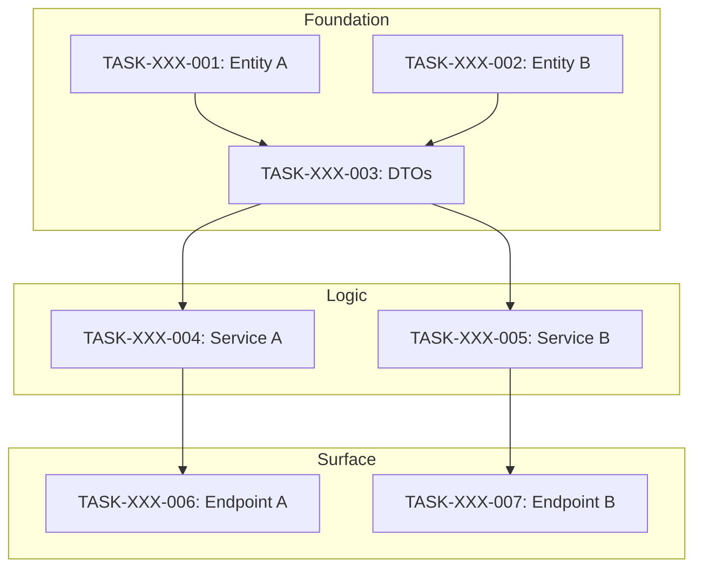

# Atomic Task Breakdown Framework

## Complete Protocol for Decomposing Any Input into Sequential Executable Tasks

---

## Part 1: Core Principles

### 1.1 What is an Atomic Task?

An **atomic task** is the smallest indivisible unit of work with:
- **One Goal**: Single conceptual change or deliverable
- **One Focus**: Single component, file, or implementation concern
- **Self-Contained**: All context needed is specified
- **Verifiable**: Clear definition of done with exact outputs
- **Sequential Safe**: Cannot break if executed in order

**Examples:**
```
✓ "Create User Entity and Migration"          (one model, one migration)
✓ "Implement RegisterUser Service Method"     (one method, one behavior)
✓ "Create Registration Endpoint with Tests"   (one endpoint, its tests)

✗ "Build Login System"                        (too broad - multiple concerns)
✗ "Implement Auth"                            (ambiguous scope)
✗ "Add user functionality"                    (no clear boundary)
```

### 1.2 The Guarantee

When this framework is followed correctly:

> **If all atomic tasks are completed in sequence, the entire system/feature is fully implemented.**

This works because:
1. **Tasks cover 100%** — Traceability matrix proves complete coverage
2. **Tasks are atomic** — Each small enough to complete correctly
3. **Dependencies explicit** — No missing imports or references
4. **Layer ordering enforced** — Foundation → Logic → Surface
5. **Definition of done precise** — Exact signatures, no ambiguity

### 1.3 Input Types Supported

This framework processes ANY input:
- Product Requirements Document (PRD)
- Feature Request
- User Story
- Bug Fix Description
- System Design Document
- Rough Idea or Concept
- Enhancement Request
- Migration Plan
- API Specification

---

## Part 2: The Decomposition Process

### 2.1 Inside-Out, Bottom-Up Slicing

**CRITICAL: DO NOT slice by "Feature."** Slice by **Architectural Layer.**

❌ **Wrong:** Task "Build Login" → agent writes Database, Service, Controller simultaneously → context overflow, hallucinated imports, broken dependencies.

✅ **Correct:** Strict layer-by-layer generation order:

```
┌─────────────────────────────────────────────────────────────┐
│ LAYER 1: FOUNDATION (Data & Types)                          │
│ Output: Migrations, entities, interfaces, DTOs, constants   │
│ Why: Zero dependencies. Must exist before anything imports. │
└─────────────────────────────────────────────────────────────┘
                          ↓
┌─────────────────────────────────────────────────────────────┐
│ LAYER 2: LOGIC (Business Rules & Services)                  │
│ Output: Service classes, utilities, business logic, tests   │
│ Why: Depends on Layer 1 only. Isolated unit testing.        │
└─────────────────────────────────────────────────────────────┘
                          ↓
┌─────────────────────────────────────────────────────────────┐
│ LAYER 3: SURFACE (Interface & Exposure)                     │
│ Output: Controllers, routes, UI components, integration     │
│ Why: Depends on Layer 2. Wires everything together.         │
└─────────────────────────────────────────────────────────────┘
```

**Iron Rule:** Task N cannot reference files created in Task N+1 or later.

### 2.2 Five-Step Extraction Process

**Step 1: Identify Components**
From the input, extract every distinct component:
- Data models / entities
- DTOs / interfaces / types
- Service methods / business logic
- API endpoints / routes
- UI components / views
- Utilities / helpers
- Configurations
- Migrations / seeds

**Step 2: Assign Layers**
Categorize each component:
- `foundation` — data models, types, migrations, DTOs, constants
- `logic` — services, business rules, utilities, validators
- `surface` — controllers, routes, UI, integration points

**Step 3: Map Dependencies**
For each component, identify:
- What it imports/uses
- What depends on it
- Required execution order

**Step 4: Create Atomic Tasks**
Split until each task has ONE goal:
- One entity = one task
- One service method = one task
- One endpoint = one task (with its tests)
- One UI component = one task

**Step 5: Sequence and Number**
Order tasks by:
1. Layer (foundation → logic → surface)
2. Dependencies within layer
3. Assign sequential IDs: `TASK-[DOMAIN]-[###]`

### 2.3 Quick Decomposition Template

Use this to quickly extract tasks from any input:

```markdown
## Input Analysis: [Feature/System Name]

### Components Identified

**Foundation Layer:**
- [ ] [Entity/Model 1]
- [ ] [Entity/Model 2]
- [ ] [DTO/Interface 1]
- [ ] [Migration 1]

**Logic Layer:**
- [ ] [Service Method 1]
- [ ] [Service Method 2]
- [ ] [Utility Function 1]
- [ ] [Validator 1]

**Surface Layer:**
- [ ] [Endpoint 1]
- [ ] [Endpoint 2]
- [ ] [UI Component 1]
- [ ] [Middleware 1]

### Dependency Map
| Component | Depends On | Used By |
|-----------|------------|---------|
| Entity1   | —          | Service1, Endpoint1 |
| Service1  | Entity1    | Endpoint1 |
| Endpoint1 | Service1   | — |

### Task Sequence
1. TASK-XXX-001: [Foundation Task 1]
2. TASK-XXX-002: [Foundation Task 2]
3. TASK-XXX-003: [Logic Task 1]
...
```

---

## Part 3: Task Specification Template

Every atomic task MUST have this structure:

```xml
<task_spec id="TASK-[DOMAIN]-[###]" version="1.0">
<metadata>
  <title>[Clear, Action-Oriented Title]</title>
  <status>ready|in_progress|complete|blocked</status>
  <layer>foundation|logic|surface</layer>
  <sequence>[execution order number]</sequence>
  <implements>
    <!-- What requirements/features this task delivers -->
    <item>[REQ-ID or Feature Description]</item>
  </implements>
  <depends_on>
    <!-- Previous tasks that MUST complete first -->
    <task_ref>TASK-XXX-###</task_ref>
  </depends_on>
  <estimated_complexity>low|medium|high</estimated_complexity>
</metadata>

<context>
<!-- Brief explanation of WHY this task exists and WHERE it fits -->
[1-3 sentences explaining purpose and relationship to other tasks]
</context>

<input_context_files>
  <!-- ONLY files the agent needs to read for THIS task -->
  <file purpose="[why needed]">[path/to/file]</file>
</input_context_files>

<prerequisites>
  <!-- Conditions that must be true before starting -->
  <check>[Prerequisite 1]</check>
  <check>[Prerequisite 2]</check>
</prerequisites>

<scope>
  <in_scope>
    <!-- Exactly what this task includes -->
    - [Deliverable 1]
    - [Deliverable 2]
  </in_scope>
  <out_of_scope>
    <!-- Explicitly what this task does NOT include -->
    - [Excluded item] (handled in TASK-XXX-###)
  </out_of_scope>
</scope>

<definition_of_done>
  <signatures>
    <!-- EXACT code signatures the agent must produce -->
    <signature file="[path/to/file]">
      [exact function/class/interface signature]
    </signature>
  </signatures>

  <constraints>
    <!-- Rules that must be followed -->
    - [Constraint 1]
    - [Constraint 2]
  </constraints>

  <verification>
    <!-- How to verify task completion -->
    - [Verification step 1]
    - [Verification step 2]
  </verification>
</definition_of_done>

<pseudo_code>
<!-- High-level implementation approach -->
[Component Name] ([path]):
  [pseudo-code description of implementation]
</pseudo_code>

<files_to_create>
  <file path="[path/to/new/file]">[description of contents]</file>
</files_to_create>

<files_to_modify>
  <file path="[path/to/existing/file]">[what changes]</file>
</files_to_modify>

<validation_criteria>
  <!-- Checklist for task acceptance -->
  <criterion>[Validation check 1]</criterion>
  <criterion>[Validation check 2]</criterion>
</validation_criteria>

<test_commands>
  <!-- Commands to run for verification -->
  <command>[test command 1]</command>
  <command>[test command 2]</command>
</test_commands>
</task_spec>
```

### 3.1 Minimal Task Spec (Quick Version)

For simpler tasks, use this condensed format:

```xml
<task_spec id="TASK-XXX-###">
<metadata>
  <title>[Title]</title>
  <layer>foundation|logic|surface</layer>
  <implements>[What this delivers]</implements>
  <depends_on>[Previous task IDs]</depends_on>
</metadata>

<input_context_files>
  <file>[path/to/file]</file>
</input_context_files>

<definition_of_done>
  <signature>[exact output signature]</signature>
  <constraints>
    - [Constraint 1]
  </constraints>
</definition_of_done>

<files_to_create>
  <file>[path/to/file]</file>
</files_to_create>

<validation_criteria>
  <criterion>[How to verify]</criterion>
</validation_criteria>
</task_spec>
```

---

## Part 4: Task Index (`_index.md`)

The task index serves as the **master execution plan** with dependency visualization.

### 4.1 Task Index Template

Create `tasks/_index.md`:

```markdown
# Task Index: [Domain/Feature Name]

## Overview
- **Total Tasks:** [N]
- **Foundation:** [N] tasks
- **Logic:** [N] tasks
- **Surface:** [N] tasks
- **Current Progress:** [X]/[N] ([%]%)

## Dependency Graph



## Execution Order

| # | Task ID | Title | Layer | Depends On | Status |
|---|---------|-------|-------|------------|--------|
| 1 | TASK-XXX-001 | Create Entity A | foundation | — | ⏳ Ready |
| 2 | TASK-XXX-002 | Create Entity B | foundation | — | ⏳ Ready |
| 3 | TASK-XXX-003 | Create DTOs | foundation | 001, 002 | ⏳ Blocked |
| 4 | TASK-XXX-004 | Implement Service A | logic | 003 | ⏳ Blocked |
| 5 | TASK-XXX-005 | Implement Service B | logic | 003 | ⏳ Blocked |
| 6 | TASK-XXX-006 | Create Endpoint A | surface | 004 | ⏳ Blocked |
| 7 | TASK-XXX-007 | Create Endpoint B | surface | 005 | ⏳ Blocked |

## Status Legend
- ⏳ Ready — Can be started now
- 🔄 In Progress — Currently being worked on
- ✅ Complete — Finished and verified
- ⛔ Blocked — Waiting on dependencies
- ❌ Failed — Needs revision

## Completion Tracking

| Task | Started | Completed | Verified | Notes |
|------|---------|-----------|----------|-------|
| TASK-XXX-001 | — | — | — | |
| TASK-XXX-002 | — | — | — | |
| ... | | | | |

## Critical Path
The longest dependency chain that determines minimum completion time:
```
TASK-XXX-001 → TASK-XXX-003 → TASK-XXX-004 → TASK-XXX-006
```

## Parallel Opportunities
Tasks that can execute simultaneously:
- **Batch 1:** TASK-XXX-001, TASK-XXX-002 (no dependencies)
- **Batch 2:** TASK-XXX-004, TASK-XXX-005 (both depend only on 003)
```

---

## Part 5: Traceability Matrix (`_traceability.md`)

The traceability matrix **proves complete coverage** — every requirement has a task.

### 5.1 Traceability Template

Create `tasks/_traceability.md`:

```markdown
# Task Traceability Matrix: [Domain/Feature Name]

## Purpose
This matrix ensures every requirement, component, and behavior from the input
is covered by at least one atomic task. **Empty "Task ID" columns = INCOMPLETE.**

## Coverage Matrix

### Data Models / Entities
| Item | Description | Task ID | Verified |
|------|-------------|---------|----------|
| User entity | User data model | TASK-XXX-001 | ☐ |
| Session entity | Session data model | TASK-XXX-002 | ☐ |

### DTOs / Interfaces / Types
| Item | Description | Task ID | Verified |
|------|-------------|---------|----------|
| CreateUserDto | User creation input | TASK-XXX-003 | ☐ |
| UserResponse | User API response | TASK-XXX-003 | ☐ |

### Service Methods / Business Logic
| Item | Description | Task ID | Verified |
|------|-------------|---------|----------|
| registerUser() | User registration | TASK-XXX-004 | ☐ |
| authenticateUser() | User authentication | TASK-XXX-005 | ☐ |

### API Endpoints / Routes
| Item | Description | Task ID | Verified |
|------|-------------|---------|----------|
| POST /auth/register | Registration endpoint | TASK-XXX-006 | ☐ |
| POST /auth/login | Login endpoint | TASK-XXX-007 | ☐ |

### Error States
| Error | Condition | Task ID | Verified |
|-------|-----------|---------|----------|
| ERR-001 | Invalid email format | TASK-XXX-006 | ☐ |
| ERR-002 | Email already exists | TASK-XXX-006 | ☐ |

### Edge Cases
| Scenario | Expected Behavior | Task ID | Verified |
|----------|-------------------|---------|----------|
| Empty password | Return validation error | TASK-XXX-006 | ☐ |
| Network timeout | Retry with backoff | TASK-XXX-007 | ☐ |

## Uncovered Items
<!-- List any items without task coverage - these MUST be addressed -->
| Item | Type | Reason | Action Required |
|------|------|--------|-----------------|
| (none) | | | |

## Coverage Summary
- **Data Models:** [X]/[Y] covered (100%)
- **DTOs/Types:** [X]/[Y] covered (100%)
- **Service Methods:** [X]/[Y] covered (100%)
- **API Endpoints:** [X]/[Y] covered (100%)
- **Error States:** [X]/[Y] covered (100%)
- **Edge Cases:** [X]/[Y] covered (100%)

**TOTAL COVERAGE: 100%** ✅

## Validation Checklist
- [ ] All data models have tasks
- [ ] All DTOs/interfaces have tasks
- [ ] All service methods have tasks
- [ ] All API endpoints have tasks
- [ ] All error states handled in tasks
- [ ] All edge cases covered in tasks
- [ ] Task dependencies form valid DAG (no cycles)
- [ ] Layer ordering correct (foundation → logic → surface)
- [ ] No item appears without a task assignment
```

---

## Part 6: Task Generation Checklist

Run this checklist BEFORE executing any tasks:

### 6.1 Completeness Checks
- [ ] Every component from input has at least one task
- [ ] Traceability matrix has zero empty "Task ID" cells
- [ ] Every service method has its own task
- [ ] Every API endpoint has its own task
- [ ] All error states are covered
- [ ] All edge cases are addressed

### 6.2 Ordering Checks
- [ ] Foundation tasks come before Logic tasks
- [ ] Logic tasks come before Surface tasks
- [ ] Dependencies are satisfied within each layer
- [ ] No task references files from later tasks
- [ ] Parallel-safe tasks are identified

### 6.3 Quality Checks
- [ ] Each task is truly atomic (ONE conceptual change)
- [ ] Input context files are minimal and correct
- [ ] Definition of done has exact signatures
- [ ] Constraints are specific and verifiable
- [ ] Test commands are specified
- [ ] Validation criteria are clear

### 6.4 Structure Checks
- [ ] Tasks named `TASK-[DOMAIN]-[###]`
- [ ] Sequence numbers are gapless (001, 002, 003...)
- [ ] No cycles in dependency graph
- [ ] `_index.md` is complete with all tasks
- [ ] `_traceability.md` shows 100% coverage

---

## Part 7: Execution Protocol

### 7.1 Sequential Execution Rules

**CRITICAL:** Follow these rules during task execution:

1. **Execute in Order**
   - Process tasks in sequence number order
   - Never skip ahead, even if a task seems simple
   - Complete verification before moving to next task

2. **Dependency Enforcement**
   - Before starting Task N, verify Task N-1 is complete
   - If blocked by missing dependency, STOP and report
   - Never reference files that don't exist yet

3. **One Task at a Time**
   - Focus on single task until complete
   - Don't batch or combine tasks
   - Mark complete only when verified

4. **Context Isolation**
   - Read ONLY files listed in `input_context_files`
   - Don't pull in additional context
   - Trust the task spec to provide what's needed

### 7.2 Task Completion Criteria

A task is COMPLETE only when ALL are true:
- [ ] All files in `files_to_create` exist
- [ ] All files in `files_to_modify` are updated
- [ ] All `signatures` in definition_of_done are exact matches
- [ ] All `constraints` are satisfied
- [ ] All `verification` steps pass
- [ ] All `test_commands` succeed
- [ ] All `validation_criteria` are met

### 7.3 Progress Tracking

Update `_index.md` after each task:
1. Change status from Ready → In Progress → Complete
2. Record start and completion timestamps
3. Note any deviations or issues
4. Update completion percentage

---

## Part 8: Example Breakdowns

### 8.1 Example: Authentication System

**Input:** "Build user authentication with registration, login, and logout"

**Atomic Task Sequence:**

```
FOUNDATION LAYER:
TASK-AUTH-001: Create User Entity and Migration
TASK-AUTH-002: Create Session Entity and Migration
TASK-AUTH-003: Create Auth DTOs and Interfaces

LOGIC LAYER:
TASK-AUTH-004: Implement Password Hashing Utility
TASK-AUTH-005: Implement RegisterUser Service Method
TASK-AUTH-006: Implement AuthenticateUser Service Method
TASK-AUTH-007: Implement Session Management Service

SURFACE LAYER:
TASK-AUTH-008: Create Registration Endpoint with Tests
TASK-AUTH-009: Create Login Endpoint with Tests
TASK-AUTH-010: Create Logout Endpoint with Tests
TASK-AUTH-011: Create Auth Middleware
```

**Total: 11 atomic tasks**

### 8.2 Example: Export Feature

**Input:** "Add CSV export button to data tables"

**Atomic Task Sequence:**

```
FOUNDATION LAYER:
TASK-EXPORT-001: Create Export Types and Interfaces
TASK-EXPORT-002: Create CSV Format Constants

LOGIC LAYER:
TASK-EXPORT-003: Implement CSV Generator Utility
TASK-EXPORT-004: Implement Export Service Method

SURFACE LAYER:
TASK-EXPORT-005: Create ExportButton Component
TASK-EXPORT-006: Integrate Export into DataTable Component
TASK-EXPORT-007: Add Export E2E Tests
```

**Total: 7 atomic tasks**

### 8.3 Example: Bug Fix

**Input:** "Login fails silently on network timeout"

**Atomic Task Sequence:**

```
FOUNDATION LAYER:
TASK-BUGFIX-001: Add Timeout Error Type

LOGIC LAYER:
TASK-BUGFIX-002: Add Timeout to Auth Service Fetch

SURFACE LAYER:
TASK-BUGFIX-003: Add Timeout Error UI Handling
TASK-BUGFIX-004: Add Timeout Test Cases
```

**Total: 4 atomic tasks**

---

## Part 9: Quick Reference

### Atomic Task Rules Summary

| Rule | Description |
|------|-------------|
| **One Goal** | Single conceptual change per task |
| **Layer Order** | Foundation → Logic → Surface |
| **No Forward Refs** | Task N cannot reference Task N+1 files |
| **Explicit Deps** | All dependencies listed in task spec |
| **Exact Outputs** | Definition of done has exact signatures |
| **Complete Coverage** | Traceability matrix shows 100% |
| **Sequential Safe** | Tasks can only execute in order |
| **Self-Contained** | All needed context in input_context_files |

### Common Decomposition Patterns

| Input Pattern | Typical Tasks |
|---------------|---------------|
| "Create [Entity]" | 1 entity task, 1 migration task, 1 DTO task |
| "Build [Service]" | N service method tasks (one per method) |
| "Add [Endpoint]" | 1 endpoint task (includes tests) |
| "Implement [Feature]" | 3-15 tasks across all layers |
| "Fix [Bug]" | 2-5 tasks (type → logic → surface → test) |

### Danger Signs (Task Too Big)

- Task mentions multiple files in different directories
- Task says "and" more than once
- Task could be split without losing coherence
- Task spans multiple layers
- Task takes more than 1 hour to estimate
- Task has more than 3 files to create

### Task Sizing Guidelines

| Complexity | Typical Files | Example |
|------------|---------------|---------|
| Low | 1-2 files | Single entity, single utility |
| Medium | 2-4 files | Service method with tests |
| High | 4-6 files | Endpoint with middleware and tests |

**If > 6 files, SPLIT THE TASK.**

---

## Appendix: Generator Prompt

Use this prompt with an LLM to generate atomic tasks from any input:

```xml
<task_generation_prompt>
Analyze the following input and generate atomic task specifications.

<input>
[PASTE YOUR PRD/FEATURE/IDEA HERE]
</input>

<rules>
<granularity>
One task = One conceptual change.
✓ "Create User Entity and Migration"
✓ "Implement RegisterUser Service Method"
✓ "Create Registration Endpoint with Tests"
✗ "Build entire auth system"
</granularity>

<dependency_ordering>
STRICT ORDER:
1. Task N cannot reference files from Task N+1
2. Database models/types FIRST (foundation)
3. Services/business logic SECOND (logic)
4. Controllers/UI LAST (surface)
</dependency_ordering>

<testing_requirement>
Every Logic/Surface task MUST include test file creation.
Tests ship with implementation, not separately.
</testing_requirement>

<naming_convention>
Explicit sequence: TASK-[DOMAIN]-[###]
Example: TASK-AUTH-001, TASK-AUTH-002
</naming_convention>

<layer_assignment>
Tag each task:
- layer="foundation" (data models, types, migrations, DTOs)
- layer="logic" (services, business rules, utilities)
- layer="surface" (controllers, routes, UI components)
</layer_assignment>
</rules>

<output_format>
Generate:
1. Complete _index.md with dependency graph
2. Complete _traceability.md with coverage matrix
3. Full task spec for each task using the template
</output_format>
</task_generation_prompt>
```

---

**END OF ATOMIC TASK FRAMEWORK**
