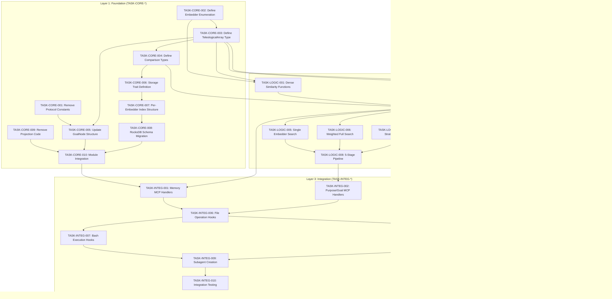

# Task Index: Teleological Array System Refactoring

## Overview

This document defines the complete task dependency graph for refactoring the ContextGraph system to use teleological arrays (13-embedder arrays) as the fundamental storage and comparison unit.

**Total Tasks**: 30
**Layers**: Foundation (10), Logic (10), Integration (10)
**Estimated Timeline**: 10-14 weeks

---

## Dependency Graph



---

## Execution Order

### Layer 1: Foundation (Weeks 1-3)

| # | Task ID | Title | Depends On | Est. Days |
|---|---------|-------|------------|-----------|
| 1 | TASK-CORE-001 | Remove Protocol Constants | - | 0.5 |
| 2 | TASK-CORE-002 | Define Embedder Enumeration | - | 1 |
| 3 | TASK-CORE-003 | Define TeleologicalArray Type | CORE-002 | 2 |
| 4 | TASK-CORE-004 | Define Comparison Types | CORE-003 | 1.5 |
| 5 | TASK-CORE-005 | Update GoalNode Structure | CORE-001, CORE-003 | 1 |
| 6 | TASK-CORE-006 | Storage Trait Definition | CORE-004 | 1.5 |
| 7 | TASK-CORE-007 | Per-Embedder Index Structure | CORE-006 | 2 |
| 8 | TASK-CORE-008 | RocksDB Schema Migration | CORE-007 | 3 |
| 9 | TASK-CORE-009 | Remove Projection Code | CORE-001 | 1 |
| 10 | TASK-CORE-010 | Module Integration | CORE-005, CORE-008, CORE-009 | 1 |

### Layer 2: Logic (Weeks 4-7)

| # | Task ID | Title | Depends On | Est. Days |
|---|---------|-------|------------|-----------|
| 11 | TASK-LOGIC-001 | Dense Similarity Functions | CORE-002, CORE-003 | 2 |
| 12 | TASK-LOGIC-002 | Sparse Similarity Functions | CORE-003 | 1.5 |
| 13 | TASK-LOGIC-003 | Token-Level Similarity | CORE-003 | 1.5 |
| 14 | TASK-LOGIC-004 | Teleological Comparator | CORE-004, LOGIC-001, LOGIC-002, LOGIC-003 | 3 |
| 15 | TASK-LOGIC-005 | Single Embedder Search | LOGIC-004 | 2 |
| 16 | TASK-LOGIC-006 | Weighted Full Search | LOGIC-004 | 2 |
| 17 | TASK-LOGIC-007 | Matrix Strategy Search | LOGIC-004 | 2 |
| 18 | TASK-LOGIC-008 | 5-Stage Pipeline | LOGIC-005, LOGIC-006, LOGIC-007 | 3 |
| 19 | TASK-LOGIC-009 | Goal Discovery Pipeline | LOGIC-004 | 3 |
| 20 | TASK-LOGIC-010 | Drift Detection | LOGIC-004 | 2 |

### Layer 3: Integration (Weeks 8-12)

| # | Task ID | Title | Depends On | Est. Days |
|---|---------|-------|------------|-----------|
| 21 | TASK-INTEG-001 | Memory MCP Handlers | CORE-010, LOGIC-004 | 2 |
| 22 | TASK-INTEG-002 | Purpose/Goal MCP Handlers | LOGIC-009, LOGIC-010 | 2 |
| 23 | TASK-INTEG-003 | Consciousness MCP Handlers | LOGIC-004 | 2 |
| 24 | TASK-INTEG-004 | Hook Protocol & Core Handlers | CORE-003, LOGIC-006 | 2 |
| 25 | TASK-INTEG-005 | Edit Hooks (PreFileWrite, PostFileWrite) | INTEG-004, LOGIC-010 | 3 |
| 26 | TASK-INTEG-006 | File Operation Hooks (Read) | INTEG-004, LOGIC-001 | 2 |
| 27 | TASK-INTEG-007 | Bash Execution Hooks | INTEG-004, LOGIC-006 | 2 |
| 28 | TASK-INTEG-008 | Skills Development | INTEG-001, INTEG-002, INTEG-003 | 2 |
| 29 | TASK-INTEG-009 | Subagent Creation | INTEG-008, LOGIC-009, LOGIC-010 | 3 |
| 30 | TASK-INTEG-010 | Integration Testing | INTEG-004-009 | 2 |

---

## Status Tracking

| Task | Status | Started | Completed | Verified |
|------|--------|---------|-----------|----------|
| TASK-CORE-001 | :white_circle: todo | - | - | - |
| TASK-CORE-002 | :white_circle: todo | - | - | - |
| TASK-CORE-003 | :white_circle: todo | - | - | - |
| TASK-CORE-004 | :white_circle: todo | - | - | - |
| TASK-CORE-005 | :white_circle: todo | - | - | - |
| TASK-CORE-006 | :white_circle: todo | - | - | - |
| TASK-CORE-007 | :white_circle: todo | - | - | - |
| TASK-CORE-008 | :white_circle: todo | - | - | - |
| TASK-CORE-009 | :white_circle: todo | - | - | - |
| TASK-CORE-010 | :white_circle: todo | - | - | - |
| TASK-LOGIC-001 | :white_circle: todo | - | - | - |
| TASK-LOGIC-002 | :white_circle: todo | - | - | - |
| TASK-LOGIC-003 | :white_circle: todo | - | - | - |
| TASK-LOGIC-004 | :white_circle: todo | - | - | - |
| TASK-LOGIC-005 | :white_circle: todo | - | - | - |
| TASK-LOGIC-006 | :white_circle: todo | - | - | - |
| TASK-LOGIC-007 | :white_circle: todo | - | - | - |
| TASK-LOGIC-008 | :white_circle: todo | - | - | - |
| TASK-LOGIC-009 | :white_circle: todo | - | - | - |
| TASK-LOGIC-010 | :white_circle: todo | - | - | - |
| TASK-INTEG-001 | :white_circle: todo | - | - | - |
| TASK-INTEG-002 | :white_circle: todo | - | - | - |
| TASK-INTEG-003 | :white_circle: todo | - | - | - |
| TASK-INTEG-004 | :white_circle: todo | - | - | - |
| TASK-INTEG-005 | :white_circle: todo | - | - | - |
| TASK-INTEG-006 | :white_circle: todo | - | - | - |
| TASK-INTEG-007 | :white_circle: todo | - | - | - |
| TASK-INTEG-008 | :white_circle: todo | - | - | - |
| TASK-INTEG-009 | :white_circle: todo | - | - | - |
| TASK-INTEG-010 | :white_circle: todo | - | - | - |

**Progress: 0/30 tasks (0%)**

---

## Critical Path

The critical path determines minimum timeline:

```
CORE-002 -> CORE-003 -> CORE-004 -> LOGIC-004 -> LOGIC-008 -> INTEG-002 -> INTEG-006 -> INTEG-007 -> INTEG-009 -> INTEG-010
```

**Critical Path Duration**: ~25 days (5 weeks minimum)

---

## Parallel Execution Opportunities

The following tasks can be executed in parallel:

**Week 1-2 (Foundation Start)**:
- CORE-001 || CORE-002 (no dependencies)

**Week 2-3 (Foundation Middle)**:
- CORE-004 || CORE-005 (both depend on CORE-003)
- CORE-009 (depends only on CORE-001)

**Week 4-5 (Logic Start)**:
- LOGIC-001 || LOGIC-002 || LOGIC-003 (all depend on CORE-003)

**Week 6-7 (Logic Middle)**:
- LOGIC-005 || LOGIC-006 || LOGIC-007 (all depend on LOGIC-004)
- LOGIC-009 || LOGIC-010 (depend on LOGIC-004)

**Week 8-10 (Integration Start)**:
- INTEG-001 || INTEG-003 || INTEG-005 (independent of each other)
- INTEG-002 || INTEG-004 (different dependencies)

**Week 11-12 (Integration End)**:
- INTEG-007 || INTEG-008 (both depend on INTEG-006)

---

## Risk Areas

### High Risk
- **TASK-CORE-008 (RocksDB Schema)**: Core data model change, requires careful migration
- **TASK-LOGIC-004 (Comparator)**: Critical for all downstream operations

### Medium Risk
- **TASK-LOGIC-008 (5-Stage Pipeline)**: Complex multi-stage retrieval
- **TASK-INTEG-010 (Subagent Orchestrator)**: Complex agent coordination

### Low Risk
- Foundation type definitions (CORE-002, CORE-003, CORE-004)
- Simple MCP handlers (INTEG-003, INTEG-005)

---

## Validation Checkpoints

### After Foundation (Week 3)
- [ ] All core types compile without errors
- [ ] No projection code in codebase
- [ ] Storage trait is object-safe
- [ ] RocksDB schema migration reversible

### After Logic (Week 7)
- [ ] All similarity functions benchmarked
- [ ] Comparator handles all comparison types
- [ ] Search latency <60ms at 1M memories
- [ ] Goal discovery clusters correctly

### After Integration (Week 12)
- [ ] All MCP tools functional
- [ ] Hooks integrate with Claude Code
- [ ] Skills discoverable and loadable
- [ ] Subagent communication working

---

## Files Created by Layer

### Foundation Files
```
crates/context-graph-core/src/teleology/
    mod.rs
    embedder.rs
    array.rs
    comparison.rs

crates/context-graph-storage/src/teleological/
    mod.rs
    store.rs
    index.rs
    rocksdb_store.rs
```

### Logic Files
```
crates/context-graph-core/src/teleology/similarity/
    mod.rs
    dense.rs
    sparse.rs
    token_level.rs

crates/context-graph-core/src/teleology/
    comparator.rs

crates/context-graph-storage/src/teleological/search/
    mod.rs
    single.rs
    weighted.rs
    matrix.rs
    pipeline.rs

crates/context-graph-core/src/autonomous/
    mod.rs
    discovery.rs
    drift.rs
```

### Integration Files
```
crates/context-graph-mcp/src/handlers/
    memory.rs (modified)
    purpose.rs (modified)
    autonomous.rs (new)
    consciousness.rs (new)

crates/context-graph-mcp/src/hooks/
    mod.rs
    protocol.rs
    pre_task.rs
    post_task.rs
    session.rs

crates/context-graph-mcp/src/skills/
    mod.rs
    loader.rs

crates/context-graph-mcp/src/agents/
    mod.rs
    orchestrator.rs
```

---

## Traceability to Source Documents

| Task ID | Source Phase | Source Task |
|---------|--------------|-------------|
| TASK-CORE-001 | Phase 1 | Task 1.1 |
| TASK-CORE-002 | Phase 2 | Task 2.2 |
| TASK-CORE-003 | Phase 2 | Task 2.1 |
| TASK-CORE-004 | Phase 2 | Task 2.3 |
| TASK-CORE-005 | Phase 1 | Task 1.5 |
| TASK-CORE-006 | Phase 2 | Task 2.6 |
| TASK-CORE-007 | Phase 2 | Task 2.7 |
| TASK-CORE-008 | Phase 2 | Task 2.8 |
| TASK-CORE-009 | Phase 1 | Task 1.4 |
| TASK-CORE-010 | Phase 2 | Task 2.10 |
| TASK-LOGIC-001 | Phase 2 | Task 2.4 |
| TASK-LOGIC-002 | Phase 2 | Task 2.4 |
| TASK-LOGIC-003 | Phase 2 | Task 2.4 |
| TASK-LOGIC-004 | Phase 2 | Task 2.5 |
| TASK-LOGIC-005 | Phase 3 | Task 3.1 |
| TASK-LOGIC-006 | Phase 3 | Task 3.3 |
| TASK-LOGIC-007 | Phase 3 | Task 3.4 |
| TASK-LOGIC-008 | Phase 3 | Task 3.6 |
| TASK-LOGIC-009 | Phase 5 | Task 5.3 |
| TASK-LOGIC-010 | Phase 5 | Task 5.4 |
| TASK-INTEG-001 | 08-MCP-TOOLS | memory/* handlers |
| TASK-INTEG-002 | 08-MCP-TOOLS | purpose/*, goal/* handlers |
| TASK-INTEG-003 | 08-MCP-TOOLS | consciousness/* handlers |
| TASK-INTEG-004 | Phase 7 | Task 7.1, 7.11 (Hook protocol) |
| TASK-INTEG-005 | Phase 7 | Task 7.6, 7.7 (Edit hooks) |
| TASK-INTEG-006 | Phase 7 | Task 7.4, 7.5 (File read hooks) |
| TASK-INTEG-007 | Phase 7 | Task 7.8, 7.9 (Bash hooks) |
| TASK-INTEG-008 | Phase 8 | Tasks 8.2-8.7 (Skills) |
| TASK-INTEG-009 | Phase 9 | Tasks 9.2-9.7 (Subagents) |
| TASK-INTEG-010 | Phase 10 | Tasks 10.1-10.6 (Integration tests) |
