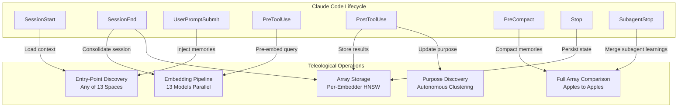
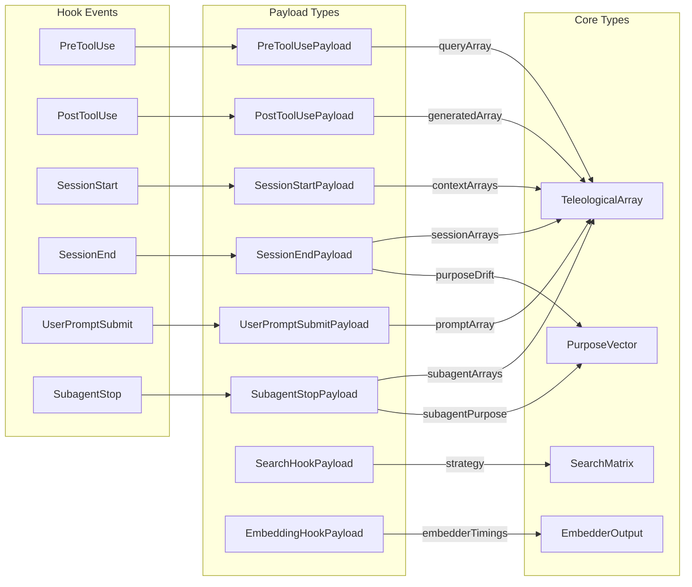

# Technical Architecture Specification

```xml
<technical_spec id="TECH-TELEOLOGICAL-ARRAY" version="1.0.0" implements="SPEC-TELEOLOGICAL-MEMORY">
<metadata>
  <title>Teleological Array System Architecture</title>
  <status>approved</status>
  <owner>ContextGraph Core Team</owner>
  <last_updated>2026-01-09</last_updated>
  <related_specs>
    <spec_ref>SPEC-STORAGE</spec_ref>
    <spec_ref>SPEC-SEARCH</spec_ref>
    <spec_ref>SPEC-HOOKS</spec_ref>
  </related_specs>
</metadata>

<overview>
The Teleological Array System is a multi-embedding architecture where the 13-embedding array IS the
fundamental unit of storage and comparison. Unlike traditional single-vector approaches, this system
maintains semantic fidelity across 13 distinct embedding spaces, enabling nuanced multi-perspective
retrieval while enforcing strict "apples-to-apples" comparison semantics.

Key Design Principles:
1. Atomic Arrays: All 13 embeddings are generated, stored, and compared as a single unit
2. No Manual North Star: Goals emerge autonomously from data patterns
3. Claude Code Hooks Integration: Autonomous embedding pipeline via lifecycle hooks
4. Entry-Point Discovery: Find closest matches in any of the 13 spaces
</overview>

<architecture_diagram>
```mermaid
flowchart TB
    subgraph "Claude Code Extensibility Layer"
        direction TB
        HOOKS[Hooks<br/>PreToolUse | PostToolUse<br/>SessionStart | SessionEnd<br/>UserPromptSubmit | PreCompact<br/>Stop | SubagentStop]
        SKILLS[Skills<br/>memory-inject | semantic-search<br/>array-compare | entry-discover<br/>purpose-align]
        SUBAGENTS[Subagents<br/>coder | researcher | tester<br/>reviewer | architect | documenter]
    end

    subgraph "Teleological Array System"
        direction TB

        subgraph "Embedding Layer"
            EMB[EmbeddingPipeline<br/>13 Parallel Embedders]
            E1[E1: Semantic 1024D]
            E2[E2-E4: Temporal 512Dx3]
            E5[E5: Causal 768D]
            E6[E6+E13: SPLADE Sparse]
            E7[E7: Code 1536D]
            E8[E8-E11: Graph/HDC/Multi/Entity]
            E12[E12: Late Interaction 128D/token]
        end

        subgraph "Storage Layer"
            STORE[TeleologicalStore]
            HNSW[Per-Embedder HNSW<br/>13 Indices]
            SPARSE[Sparse Inverted Index<br/>E6 + E13]
            PURPOSE_IDX[Purpose Index<br/>13D HNSW]
        end

        subgraph "Search Layer"
            ENTRY[Entry-Point Discovery<br/>Any of 13 Spaces]
            PIPELINE[5-Stage Pipeline]
            COMPARE[SearchMatrix<br/>Apples-to-Apples]
        end

        subgraph "Purpose Layer"
            DISCOVER[AutonomousPurposeDiscovery]
            DRIFT[Drift Detection]
            CLUSTER[Per-Embedder Clustering]
        end
    end

    HOOKS -->|"PreToolUse"| ENTRY
    HOOKS -->|"PostToolUse"| EMB
    HOOKS -->|"SessionStart"| ENTRY
    HOOKS -->|"SessionEnd"| DISCOVER
    HOOKS -->|"SubagentStop"| COMPARE

    SKILLS -->|"memory-inject"| EMB
    SKILLS -->|"semantic-search"| ENTRY
    SKILLS -->|"array-compare"| COMPARE

    SUBAGENTS -->|"Dispatch embed"| EMB
    SUBAGENTS -->|"Dispatch search"| ENTRY

    EMB --> E1 & E2 & E5 & E6 & E7 & E8 & E12
    E1 & E2 & E5 & E6 & E7 & E8 & E12 -->|"13 vectors"| STORE

    STORE --> HNSW & SPARSE & PURPOSE_IDX

    ENTRY -->|"Query 13 indices"| HNSW
    ENTRY -->|"Best space"| PIPELINE
    PIPELINE -->|"Candidates"| COMPARE
    COMPARE -->|"Results"| HOOKS

    STORE -->|"New arrays"| DISCOVER
    DISCOVER --> DRIFT
    DISCOVER --> CLUSTER
```
</architecture_diagram>

<data_models>
<!-- ============================================================ -->
<!-- CORE DATA MODEL: TeleologicalArray -->
<!-- ============================================================ -->
<model name="TeleologicalArray" language="rust" path="src/core/teleological_array.rs">
  <description>
    The fundamental, indivisible unit of the teleological memory system.
    Contains exactly 13 embedding vectors generated atomically.
    All comparisons operate on these arrays - never on isolated embeddings.
  </description>

  <field name="id" type="Uuid" constraints="primary_key, v4_auto">
    Unique identifier generated on creation
  </field>

  <field name="embeddings" type="[EmbedderOutput; 13]" constraints="not_null, atomic">
    The 13 embedding vectors - one per embedder.
    Invariant: All 13 slots are always populated.
    Use EmbedderOutput::default() for embedders that don't apply.
  </field>

  <field name="purpose_vector" type="PurposeVector" constraints="not_null, default: uniform">
    13D purpose alignment signature (one per embedder space).
    Each element is the cosine similarity to the emergent goal centroid.
  </field>

  <field name="johari" type="JohariFingerprint" constraints="not_null">
    Per-embedder Johari awareness classification
  </field>

  <field name="theta_to_purpose" type="f32" constraints="range: [0.0, 1.0]">
    Aggregate alignment to emergent purpose (computed from purpose_vector)
  </field>

  <field name="content_hash" type="[u8; 32]" constraints="unique, sha256">
    SHA-256 hash of source content for deduplication
  </field>

  <field name="created_at" type="DateTime&lt;Utc&gt;" constraints="not_null, auto">
    Timestamp of creation
  </field>

  <field name="last_updated" type="DateTime&lt;Utc&gt;" constraints="not_null, auto_update">
    Last update timestamp
  </field>

  <field name="access_count" type="u64" constraints="default: 0">
    Access count for importance weighting
  </field>

  <field name="source_content" type="Option&lt;String&gt;" constraints="nullable">
    Optional source content (for debugging, not indexed)
  </field>

  <field name="metadata" type="Option&lt;TeleologicalMetadata&gt;" constraints="nullable">
    Optional application-specific metadata
  </field>

  <invariants>
    <invariant id="INV-ATOMIC-13">
      All 13 embeddings MUST be populated before storage.
      Partial arrays are invalid and will panic on construction.
    </invariant>
    <invariant id="INV-DIMENSION-MATCH">
      Each embedding MUST match expected dimensions for its embedder.
      validate_dimensions() is called on construction.
    </invariant>
  </invariants>
</model>

<!-- ============================================================ -->
<!-- EMBEDDER OUTPUT: Per-Embedder Vector -->
<!-- ============================================================ -->
<model name="EmbedderOutput" language="rust" path="src/core/embedder_output.rs">
  <description>
    Output from a single embedder within a TeleologicalArray.
    Supports three embedding modalities: Dense, Sparse, TokenLevel.
  </description>

  <variants type="enum">
    <variant name="Dense" type="Vec&lt;f32&gt;">
      Dense embedding vector (most embedders: E1-E5, E7-E11)
    </variant>

    <variant name="Sparse" type="SparseVector">
      Sparse embedding (SPLADE-style: E6, E13)
    </variant>

    <variant name="TokenLevel" type="TokenLevelEmbedding">
      Token-level embeddings for late interaction (E12 ColBERT)
    </variant>
  </variants>

  <methods>
    <method name="magnitude" signature="fn magnitude(&amp;self) -> f32">
      Compute vector magnitude for ranking
    </method>

    <method name="validate_dimensions" signature="fn validate_dimensions(&amp;self, embedder: Embedder) -> Result&lt;(), DimensionError&gt;">
      Validate dimensions match expected for given embedder
    </method>

    <method name="dims" signature="fn dims(&amp;self) -> EmbedderDims">
      Get actual dimensions of this output
    </method>
  </methods>
</model>

<!-- ============================================================ -->
<!-- SPARSE VECTOR: SPLADE Embeddings -->
<!-- ============================================================ -->
<model name="SparseVector" language="rust" path="src/core/sparse_vector.rs">
  <description>
    Sparse vector representation for SPLADE embeddings (E6, E13).
    Uses inverted index format for efficient storage and retrieval.
  </description>

  <field name="indices" type="Vec&lt;u32&gt;" constraints="sorted, unique">
    Vocabulary indices with non-zero weights
  </field>

  <field name="values" type="Vec&lt;f32&gt;" constraints="positive, same_length_as_indices">
    Corresponding weight values
  </field>

  <field name="vocab_size" type="u32" constraints="default: 30522">
    Vocabulary size (30522 for BERT tokenizer)
  </field>

  <methods>
    <method name="dot" signature="fn dot(&amp;self, other: &amp;Self) -> f32">
      Compute sparse dot product with another sparse vector.
      O(n+m) merge algorithm on sorted indices.
    </method>
  </methods>
</model>

<!-- ============================================================ -->
<!-- TOKEN LEVEL EMBEDDING: ColBERT Late Interaction -->
<!-- ============================================================ -->
<model name="TokenLevelEmbedding" language="rust" path="src/core/token_level.rs">
  <description>
    Token-level embeddings for late interaction (E12 ColBERT).
    Variable number of tokens, each with fixed 128D embedding.
  </description>

  <field name="tokens" type="Vec&lt;Vec&lt;f32&gt;&gt;" constraints="inner_len: 128">
    Per-token 128D embeddings
  </field>

  <field name="token_dim" type="usize" constraints="const: 128">
    Token dimension (always 128 for ColBERT)
  </field>
</model>

<!-- ============================================================ -->
<!-- PURPOSE VECTOR: 13D Alignment Signature -->
<!-- ============================================================ -->
<model name="PurposeVector" language="rust" path="src/core/purpose_vector.rs">
  <description>
    13D purpose alignment signature.
    Each element represents alignment in one embedder space.
  </description>

  <field name="0" type="[f32; 13]" constraints="normalized, sum_to_one">
    13-element array of alignment scores [0, 1]
  </field>

  <methods>
    <method name="uniform" signature="fn uniform() -> Self">
      Create uniform purpose (equal weight to all embedders): [1/13; 13]
    </method>

    <method name="cosine_similarity" signature="fn cosine_similarity(&amp;self, other: &amp;Self) -> f32">
      Compute cosine similarity with another purpose vector
    </method>
  </methods>
</model>

<!-- ============================================================ -->
<!-- EMBEDDER ENUMERATION: 13 Embedders -->
<!-- ============================================================ -->
<model name="Embedder" language="rust" path="src/core/embedder.rs">
  <description>
    The 13 embedders that comprise a TeleologicalArray.
    Each captures a distinct semantic axis.
  </description>

  <variants type="enum">
    <variant name="Semantic" value="0" dims="1024" model="e5-large-v2">
      E1: Core meaning representation (V_meaning)
    </variant>

    <variant name="TemporalRecent" value="1" dims="512" model="custom_decay">
      E2: Recency-weighted patterns (V_freshness)
    </variant>

    <variant name="TemporalPeriodic" value="2" dims="512" model="fourier">
      E3: Cyclical/seasonal patterns (V_periodicity)
    </variant>

    <variant name="TemporalPositional" value="3" dims="512" model="sinusoidal_pe">
      E4: Sequence ordering (V_ordering)
    </variant>

    <variant name="Causal" value="4" dims="768" model="longformer_scm" asymmetric="true">
      E5: Cause-effect chain representation (V_causality)
      NOTE: Asymmetric - direction matters for similarity
    </variant>

    <variant name="SpladePrimary" value="5" dims="sparse:30522" model="splade_v2">
      E6: Sparse lexical matching (V_selectivity)
    </variant>

    <variant name="Code" value="6" dims="1536" model="qodo-embed-1.5b">
      E7: Programming language understanding (V_correctness)
    </variant>

    <variant name="Graph" value="7" dims="384" model="minilm_gnn">
      E8: Structural relationship patterns (V_connectivity)
    </variant>

    <variant name="Hdc" value="8" dims="1024" model="hdc_10k">
      E9: Holographic hyperdimensional (V_robustness)
    </variant>

    <variant name="Multimodal" value="9" dims="768" model="clip">
      E10: Cross-modal bridge (V_multimodality)
    </variant>

    <variant name="Entity" value="10" dims="384" model="minilm">
      E11: Named entity/fact representation (V_factuality)
    </variant>

    <variant name="LateInteraction" value="11" dims="128/token" model="colbert_v2">
      E12: Token-level precision retrieval (V_precision)
    </variant>

    <variant name="SpladeKeyword" value="12" dims="sparse:30522" model="splade_v3">
      E13: Term-specific matching (V_keyword_precision)
    </variant>
  </variants>

  <summary_table>
    | Index | Name | Dimensions | Type | Model |
    |-------|------|------------|------|-------|
    | E1 | Semantic | 1024 | Dense | e5-large-v2 |
    | E2 | TemporalRecent | 512 | Dense | Custom decay |
    | E3 | TemporalPeriodic | 512 | Dense | Fourier |
    | E4 | TemporalPositional | 512 | Dense | Sinusoidal PE |
    | E5 | Causal | 768 | Dense (asymmetric) | Longformer SCM |
    | E6 | SpladePrimary | ~30K vocab | Sparse | SPLADE v2 |
    | E7 | Code | 1536 | Dense | Qodo-Embed-1.5B |
    | E8 | Graph | 384 | Dense | MiniLM+GNN |
    | E9 | Hdc | 1024 | Dense | HDC 10K-bit |
    | E10 | Multimodal | 768 | Dense | CLIP |
    | E11 | Entity | 384 | Dense | MiniLM |
    | E12 | LateInteraction | 128/token | TokenLevel | ColBERT v2 |
    | E13 | SpladeKeyword | ~30K vocab | Sparse | SPLADE v3 |
  </summary_table>
</model>

<!-- ============================================================ -->
<!-- EMBEDDER MASK: Bitmask for Selection -->
<!-- ============================================================ -->
<model name="EmbedderMask" language="rust" path="src/core/embedder_mask.rs">
  <description>
    Bitmask for selecting embedders (13 bits).
    Efficient O(1) membership testing for embedder subsets.
  </description>

  <field name="0" type="u16" constraints="range: [0, 0x1FFF]">
    13-bit bitmask (bits 0-12 represent E1-E13)
  </field>

  <methods>
    <method name="empty" signature="const fn empty() -> Self">
      Empty mask (no embedders): 0x0000
    </method>

    <method name="all" signature="const fn all() -> Self">
      All 13 embedders: 0x1FFF
    </method>

    <method name="with" signature="const fn with(self, embedder: Embedder) -> Self">
      Add an embedder to the mask
    </method>

    <method name="contains" signature="const fn contains(&amp;self, embedder: Embedder) -> bool">
      Check if mask contains embedder
    </method>

    <method name="count" signature="const fn count(&amp;self) -> usize">
      Count of embedders in mask
    </method>

    <method name="iter" signature="fn iter(&amp;self) -> impl Iterator&lt;Item = Embedder&gt;">
      Iterate over embedders in mask
    </method>
  </methods>
</model>

<!-- ============================================================ -->
<!-- EMBEDDER GROUPS: Logical Groupings -->
<!-- ============================================================ -->
<model name="EmbedderGroup" language="rust" path="src/core/embedder_group.rs">
  <description>
    Predefined groups of embedders for domain-specific comparisons.
    Groups enable focused retrieval using only relevant embedding spaces.
  </description>

  <variants type="enum">
    <variant name="All" mask="0x1FFF">All 13 embedders (full comparison)</variant>
    <variant name="SemanticOnly" mask="0x0001">E1 only - pure semantic similarity</variant>
    <variant name="Temporal" mask="0x000E">E2 + E3 + E4 - temporal patterns</variant>
    <variant name="Causal" mask="0x0010">E5 only - causal relationships (asymmetric)</variant>
    <variant name="Lexical" mask="0x1020">E6 + E13 - sparse lexical matching</variant>
    <variant name="CodeOnly" mask="0x0040">E7 only - code understanding</variant>
    <variant name="Structural" mask="0x0080">E8 - graph/structural patterns</variant>
    <variant name="Holographic" mask="0x0100">E9 - holographic (robust to noise)</variant>
    <variant name="CrossModal" mask="0x0200">E10 - cross-modal embeddings</variant>
    <variant name="EntityMatching" mask="0x0400">E11 - entity/fact matching</variant>
    <variant name="TokenPrecision" mask="0x0800">E12 - token-level precision</variant>
    <variant name="Custom" type="EmbedderMask">Custom subset via bitmask</variant>
  </variants>
</model>

<!-- ============================================================ -->
<!-- SEARCH MATRIX: Comparison Strategies -->
<!-- ============================================================ -->
<model name="SearchMatrix" language="rust" path="src/search/search_matrix.rs">
  <description>
    Matrix-based search strategies for cross-embedder analysis.
    The 13x13 weight matrix controls how embedder outputs are compared.
    By default, only diagonal entries are used (apples-to-apples).
  </description>

  <field name="weights" type="[[f32; 13]; 13]" constraints="diagonal_primary">
    13x13 weight matrix.
    matrix[i][j] = weight for comparing embedder i to embedder j.
    Diagonal entries: same-embedder comparisons (E_i to E_i).
    Off-diagonal entries: cross-embedder correlations (analysis only).
  </field>

  <field name="name" type="String" constraints="not_null">
    Strategy name for logging/debugging
  </field>

  <field name="use_correlations" type="bool" constraints="default: false">
    Whether to use off-diagonal correlations.
    Default: false (apples-to-apples only).
  </field>

  <field name="aggregation" type="AggregationMethod" constraints="not_null">
    Aggregation method for combining per-embedder scores
  </field>

  <predefined_strategies>
    <strategy name="identity">
      Pure apples-to-apples: Equal weight (1/13) for each embedder on diagonal.
    </strategy>

    <strategy name="semantic_focused">
      50% weight on E1 (Semantic), rest distributed equally.
    </strategy>

    <strategy name="temporal_focused">
      Emphasize E2+E3+E4 (25%/20%/15%) for time-aware retrieval.
    </strategy>

    <strategy name="causal_focused">
      50% weight on E5 (Causal) for cause-effect reasoning.
    </strategy>

    <strategy name="code_focused">
      50% weight on E7 (Code) for programming content.
    </strategy>

    <strategy name="hybrid_lexical">
      35% E6 + 35% E13 + 30% E1 with RRF aggregation.
    </strategy>
  </predefined_strategies>
</model>

<!-- ============================================================ -->
<!-- AGGREGATION METHOD -->
<!-- ============================================================ -->
<model name="AggregationMethod" language="rust" path="src/search/aggregation.rs">
  <description>
    How to aggregate per-embedder similarity scores into final score.
  </description>

  <variants type="enum">
    <variant name="WeightedAverage">
      sum(weight_i * score_i) / sum(weight_i)
    </variant>

    <variant name="Rrf" fields="k: f32">
      Reciprocal Rank Fusion: sum(1 / (k + rank_i))
    </variant>

    <variant name="Max">
      Maximum score across all embedders
    </variant>

    <variant name="Min">
      Minimum score (conservative)
    </variant>

    <variant name="GeometricMean">
      (prod(score_i))^(1/n)
    </variant>
  </variants>
</model>
</data_models>

<component_contracts>
<!-- ============================================================ -->
<!-- TRAIT: TeleologicalArrayStore -->
<!-- ============================================================ -->
<component name="TeleologicalArrayStore" type="trait" path="src/storage/traits.rs">
  <description>
    Storage layer trait for TeleologicalArrays with per-embedder indices.
    Implementations must maintain atomic storage semantics.
  </description>

  <method name="store">
    <signature>async fn store(&amp;self, array: TeleologicalArray) -> CoreResult&lt;Uuid&gt;</signature>
    <implements>REQ-STORAGE-01</implements>
    <behavior>
      1. Validate all 13 embeddings have correct dimensions
      2. Compute content hash for deduplication
      3. Check if array with same hash exists (return existing ID if duplicate)
      4. Store full array in primary storage (RocksDB)
      5. Update all 13 HNSW indices atomically
      6. Update sparse inverted index for E6 and E13
      7. Update purpose index with 13D purpose vector
      8. Return new array ID
    </behavior>
    <throws>StorageError::DimensionMismatch, StorageError::IndexFailure</throws>
  </method>

  <method name="retrieve">
    <signature>async fn retrieve(&amp;self, id: Uuid) -> CoreResult&lt;TeleologicalArray&gt;</signature>
    <implements>REQ-STORAGE-02</implements>
    <behavior>
      1. Lookup array by ID in primary storage
      2. Return full TeleologicalArray with all 13 embeddings
      3. Increment access_count
      4. Update last_updated timestamp
    </behavior>
    <throws>StorageError::NotFound</throws>
  </method>

  <method name="search_by_embedder">
    <signature>async fn search_by_embedder(&amp;self, embedder: Embedder, query: &amp;EmbedderOutput, top_k: usize) -> CoreResult&lt;Vec&lt;(Uuid, f32)&gt;&gt;</signature>
    <implements>REQ-SEARCH-01</implements>
    <behavior>
      1. Validate query dimensions match embedder
      2. Query the specific embedder's HNSW index
      3. Return top_k results with (id, similarity) pairs
    </behavior>
    <throws>SearchError::DimensionMismatch</throws>
  </method>

  <method name="search_sparse">
    <signature>async fn search_sparse(&amp;self, query: &amp;SparseVector, top_k: usize) -> CoreResult&lt;Vec&lt;(Uuid, f32)&gt;&gt;</signature>
    <implements>REQ-SEARCH-02</implements>
    <behavior>
      1. Query the sparse inverted index (E6 + E13)
      2. Compute dot product scores using merge algorithm
      3. Return top_k results with BM25-style scoring
    </behavior>
  </method>

  <method name="search_by_purpose">
    <signature>async fn search_by_purpose(&amp;self, purpose: &amp;PurposeVector, top_k: usize) -> CoreResult&lt;Vec&lt;(Uuid, f32)&gt;&gt;</signature>
    <implements>REQ-SEARCH-03</implements>
    <behavior>
      1. Query the 13D purpose HNSW index
      2. Return arrays with similar purpose alignment
    </behavior>
  </method>

  <method name="retrieve_random">
    <signature>async fn retrieve_random(&amp;self, count: usize) -> CoreResult&lt;Vec&lt;TeleologicalArray&gt;&gt;</signature>
    <implements>REQ-PURPOSE-01</implements>
    <behavior>
      Sample random arrays for purpose bootstrap and clustering
    </behavior>
  </method>

  <method name="delete">
    <signature>async fn delete(&amp;self, id: Uuid) -> CoreResult&lt;()&gt;</signature>
    <implements>REQ-STORAGE-03</implements>
    <behavior>
      1. Remove from primary storage
      2. Remove from all 13 HNSW indices
      3. Remove from sparse inverted index
      4. Remove from purpose index
    </behavior>
  </method>
</component>

<!-- ============================================================ -->
<!-- TRAIT: EmbedderIndex -->
<!-- ============================================================ -->
<component name="EmbedderIndex" type="trait" path="src/index/traits.rs">
  <description>
    Trait for per-embedder HNSW indices.
    Each of the 13 embedders has its own index for efficient single-space search.
  </description>

  <method name="insert">
    <signature>async fn insert(&amp;self, id: Uuid, vector: &amp;EmbedderOutput) -> CoreResult&lt;()&gt;</signature>
    <behavior>
      Insert vector into HNSW graph. Validates dimensions match embedder config.
    </behavior>
  </method>

  <method name="search">
    <signature>async fn search(&amp;self, query: &amp;EmbedderOutput, top_k: usize) -> CoreResult&lt;Vec&lt;(Uuid, f32)&gt;&gt;</signature>
    <behavior>
      Execute HNSW search. Returns top_k nearest neighbors with distances.
    </behavior>
  </method>

  <method name="remove">
    <signature>async fn remove(&amp;self, id: Uuid) -> CoreResult&lt;()&gt;</signature>
    <behavior>
      Remove vector from HNSW graph (mark as deleted for lazy cleanup).
    </behavior>
  </method>

  <method name="config">
    <signature>fn config(&amp;self) -> &amp;HnswConfig</signature>
    <behavior>
      Return HNSW configuration for this embedder
    </behavior>
  </method>
</component>

<!-- ============================================================ -->
<!-- TRAIT: TeleologicalComparator -->
<!-- ============================================================ -->
<component name="TeleologicalComparator" type="trait" path="src/compare/traits.rs">
  <description>
    Trait for comparing TeleologicalArrays.
    Enforces apples-to-apples comparison semantics.
  </description>

  <method name="compare">
    <signature>fn compare(&amp;self, a: &amp;TeleologicalArray, b: &amp;TeleologicalArray, strategy: &amp;SearchMatrix) -> ComparisonResult</signature>
    <implements>REQ-COMPARE-01</implements>
    <behavior>
      1. Validate both arrays have all 13 embeddings
      2. For each embedder with non-zero diagonal weight:
         a. Compute embedder-specific similarity (E_i to E_i)
         b. Apply embedder weight from matrix
      3. If use_correlations, also compute off-diagonal correlations
      4. Aggregate per-embedder scores using aggregation method
      5. Return ComparisonResult with breakdown
    </behavior>
    <throws>ComparisonError::InvalidWeights, ComparisonError::DimensionMismatch</throws>
  </method>

  <method name="compare_single">
    <signature>fn compare_single(&amp;self, a: &amp;TeleologicalArray, b: &amp;TeleologicalArray, embedder: Embedder) -> f32</signature>
    <implements>REQ-COMPARE-02</implements>
    <behavior>
      Compare single embedder output (E_i to E_i only).
      For asymmetric embedders (E5 Causal), direction matters.
    </behavior>
  </method>

  <method name="compare_group">
    <signature>fn compare_group(&amp;self, a: &amp;TeleologicalArray, b: &amp;TeleologicalArray, group: EmbedderGroup) -> f32</signature>
    <implements>REQ-COMPARE-03</implements>
    <behavior>
      Compare embedder group with equal weights within group.
    </behavior>
  </method>
</component>

<!-- ============================================================ -->
<!-- STRUCT: EntryPointDiscoveryEngine -->
<!-- ============================================================ -->
<component name="EntryPointDiscoveryEngine" type="struct" path="src/search/entry_point.rs">
  <description>
    Entry-point discovery engine for multi-space search.
    Finds which of 13 spaces has the best match, then uses as anchor.
  </description>

  <fields>
    <field name="indices" type="[HnswIndex; 13]">Per-embedder HNSW indices</field>
    <field name="config" type="EntryPointConfig">Discovery configuration</field>
  </fields>

  <method name="search">
    <signature>async fn search(&amp;self, query: &amp;TeleologicalArray, top_k: usize) -> CoreResult&lt;Vec&lt;(TeleologicalArray, ComparisonResult)&gt;&gt;</signature>
    <implements>REQ-SEARCH-04</implements>
    <behavior>
      Stage 1: Query all 13 HNSW indices in parallel (O(log N) each)
      Stage 2: Find space with highest similarity match
      Stage 3: Use that space's candidates for full comparison
      Stage 4: Refine using configured SearchMatrix

      Complexity: O(log N) + O(refinement_k) with parallelization
    </behavior>
  </method>

  <method name="discover_entry_point">
    <signature>async fn discover_entry_point(&amp;self, query: &amp;TeleologicalArray) -> CoreResult&lt;EntryPointInfo&gt;</signature>
    <behavior>
      Determine which embedding space provides the best match for query.
      Returns EntryPointInfo with best embedder and similarity.
    </behavior>
  </method>
</component>

<!-- ============================================================ -->
<!-- STRUCT: EmbeddingPipeline -->
<!-- ============================================================ -->
<component name="EmbeddingPipeline" type="struct" path="src/embed/pipeline.rs">
  <description>
    Pipeline for generating complete TeleologicalArrays.
    All 13 embeddings are generated atomically - no partial arrays.
  </description>

  <fields>
    <field name="embedders" type="[Arc&lt;dyn Embedder&gt;; 13]">GPU-accelerated embedder instances</field>
    <field name="batch_queue" type="BatchQueue">Batch queue for efficient GPU utilization</field>
    <field name="config" type="PipelineConfig">Pipeline configuration</field>
  </fields>

  <method name="embed">
    <signature>async fn embed(&amp;self, content: &amp;str) -> CoreResult&lt;TeleologicalArray&gt;</signature>
    <implements>REQ-EMBED-01</implements>
    <behavior>
      1. Compute SHA-256 content hash
      2. Generate all 13 embeddings in parallel (GPU batched)
      3. Validate all embeddings have correct dimensions
      4. If any embedder fails, entire operation fails (atomicity)
      5. Construct and return TeleologicalArray
    </behavior>
    <throws>CoreError::Embedding</throws>
    <performance>Target: &lt;35ms for single embed (all 13)</performance>
  </method>

  <method name="embed_batch">
    <signature>async fn embed_batch(&amp;self, contents: &amp;[String]) -> CoreResult&lt;Vec&lt;TeleologicalArray&gt;&gt;</signature>
    <implements>REQ-EMBED-02</implements>
    <behavior>
      Batch embed multiple contents efficiently using GPU batching.
    </behavior>
    <performance>Target: &lt;120ms for 64 items</performance>
  </method>
</component>

<!-- ============================================================ -->
<!-- STRUCT: AutonomousPurposeDiscovery -->
<!-- ============================================================ -->
<component name="AutonomousPurposeDiscovery" type="struct" path="src/purpose/discovery.rs">
  <description>
    Autonomous purpose discovery from stored TeleologicalArrays.
    Goals emerge from data patterns - NO manual north star.
  </description>

  <fields>
    <field name="store" type="Arc&lt;dyn TeleologicalMemoryStore&gt;">Memory store for accessing stored arrays</field>
    <field name="cluster_states" type="[ClusterState; 13]">Per-embedder clustering state</field>
    <field name="current_purpose" type="RwLock&lt;PurposeVector&gt;">Current emergent purpose (13D)</field>
    <field name="purpose_history" type="RwLock&lt;Vec&lt;PurposeSnapshot&gt;&gt;">Purpose evolution history</field>
  </fields>

  <method name="bootstrap">
    <signature>async fn bootstrap(&amp;self) -> CoreResult&lt;PurposeVector&gt;</signature>
    <implements>REQ-PURPOSE-02</implements>
    <behavior>
      1. Sample stored arrays (up to 1000)
      2. For each embedder space, compute centroid
      3. Purpose vector = normalized magnitude of each centroid
      4. Normalize to unit sum
      5. Store as current_purpose
    </behavior>
  </method>

  <method name="update">
    <signature>async fn update(&amp;self, new_arrays: &amp;[TeleologicalArray]) -> CoreResult&lt;()&gt;</signature>
    <implements>REQ-PURPOSE-03</implements>
    <behavior>
      1. Exponential moving average update (alpha=0.01)
      2. Re-normalize to unit sum
      3. Record snapshot in history
    </behavior>
  </method>

  <method name="detect_drift">
    <signature>async fn detect_drift(&amp;self) -> Option&lt;PurposeDrift&gt;</signature>
    <implements>REQ-PURPOSE-04</implements>
    <behavior>
      1. Compare recent vs previous purpose
      2. Compute drift magnitude (L2 distance)
      3. If magnitude > 0.1, return PurposeDrift with direction
    </behavior>
  </method>
</component>

<!-- ============================================================ -->
<!-- STRUCT: RetrievalPipeline -->
<!-- ============================================================ -->
<component name="RetrievalPipeline" type="struct" path="src/search/retrieval_pipeline.rs">
  <description>
    5-stage retrieval pipeline for production-quality search.
  </description>

  <stages>
    <stage number="1" name="Sparse Recall" index="E13 SPLADE inverted" latency="&lt;5ms">
      High-recall sparse retrieval from inverted index
    </stage>
    <stage number="2" name="Semantic ANN" index="E1 Matryoshka 128D" latency="&lt;10ms">
      Narrow by semantic similarity in E1 space
    </stage>
    <stage number="3" name="Multi-space Rerank" index="All 13 HNSW" latency="&lt;20ms">
      RRF fusion across all 13 embedding spaces
    </stage>
    <stage number="4" name="Teleological Filter" index="Purpose vector" latency="&lt;10ms">
      Filter by purpose alignment (13D cosine similarity)
    </stage>
    <stage number="5" name="Late Interaction" index="E12 MaxSim" latency="&lt;15ms">
      Final precision reranking with token-level MaxSim
    </stage>
  </stages>

  <method name="retrieve">
    <signature>async fn retrieve(&amp;self, query: &amp;TeleologicalArray, top_k: usize) -> CoreResult&lt;Vec&lt;TeleologicalSearchResult&gt;&gt;</signature>
    <implements>REQ-SEARCH-05</implements>
    <performance>
      Total @ 1M vectors: &lt;60ms
      Total @ 100K vectors: &lt;30ms
    </performance>
  </method>
</component>
</component_contracts>

<hook_integration_layer>
<!-- ============================================================ -->
<!-- TYPESCRIPT INTERFACES: Hook Payloads -->
<!-- ============================================================ -->
<interface name="TeleologicalHookPayload" language="typescript" path="src/hooks/types.ts">
  <description>
    Base payload interface for all teleological hooks.
    Claude Code provides 8 lifecycle hooks that integrate with the system.
  </description>

  <field name="hookType" type="HookType" required="true">
    Hook event type
  </field>

  <field name="sessionId" type="string" required="true">
    Session identifier for correlation
  </field>

  <field name="timestamp" type="string" required="true">
    ISO-8601 timestamp of hook invocation
  </field>

  <field name="arrayIds" type="string[]" required="false">
    Optional teleological array IDs involved
  </field>

  <field name="activeEmbedders" type="EmbedderMask" required="true">
    Which embedder spaces are active for this operation
  </field>

  <typescript_definition>
```typescript
type HookType =
  | 'PreToolUse'
  | 'PostToolUse'
  | 'SessionStart'
  | 'SessionEnd'
  | 'UserPromptSubmit'
  | 'PreCompact'
  | 'Stop'
  | 'SubagentStop';

interface TeleologicalHookPayload {
  hookType: HookType;
  sessionId: string;
  timestamp: string;
  arrayIds?: string[];
  activeEmbedders: number; // 13-bit mask
}
```
  </typescript_definition>
</interface>

<interface name="PreToolUsePayload" language="typescript" extends="TeleologicalHookPayload">
  <description>
    Payload for PreToolUse hook - triggers query embedding
  </description>

  <field name="hookType" type="'PreToolUse'" required="true" const="true"/>
  <field name="toolName" type="string" required="true">Tool being invoked</field>
  <field name="toolInput" type="Record&lt;string, unknown&gt;" required="true">Tool input parameters</field>
  <field name="queryArray" type="TeleologicalArraySummary" required="false">Pre-computed query embedding</field>
  <field name="suggestedEntryPoint" type="Embedder" required="true">Suggested entry-point embedder based on tool type</field>

  <typescript_definition>
```typescript
interface PreToolUsePayload extends TeleologicalHookPayload {
  hookType: 'PreToolUse';
  toolName: string;
  toolInput: Record<string, unknown>;
  queryArray?: TeleologicalArraySummary;
  suggestedEntryPoint: Embedder;
}
```
  </typescript_definition>
</interface>

<interface name="PostToolUsePayload" language="typescript" extends="TeleologicalHookPayload">
  <description>
    Payload for PostToolUse hook - triggers result storage
  </description>

  <field name="hookType" type="'PostToolUse'" required="true" const="true"/>
  <field name="toolName" type="string" required="true">Tool that was invoked</field>
  <field name="toolOutput" type="string" required="true">Tool output</field>
  <field name="shouldStore" type="boolean" required="true">Whether output should be embedded and stored</field>
  <field name="contentHash" type="string" required="true">Content hash for deduplication check</field>
  <field name="generatedArray" type="TeleologicalArraySummary" required="false">Generated array if shouldStore=true</field>

  <typescript_definition>
```typescript
interface PostToolUsePayload extends TeleologicalHookPayload {
  hookType: 'PostToolUse';
  toolName: string;
  toolOutput: string;
  shouldStore: boolean;
  contentHash: string;
  generatedArray?: TeleologicalArraySummary;
}
```
  </typescript_definition>
</interface>

<interface name="SessionStartPayload" language="typescript" extends="TeleologicalHookPayload">
  <description>
    Payload for SessionStart hook - triggers context loading
  </description>

  <field name="hookType" type="'SessionStart'" required="true" const="true"/>
  <field name="projectPath" type="string" required="true">Project path for scoped memory retrieval</field>
  <field name="previousSessionId" type="string" required="false">Previous session ID for continuity</field>
  <field name="contextArrays" type="TeleologicalArraySummary[]" required="true">Retrieved context arrays from previous sessions</field>
  <field name="currentPurpose" type="number[]" required="true">Current purpose vector (13D)</field>

  <typescript_definition>
```typescript
interface SessionStartPayload extends TeleologicalHookPayload {
  hookType: 'SessionStart';
  projectPath: string;
  previousSessionId?: string;
  contextArrays: TeleologicalArraySummary[];
  currentPurpose: number[]; // length 13
}
```
  </typescript_definition>
</interface>

<interface name="SessionEndPayload" language="typescript" extends="TeleologicalHookPayload">
  <description>
    Payload for SessionEnd hook - triggers consolidation
  </description>

  <field name="hookType" type="'SessionEnd'" required="true" const="true"/>
  <field name="tasksCompleted" type="string[]" required="true">Tasks completed in this session</field>
  <field name="durationSecs" type="number" required="true">Session duration in seconds</field>
  <field name="sessionArrays" type="TeleologicalArraySummary[]" required="true">Arrays created during session</field>
  <field name="purposeDrift" type="PurposeDriftInfo" required="false">Purpose drift detected during session</field>
  <field name="consolidationArray" type="TeleologicalArraySummary" required="false">Consolidated summary array</field>

  <typescript_definition>
```typescript
interface SessionEndPayload extends TeleologicalHookPayload {
  hookType: 'SessionEnd';
  tasksCompleted: string[];
  durationSecs: number;
  sessionArrays: TeleologicalArraySummary[];
  purposeDrift?: PurposeDriftInfo;
  consolidationArray?: TeleologicalArraySummary;
}
```
  </typescript_definition>
</interface>

<interface name="UserPromptSubmitPayload" language="typescript" extends="TeleologicalHookPayload">
  <description>
    Payload for UserPromptSubmit hook - triggers memory injection
  </description>

  <field name="hookType" type="'UserPromptSubmit'" required="true" const="true"/>
  <field name="prompt" type="string" required="true">User's prompt text</field>
  <field name="promptArray" type="TeleologicalArraySummary" required="true">Prompt embedding for retrieval</field>
  <field name="entryPointResults" type="EntryPointDiscoveryResult[]" required="true">Entry-point discovery results</field>
  <field name="injectedMemories" type="TeleologicalArraySummary[]" required="true">Retrieved memories to inject</field>

  <typescript_definition>
```typescript
interface UserPromptSubmitPayload extends TeleologicalHookPayload {
  hookType: 'UserPromptSubmit';
  prompt: string;
  promptArray: TeleologicalArraySummary;
  entryPointResults: EntryPointDiscoveryResult[];
  injectedMemories: TeleologicalArraySummary[];
}
```
  </typescript_definition>
</interface>

<interface name="SearchHookPayload" language="typescript" extends="TeleologicalHookPayload">
  <description>
    Search hook payload for search operations
  </description>

  <field name="query" type="string" required="true">Search query text</field>
  <field name="queryArray" type="TeleologicalArraySummary" required="true">Generated query array</field>
  <field name="strategy" type="SearchMatrixStrategy" required="true">Search strategy used</field>
  <field name="entryPoints" type="EntryPointDiscoveryResult[]" required="false">Entry-point discovery results</field>
  <field name="topK" type="number" required="true">Number of results requested</field>
  <field name="minSimilarity" type="number" required="true">Minimum similarity threshold</field>
  <field name="results" type="SearchResultSummary[]" required="false">Results returned</field>
  <field name="latencyMs" type="number" required="false">Search latency in milliseconds</field>

  <typescript_definition>
```typescript
type SearchMatrixStrategy =
  | 'identity'
  | 'semantic_focused'
  | 'temporal_focused'
  | 'causal_focused'
  | 'code_focused'
  | 'hybrid_lexical'
  | 'entry_point_discovery'
  | 'custom';

interface SearchHookPayload extends TeleologicalHookPayload {
  query: string;
  queryArray: TeleologicalArraySummary;
  strategy: SearchMatrixStrategy;
  entryPoints?: EntryPointDiscoveryResult[];
  topK: number;
  minSimilarity: number;
  results?: SearchResultSummary[];
  latencyMs?: number;
}
```
  </typescript_definition>
</interface>

<interface name="EmbeddingHookPayload" language="typescript" extends="TeleologicalHookPayload">
  <description>
    Embedding hook payload for embedding operations
  </description>

  <field name="contentHash" type="string" required="true">Content being embedded</field>
  <field name="contentLength" type="number" required="true">Content length in characters</field>
  <field name="generatedArray" type="TeleologicalArraySummary" required="false">Generated array (if successful)</field>
  <field name="embedderTimings" type="number[]" required="false">Per-embedder timing in milliseconds (13 values)</field>
  <field name="totalTimeMs" type="number" required="true">Total embedding time in milliseconds</field>
  <field name="hadFailures" type="boolean" required="true">Whether any embedders failed</field>
  <field name="failedEmbedders" type="number[]" required="false">Failed embedder indices (if any)</field>

  <typescript_definition>
```typescript
interface EmbeddingHookPayload extends TeleologicalHookPayload {
  contentHash: string;
  contentLength: number;
  generatedArray?: TeleologicalArraySummary;
  embedderTimings?: number[]; // length 13
  totalTimeMs: number;
  hadFailures: boolean;
  failedEmbedders?: number[];
}
```
  </typescript_definition>
</interface>

<interface name="SubagentStopPayload" language="typescript" extends="TeleologicalHookPayload">
  <description>
    Payload for SubagentStop hook - triggers learning merge
  </description>

  <field name="hookType" type="'SubagentStop'" required="true" const="true"/>
  <field name="subagentType" type="SubagentType" required="true">Subagent type that stopped</field>
  <field name="subagentSessionId" type="string" required="true">Subagent session identifier</field>
  <field name="subagentArrays" type="TeleologicalArraySummary[]" required="true">Arrays created by subagent</field>
  <field name="subagentPurpose" type="number[]" required="true">Subagent's learned purpose vector (13D)</field>
  <field name="mergeStrategy" type="SubagentMergeStrategy" required="true">How to merge with parent agent</field>

  <typescript_definition>
```typescript
type SubagentType =
  | 'coder'
  | 'researcher'
  | 'tester'
  | 'reviewer'
  | 'architect'
  | 'documenter';

type SubagentMergeStrategy =
  | 'absorb'      // Parent absorbs all subagent arrays
  | 'selective'   // Parent selects high-value arrays
  | 'summarize'   // Consolidate into summary array
  | 'federated';  // Keep separate but linked

interface SubagentStopPayload extends TeleologicalHookPayload {
  hookType: 'SubagentStop';
  subagentType: SubagentType;
  subagentSessionId: string;
  subagentArrays: TeleologicalArraySummary[];
  subagentPurpose: number[]; // length 13
  mergeStrategy: SubagentMergeStrategy;
}
```
  </typescript_definition>
</interface>

<interface name="TeleologicalArraySummary" language="typescript">
  <description>
    Summary view of TeleologicalArray for hook payloads (lightweight)
  </description>

  <typescript_definition>
```typescript
interface TeleologicalArraySummary {
  id: string;                    // UUID
  contentHash: string;           // SHA-256 hex
  purposeVector: number[];       // 13D
  dominantEmbedder: Embedder;
  createdAt: string;             // ISO-8601
  accessCount: number;
  thetaToPurpose: number;        // [0, 1]
}
```
  </typescript_definition>
</interface>

<interface name="TeleologicalHooksConfig" language="typescript" path="src/hooks/config.ts">
  <description>
    Hook configuration for Teleological Array integration
  </description>

  <typescript_definition>
```typescript
interface TeleologicalHooksConfig {
  /** Enable autonomous embedding on PostToolUse */
  autoEmbedOnToolUse: boolean;

  /** Minimum content length to trigger embedding */
  minContentLength: number;

  /** File patterns to ignore for embedding */
  ignorePatterns: string[];

  /** Entry-point discovery configuration */
  entryPointConfig: {
    /** Which embedders to consider as entry points */
    candidateEmbedders: number; // 13-bit mask
    /** Candidates per space */
    perSpaceTopK: number;
    /** Minimum similarity threshold */
    minEntrySimilarity: number;
  };

  /** Session consolidation configuration */
  consolidationConfig: {
    /** Enable automatic session consolidation */
    autoConsolidate: boolean;
    /** Maximum arrays before triggering compaction */
    compactionThreshold: number;
    /** Similarity threshold for merging arrays */
    mergeThreshold: number;
  };

  /** Subagent coordination configuration */
  subagentConfig: {
    /** Default merge strategy */
    defaultMergeStrategy: SubagentMergeStrategy;
    /** Share purpose vector with subagents */
    sharePurpose: boolean;
    /** Inherit parent context arrays */
    inheritContext: boolean;
  };
}
```
  </typescript_definition>
</interface>
</hook_integration_layer>

<api_contracts>
<!-- ============================================================ -->
<!-- MCP TOOL: store_memory -->
<!-- ============================================================ -->
<endpoint tool="store_memory" protocol="MCP">
  <implements>REQ-STORE-01</implements>
  <description>
    Store content into teleological memory with full 13-embedding array generation.
  </description>

  <request_schema>
```json
{
  "type": "object",
  "properties": {
    "content": {
      "type": "string",
      "description": "Content to embed and store",
      "minLength": 1
    },
    "importance": {
      "type": "number",
      "description": "Importance score [0, 1]",
      "minimum": 0,
      "maximum": 1,
      "default": 0.5
    },
    "rationale": {
      "type": "string",
      "description": "Reason for storing this memory"
    },
    "metadata": {
      "type": "object",
      "description": "Application-specific metadata"
    }
  },
  "required": ["content"]
}
```
  </request_schema>

  <response_schema>
```json
{
  "type": "object",
  "properties": {
    "id": {
      "type": "string",
      "format": "uuid",
      "description": "Generated array UUID"
    },
    "contentHash": {
      "type": "string",
      "description": "SHA-256 content hash"
    },
    "wasDuplicate": {
      "type": "boolean",
      "description": "Whether content was deduplicated"
    },
    "embedTimingsMs": {
      "type": "array",
      "items": { "type": "number" },
      "description": "Per-embedder timing (13 values)"
    },
    "dominantEmbedder": {
      "type": "string",
      "description": "Embedder with highest magnitude"
    }
  }
}
```
  </response_schema>

  <errors>
    <error code="EMBEDDING_FAILED" description="One or more embedders failed to generate output"/>
    <error code="DIMENSION_MISMATCH" description="Generated embedding has wrong dimensions"/>
    <error code="STORAGE_FAILURE" description="Failed to persist to storage"/>
  </errors>
</endpoint>

<!-- ============================================================ -->
<!-- MCP TOOL: search_memory -->
<!-- ============================================================ -->
<endpoint tool="search_memory" protocol="MCP">
  <implements>REQ-SEARCH-05</implements>
  <description>
    Search teleological memory using entry-point discovery pattern or custom strategies.
  </description>

  <request_schema>
```json
{
  "type": "object",
  "properties": {
    "query": {
      "type": "string",
      "description": "Search query text",
      "minLength": 1
    },
    "top_k": {
      "type": "integer",
      "description": "Maximum results to return",
      "minimum": 1,
      "maximum": 1000,
      "default": 10
    },
    "strategy": {
      "type": "string",
      "enum": ["full", "entry_point", "single_embedder", "hybrid", "custom"],
      "default": "entry_point",
      "description": "Search strategy to use"
    },
    "embedder": {
      "type": "string",
      "description": "Specific embedder for single_embedder strategy"
    },
    "min_similarity": {
      "type": "number",
      "minimum": 0,
      "maximum": 1,
      "default": 0.3,
      "description": "Minimum similarity threshold"
    },
    "embedder_group": {
      "type": "string",
      "enum": ["All", "SemanticOnly", "Temporal", "Causal", "Lexical", "CodeOnly", "Structural"],
      "description": "Embedder group to focus on"
    },
    "custom_weights": {
      "type": "array",
      "items": { "type": "array", "items": { "type": "number" } },
      "description": "13x13 weight matrix for custom strategy"
    }
  },
  "required": ["query"]
}
```
  </request_schema>

  <response_schema>
```json
{
  "type": "object",
  "properties": {
    "results": {
      "type": "array",
      "items": {
        "type": "object",
        "properties": {
          "id": { "type": "string", "format": "uuid" },
          "similarity": { "type": "number" },
          "rank": { "type": "integer" },
          "entryEmbedder": { "type": "string" },
          "purposeAlignment": { "type": "number" },
          "summary": { "type": "string" }
        }
      }
    },
    "entryPoint": {
      "type": "object",
      "properties": {
        "embedder": { "type": "string" },
        "similarity": { "type": "number" }
      }
    },
    "queryEmbeddingId": {
      "type": "string",
      "format": "uuid"
    },
    "latencyMs": {
      "type": "number"
    },
    "stageTimings": {
      "type": "object",
      "properties": {
        "stage1_sparse_recall_ms": { "type": "number" },
        "stage2_semantic_ann_ms": { "type": "number" },
        "stage3_multispace_rerank_ms": { "type": "number" },
        "stage4_teleological_filter_ms": { "type": "number" },
        "stage5_late_interaction_ms": { "type": "number" }
      }
    }
  }
}
```
  </response_schema>

  <errors>
    <error code="NO_RESULTS" description="No results above minimum similarity threshold"/>
    <error code="INVALID_STRATEGY" description="Unknown search strategy"/>
    <error code="INVALID_EMBEDDER" description="Unknown embedder specified"/>
  </errors>
</endpoint>

<!-- ============================================================ -->
<!-- MCP TOOL: compare_memory -->
<!-- ============================================================ -->
<endpoint tool="compare_memory" protocol="MCP">
  <implements>REQ-COMPARE-01</implements>
  <description>
    Compare two TeleologicalArrays using apples-to-apples semantics.
  </description>

  <request_schema>
```json
{
  "type": "object",
  "properties": {
    "id1": {
      "type": "string",
      "format": "uuid",
      "description": "First TeleologicalArray UUID"
    },
    "id2": {
      "type": "string",
      "format": "uuid",
      "description": "Second TeleologicalArray UUID"
    },
    "comparison_type": {
      "type": "string",
      "enum": ["full", "single_embedder", "embedder_group", "purpose_vector"],
      "default": "full"
    },
    "embedder": {
      "type": "string",
      "description": "Specific embedder for single_embedder comparison"
    },
    "include_correlations": {
      "type": "boolean",
      "default": false,
      "description": "Include cross-embedder correlation analysis"
    }
  },
  "required": ["id1", "id2"]
}
```
  </request_schema>

  <response_schema>
```json
{
  "type": "object",
  "properties": {
    "similarity": {
      "type": "number",
      "description": "Overall similarity score [0, 1]"
    },
    "embedderScores": {
      "type": "array",
      "items": { "type": "number" },
      "description": "Per-embedder breakdown (13 values)"
    },
    "activeEmbedders": {
      "type": "integer",
      "description": "13-bit mask of contributing embedders"
    },
    "computationTimeUs": {
      "type": "integer"
    },
    "correlations": {
      "type": "object",
      "description": "Cross-embedder correlation patterns (if requested)"
    }
  }
}
```
  </response_schema>
</endpoint>

<!-- ============================================================ -->
<!-- MCP TOOL: discover_entry_point -->
<!-- ============================================================ -->
<endpoint tool="discover_entry_point" protocol="MCP">
  <implements>REQ-SEARCH-04</implements>
  <description>
    Find optimal entry point across 13 embedding spaces for a query.
  </description>

  <request_schema>
```json
{
  "type": "object",
  "properties": {
    "query": {
      "type": "string",
      "description": "Query text to analyze",
      "minLength": 1
    },
    "candidate_embedders": {
      "type": "array",
      "items": { "type": "string" },
      "description": "Embedders to consider (all 13 by default)"
    },
    "min_similarity": {
      "type": "number",
      "minimum": 0,
      "maximum": 1,
      "default": 0.3
    }
  },
  "required": ["query"]
}
```
  </request_schema>

  <response_schema>
```json
{
  "type": "object",
  "properties": {
    "bestEntryPoint": {
      "type": "string",
      "description": "Embedder with highest similarity"
    },
    "similarity": {
      "type": "number"
    },
    "spaceRankings": {
      "type": "array",
      "items": {
        "type": "object",
        "properties": {
          "embedder": { "type": "string" },
          "similarity": { "type": "number" },
          "rank": { "type": "integer" }
        }
      }
    },
    "queryEmbeddingId": {
      "type": "string",
      "format": "uuid"
    }
  }
}
```
  </response_schema>
</endpoint>

<!-- ============================================================ -->
<!-- MCP TOOL: get_purpose -->
<!-- ============================================================ -->
<endpoint tool="get_purpose" protocol="MCP">
  <implements>REQ-PURPOSE-05</implements>
  <description>
    Get current emergent purpose vector (13D).
  </description>

  <request_schema>
```json
{
  "type": "object",
  "properties": {
    "include_history": {
      "type": "boolean",
      "default": false,
      "description": "Include purpose evolution history"
    },
    "history_limit": {
      "type": "integer",
      "default": 10
    }
  }
}
```
  </request_schema>

  <response_schema>
```json
{
  "type": "object",
  "properties": {
    "purpose": {
      "type": "array",
      "items": { "type": "number" },
      "description": "Current 13D purpose vector"
    },
    "lastUpdated": {
      "type": "string",
      "format": "date-time"
    },
    "drift": {
      "type": "object",
      "properties": {
        "detected": { "type": "boolean" },
        "magnitude": { "type": "number" },
        "direction": { "type": "array", "items": { "type": "number" } }
      }
    },
    "history": {
      "type": "array",
      "items": {
        "type": "object",
        "properties": {
          "timestamp": { "type": "string", "format": "date-time" },
          "purpose": { "type": "array", "items": { "type": "number" } }
        }
      }
    }
  }
}
```
  </response_schema>
</endpoint>
</api_contracts>

<memory_layout>
<!-- ============================================================ -->
<!-- STORAGE SIZE CALCULATIONS -->
<!-- ============================================================ -->
<memory_model name="TeleologicalArray Storage">
  <description>
    Per-array storage footprint with quantization options.
  </description>

  <breakdown>
    | Component | Raw Size | Quantized Size | Notes |
    |-----------|----------|----------------|-------|
    | E1 Semantic (1024D) | 4096B | 1024B (PQ-8) | Product quantization |
    | E2 Temporal Recent (512D) | 2048B | 512B (PQ-8) | |
    | E3 Temporal Periodic (512D) | 2048B | 512B (PQ-8) | |
    | E4 Temporal Positional (512D) | 2048B | 512B (PQ-8) | |
    | E5 Causal (768D) | 3072B | 768B (PQ-8) | |
    | E6 SPLADE Primary (sparse) | ~400B avg | ~400B | Inverted index |
    | E7 Code (1536D) | 6144B | 1536B (PQ-8) | |
    | E8 Graph (384D) | 1536B | 384B (PQ-8) | |
    | E9 HDC (1024D) | 4096B | 128B (Binary) | Binary quantization |
    | E10 Multimodal (768D) | 3072B | 768B (PQ-8) | |
    | E11 Entity (384D) | 1536B | 384B (PQ-8) | |
    | E12 Late Interaction (~64 tokens) | ~32KB | ~8KB (Float8) | Variable |
    | E13 SPLADE Keyword (sparse) | ~400B avg | ~400B | Inverted index |
    | Purpose Vector (13D) | 52B | 52B | Not quantized |
    | Metadata | ~200B | ~200B | |
    | **Total (typical)** | **~68KB** | **~17KB** | 4x compression |
  </breakdown>

  <quantization_strategies>
    <strategy name="PQ-8" description="Product quantization with 8 centroids per subvector">
      Used for dense embeddings (E1-E5, E7-E8, E10-E11).
      4x memory reduction with ~5% recall loss.
    </strategy>

    <strategy name="Binary" description="Binary quantization for HDC">
      Used for E9 HDC (naturally binary-like).
      32x memory reduction, maintains Hamming distance properties.
    </strategy>

    <strategy name="Float8" description="8-bit floating point">
      Used for E12 Late Interaction tokens.
      2x memory reduction with minimal precision loss.
    </strategy>

    <strategy name="Inverted" description="Inverted index for sparse vectors">
      Used for E6 and E13 SPLADE.
      Store only non-zero indices and values.
    </strategy>
  </quantization_strategies>
</memory_model>

<!-- ============================================================ -->
<!-- HNSW INDEX CONFIGURATION -->
<!-- ============================================================ -->
<index_config name="Per-Embedder HNSW">
  <description>
    Optimized HNSW configuration per embedder.
  </description>

  <configs>
    | Embedder | Dims | M | ef_construction | ef_search | Distance |
    |----------|------|---|-----------------|-----------|----------|
    | E1 Semantic | 1024 | 16 | 200 | 100 | Cosine |
    | E2 Temporal Recent | 512 | 12 | 150 | 80 | Cosine |
    | E3 Temporal Periodic | 512 | 12 | 150 | 80 | Cosine |
    | E4 Temporal Positional | 512 | 12 | 150 | 80 | Cosine |
    | E5 Causal | 768 | 24 | 300 | 150 | Cosine |
    | E6 SPLADE Primary | N/A | N/A | N/A | N/A | Inverted |
    | E7 Code | 1536 | 24 | 250 | 120 | Cosine |
    | E8 Graph | 384 | 12 | 150 | 80 | Cosine |
    | E9 HDC | 1024 | 16 | 200 | 100 | Cosine |
    | E10 Multimodal | 768 | 16 | 200 | 100 | Cosine |
    | E11 Entity | 384 | 12 | 150 | 80 | Cosine |
    | E12 Late Interaction | N/A | N/A | N/A | N/A | MaxSim |
    | E13 SPLADE Keyword | N/A | N/A | N/A | N/A | Inverted |
  </configs>

  <notes>
    - Higher M for causal (E5) due to asymmetric similarity
    - Higher M for code (E7) due to high dimensionality
    - Sparse embedders (E6, E13) use inverted index, not HNSW
    - Late interaction (E12) uses MaxSim scoring, not HNSW
  </notes>
</index_config>
</memory_layout>

<performance_targets>
  <target operation="Single embed (all 13)" latency="&lt;35ms" notes="GPU batched"/>
  <target operation="Batch embed (64 items)" latency="&lt;120ms" notes="Full GPU utilization"/>
  <target operation="Storage per memory" size="~17KB" notes="PQ-8/Float8/Binary quantized"/>
  <target operation="Stage 1 (sparse recall)" latency="&lt;5ms" notes="Inverted index"/>
  <target operation="Stage 2 (semantic ANN)" latency="&lt;10ms" notes="Matryoshka 128D"/>
  <target operation="Stage 3 (multi-space rerank)" latency="&lt;20ms" notes="RRF fusion"/>
  <target operation="Stage 4 (teleological filter)" latency="&lt;10ms" notes="13D purpose vector"/>
  <target operation="Stage 5 (late interaction)" latency="&lt;15ms" notes="E12 MaxSim"/>
  <target operation="Total pipeline @ 1M" latency="&lt;60ms" notes="Full 5-stage"/>
  <target operation="Total pipeline @ 100K" latency="&lt;30ms" notes="Typical workload"/>
  <target operation="Entry-point discovery" latency="&lt;40ms" notes="Parallel HNSW queries"/>
  <target operation="Purpose alignment check" latency="&lt;1ms" notes="13D cosine similarity"/>
  <target operation="Hook invocation overhead" latency="&lt;5ms" notes="Per-hook"/>
  <target operation="Subagent spawn" latency="&lt;50ms" notes="With coordination setup"/>
</performance_targets>

<implementation_notes>
<note category="atomicity">
  All 13 embeddings MUST be generated, stored, and compared together.
  There is no valid partial TeleologicalArray. Failures in any embedder
  cause the entire operation to fail.
</note>

<note category="type_safety">
  Use TypedEmbedderOutput&lt;const E: u8&gt; for compile-time prevention of
  cross-embedder comparisons. Runtime validation via validate_comparison().
</note>

<note category="purpose">
  Manual north star creation is INVALID because a single embedding cannot
  be meaningfully compared to 13 diverse embedding spaces. Purpose emerges
  autonomously from clustering and drift analysis.
</note>

<note category="hooks">
  Claude Code hooks enable autonomous embedding without manual intervention.
  PostToolUse triggers embedding, SessionEnd triggers consolidation,
  SubagentStop triggers learning merge.
</note>

<note category="storage">
  Use RocksDB for primary storage with per-embedder HNSW indices.
  Sparse embedders (E6, E13) use inverted index, not HNSW.
  Late interaction (E12) uses MaxSim scoring directly.
</note>

<note category="performance">
  Entry-point discovery is the preferred search pattern: find best matching
  space first, then use as anchor for full comparison. This reduces 13x
  parallel queries to 1x initial discovery + focused refinement.
</note>
</implementation_notes>
</technical_spec>
```

---

## Hook Flow Diagram



## Payload Type Flow Diagram



---

*Document Version: 1.0.0*
*Generated: 2026-01-09*
*Status: Technical Architecture Specification*
