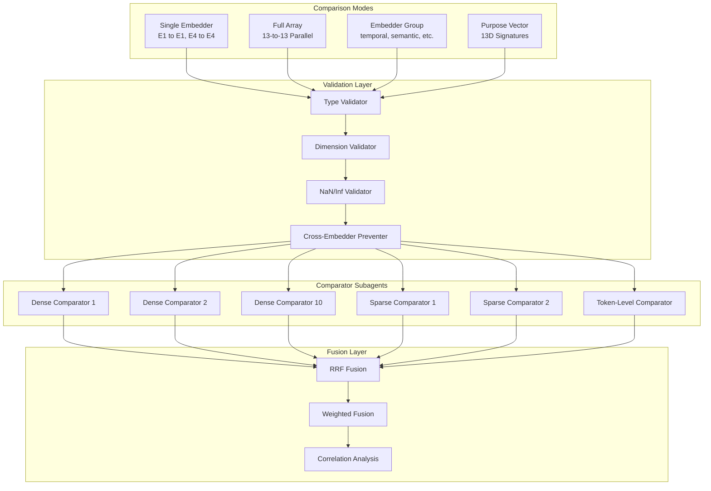
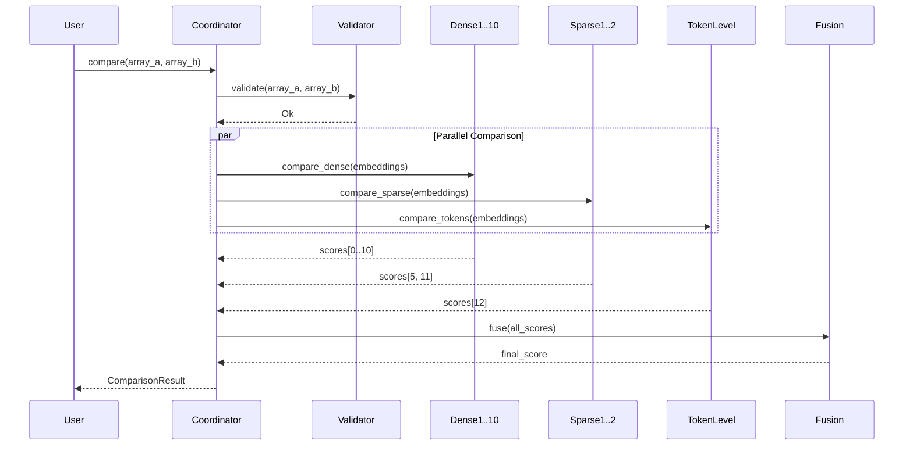

# Technical Specification: Comparison Operations

```xml
<technical_spec id="TECH-COMPARISON" version="1.0" implements="SPEC-TELEOLOGICAL-ARRAY">
<metadata>
  <title>Teleological Array Comparison System</title>
  <status>approved</status>
  <last_updated>2026-01-09</last_updated>
  <domain>comparison</domain>
  <layer>core</layer>
</metadata>

<overview>
This specification defines the comparison operations for teleological arrays.
The fundamental principle is APPLES-TO-APPLES: only compatible embedding types
are compared directly. Cross-embedder comparisons are forbidden at the type level.

Target Architecture:
  Memory Injection (MCP) -> Autonomous Embedding (13 models) -> Teleological Array Storage
    -> Entry-Point Discovery (any of 13 spaces) -> Full Array Comparison (apples to apples)
    -> Autonomous Goal Emergence (clustering)
</overview>

<architecture_diagram>

</architecture_diagram>

<data_models>
<model name="ComparisonType">
  <description>Enum defining comparison modes</description>
  <variants>
    <variant name="SingleEmbedder">
      <field name="embedder" type="Embedder" constraints="required"/>
      <description>Compare only one specific embedder space (E1 to E1)</description>
    </variant>
    <variant name="FullArray">
      <description>Compare all 13 embedders in parallel (13-to-13)</description>
    </variant>
    <variant name="EmbedderGroup">
      <field name="group" type="EmbedderGroup" constraints="required"/>
      <description>Compare a semantic group (temporal, semantic, causal, etc.)</description>
    </variant>
    <variant name="WeightedFull">
      <field name="weights" type="[f32; 13]" constraints="sum_to_one"/>
      <description>Weighted comparison across all embedders</description>
    </variant>
    <variant name="PurposeVector">
      <description>Compare 13D purpose vector signatures</description>
    </variant>
    <variant name="MatrixStrategy">
      <field name="matrix" type="SearchMatrix" constraints="required"/>
      <description>Use correlation matrix for cross-space scoring</description>
    </variant>
  </variants>
</model>

<model name="EmbedderGroup">
  <description>Semantic groupings of embedders for targeted comparison</description>
  <variants>
    <variant name="Temporal" embedders="[1, 2]">
      <description>Temporal and Counterfactual embedders</description>
    </variant>
    <variant name="Semantic" embedders="[0, 3]">
      <description>General Semantic and Entity embedders</description>
    </variant>
    <variant name="Causal" embedders="[4]">
      <description>Causal relationship embedder</description>
    </variant>
    <variant name="Lexical" embedders="[5, 12]">
      <description>SPLADE and ColBERT lexical embedders</description>
    </variant>
    <variant name="Pragmatic" embedders="[6]">
      <description>Pragmatic intent embedder</description>
    </variant>
    <variant name="Emotional" embedders="[7]">
      <description>Emotional valence embedder</description>
    </variant>
    <variant name="Technical" embedders="[8, 10]">
      <description>Code and Domain-specific embedders</description>
    </variant>
    <variant name="Multimodal" embedders="[9]">
      <description>Multimodal fusion embedder</description>
    </variant>
    <variant name="Hybrid" embedders="[11]">
      <description>Hybrid sparse embedder</description>
    </variant>
  </variants>
</model>

<model name="ComparisonResult">
  <description>Result of comparing two teleological arrays</description>
  <field name="similarity" type="f32" constraints="range: [-1.0, 1.0]"/>
  <field name="embedder_scores" type="[f32; 13]" constraints="required"/>
  <field name="active_embedders" type="EmbedderMask" constraints="required"/>
  <field name="computation_time_us" type="u64" constraints="required"/>
  <field name="correlations" type="Option<[f32; 13][13]>" constraints="optional"/>
</model>

<model name="SubagentResult">
  <description>Result from a single comparator subagent</description>
  <variants>
    <variant name="Success">
      <field name="embedder" type="Embedder" constraints="required"/>
      <field name="similarity" type="f32" constraints="range: [-1.0, 1.0]"/>
      <field name="computation_time_us" type="u64" constraints="required"/>
    </variant>
    <variant name="Error">
      <field name="error" type="SubagentError" constraints="required"/>
    </variant>
  </variants>
</model>

<model name="ValidationError">
  <description>Errors from comparison validation</description>
  <variants>
    <variant name="WrongDimension">
      <field name="embedder" type="Embedder"/>
      <field name="expected" type="usize"/>
      <field name="actual" type="usize"/>
    </variant>
    <variant name="InvalidValue">
      <field name="embedder" type="Embedder"/>
      <description>Contains NaN or Infinity</description>
    </variant>
    <variant name="TypeMismatch">
      <field name="embedder" type="Embedder"/>
      <description>Output type does not match expected</description>
    </variant>
    <variant name="EmptyTokenLevel">
      <field name="embedder" type="Embedder"/>
    </variant>
    <variant name="CrossEmbedderAttempt">
      <field name="embedder_a" type="Embedder"/>
      <field name="embedder_b" type="Embedder"/>
      <description>Attempted to compare different embedding spaces</description>
    </variant>
  </variants>
</model>

<model name="ComparisonInsights">
  <description>Analytical insights from comparison</description>
  <field name="strongest_embedders" type="Vec<(Embedder, f32)>" constraints="max_len: 3"/>
  <field name="weakest_embedders" type="Vec<(Embedder, f32)>" constraints="max_len: 3"/>
  <field name="consistency" type="f32" constraints="range: [0.0, 1.0]"/>
  <field name="patterns" type="Vec<ComparisonPattern>" constraints="optional"/>
  <field name="interpretation" type="String" constraints="required"/>
</model>

<model name="PurposeVector">
  <description>13-dimensional purpose signature for rapid comparison</description>
  <field name="signature" type="[f32; 13]" constraints="normalized"/>
  <field name="dominant_purpose" type="Embedder" constraints="derived"/>
  <field name="entropy" type="f32" constraints="range: [0.0, 1.0]"/>
  <comment>
    Purpose vectors enable rapid filtering before full array comparison.
    Each dimension represents the "purposefulness" in that embedding space.
    High entropy = general-purpose content, low entropy = specialized.
  </comment>
</model>
</data_models>

<component_contracts>
<!-- Trait: TeleologicalComparator -->
<component name="TeleologicalComparator" path="src/comparison/comparator.rs">
  <description>
    Primary trait for comparing teleological arrays.
    Implementations MUST ensure apples-to-apples semantics.
  </description>

  <method name="compare">
    <signature>
fn compare(
    &amp;self,
    a: &amp;TeleologicalArray,
    b: &amp;TeleologicalArray,
    comparison: &amp;ComparisonType,
) -> ComparisonResult
    </signature>
    <implements>REQ-COMP-01, REQ-COMP-02</implements>
    <behavior>
      1. Validate both arrays via ComparisonValidator
      2. Dispatch to appropriate comparison mode
      3. For SingleEmbedder: compare only that space
      4. For FullArray: parallel compare all 13 spaces
      5. For EmbedderGroup: compare subset defined by group
      6. For WeightedFull: apply weights to all 13 scores
      7. For PurposeVector: compare 13D signatures only
      8. For MatrixStrategy: apply correlation matrix
      9. Return ComparisonResult with per-embedder scores
    </behavior>
    <throws>ValidationError::TypeMismatch, ValidationError::CrossEmbedderAttempt</throws>
  </method>

  <method name="compute_all_embedder_scores">
    <signature>
fn compute_all_embedder_scores(
    &amp;self,
    a: &amp;TeleologicalArray,
    b: &amp;TeleologicalArray,
) -> [f32; 13]
    </signature>
    <implements>REQ-COMP-03</implements>
    <behavior>
      1. Iterate over all 13 embedders
      2. For each embedder, call compute_single_embedder_score
      3. Return array of 13 similarity scores
    </behavior>
  </method>

  <method name="compute_single_embedder_score">
    <signature>
fn compute_single_embedder_score(
    &amp;self,
    a: &amp;EmbedderOutput,
    b: &amp;EmbedderOutput,
    embedder: Embedder,
) -> f32
    </signature>
    <implements>REQ-COMP-04</implements>
    <behavior>
      1. Match on output type (Dense, Sparse, TokenLevel)
      2. Use appropriate similarity function
      3. Dense: cosine similarity (default)
      4. Sparse: sparse cosine similarity
      5. TokenLevel: symmetric MaxSim
      6. Return similarity in [-1.0, 1.0]
    </behavior>
    <invariant>
      Output types of a and b MUST match.
      This is enforced by TeleologicalArray construction.
    </invariant>
  </method>
</component>

<!-- Trait: SingleSpaceComparator -->
<component name="SingleSpaceComparator" path="src/comparison/single_space.rs">
  <description>
    Trait for comparing within a single embedding space.
    Used by comparator subagents.
  </description>

  <method name="compare_dense">
    <signature>
fn compare_dense(
    &amp;self,
    a: &amp;[f32],
    b: &amp;[f32],
    metric: DenseMetric,
) -> f32
    </signature>
    <implements>REQ-COMP-05</implements>
    <behavior>
      1. Assert dimensions match
      2. Match on metric type
      3. Cosine: normalized dot product
      4. Euclidean: 1 / (1 + L2_distance)
      5. DotProduct: raw dot product (pre-normalized vectors)
      6. Manhattan: 1 / (1 + L1_distance)
    </behavior>
    <precondition>a.len() == b.len()</precondition>
  </method>

  <method name="compare_sparse">
    <signature>
fn compare_sparse(
    &amp;self,
    a: &amp;SparseVector,
    b: &amp;SparseVector,
    metric: SparseMetric,
) -> f32
    </signature>
    <implements>REQ-COMP-06</implements>
    <behavior>
      1. Match on metric type
      2. Cosine: sparse dot product / (L2_norm_a * L2_norm_b)
      3. DotProduct: sparse dot product only
      4. Jaccard: intersection / union of indices
    </behavior>
  </method>

  <method name="compare_token_level">
    <signature>
fn compare_token_level(
    &amp;self,
    a: &amp;[Vec&lt;f32&gt;],
    b: &amp;[Vec&lt;f32&gt;],
    metric: TokenMetric,
) -> f32
    </signature>
    <implements>REQ-COMP-07</implements>
    <behavior>
      1. Match on metric type
      2. MaxSim: for each a_token, find max cosine with any b_token
      3. SymmetricMaxSim: average of MaxSim(a,b) and MaxSim(b,a)
      4. ExactMatchRatio: fraction of a_tokens with sim >= threshold
    </behavior>
  </method>
</component>

<!-- Trait: ArrayComparator -->
<component name="ArrayComparator" path="src/comparison/array.rs">
  <description>
    Trait for batch comparison operations on arrays of teleological arrays.
  </description>

  <method name="compare_one_to_many">
    <signature>
fn compare_one_to_many(
    &amp;self,
    query: &amp;TeleologicalArray,
    candidates: &amp;[TeleologicalArray],
    comparison: &amp;ComparisonType,
) -> Vec&lt;ComparisonResult&gt;
    </signature>
    <implements>REQ-COMP-08</implements>
    <behavior>
      1. Validate query array
      2. Parallel iterate over candidates (rayon)
      3. Compare query with each candidate
      4. Return ordered results matching candidate order
    </behavior>
  </method>

  <method name="compare_many_to_many">
    <signature>
fn compare_many_to_many(
    &amp;self,
    queries: &amp;[TeleologicalArray],
    candidates: &amp;[TeleologicalArray],
    comparison: &amp;ComparisonType,
) -> Vec&lt;Vec&lt;ComparisonResult&gt;&gt;
    </signature>
    <implements>REQ-COMP-09</implements>
    <behavior>
      1. Parallel iterate over queries
      2. For each query, compare with all candidates
      3. Return N x M result matrix
    </behavior>
  </method>

  <method name="compare_pairwise">
    <signature>
fn compare_pairwise(
    &amp;self,
    arrays: &amp;[TeleologicalArray],
    comparison: &amp;ComparisonType,
) -> Vec&lt;(usize, usize, ComparisonResult)&gt;
    </signature>
    <implements>REQ-COMP-10</implements>
    <behavior>
      1. Generate all unique pairs (i, j) where i &lt; j
      2. Parallel compare each pair
      3. Return tuple of (index_a, index_b, result)
    </behavior>
    <performance>O(n^2 / 2) comparisons, parallelized</performance>
  </method>
</component>

<!-- Trait: PurposeVectorComparator -->
<component name="PurposeVectorComparator" path="src/comparison/purpose.rs">
  <description>
    Trait for comparing purpose vectors (13D signatures).
    Enables rapid pre-filtering before full array comparison.
  </description>

  <method name="extract_purpose_vector">
    <signature>
fn extract_purpose_vector(
    &amp;self,
    array: &amp;TeleologicalArray,
) -> PurposeVector
    </signature>
    <implements>REQ-COMP-11</implements>
    <behavior>
      1. Compute magnitude for each of 13 embeddings
      2. Normalize to unit vector
      3. Find dominant dimension (max value)
      4. Compute entropy of distribution
      5. Return PurposeVector struct
    </behavior>
  </method>

  <method name="compare_purpose_vectors">
    <signature>
fn compare_purpose_vectors(
    &amp;self,
    a: &amp;PurposeVector,
    b: &amp;PurposeVector,
) -> f32
    </signature>
    <implements>REQ-COMP-12</implements>
    <behavior>
      1. Compute cosine similarity of 13D signatures
      2. Return similarity in [0.0, 1.0]
    </behavior>
    <use_case>
      Fast pre-filtering: if purpose_sim &lt; threshold, skip full comparison.
      Typical threshold: 0.3 for broad search, 0.7 for targeted search.
    </use_case>
  </method>

  <method name="filter_by_purpose">
    <signature>
fn filter_by_purpose(
    &amp;self,
    query: &amp;PurposeVector,
    candidates: &amp;[PurposeVector],
    threshold: f32,
) -> Vec&lt;usize&gt;
    </signature>
    <implements>REQ-COMP-13</implements>
    <behavior>
      1. Compare query with each candidate purpose vector
      2. Return indices where similarity >= threshold
      3. Used to prune candidate set before expensive full comparison
    </behavior>
  </method>
</component>

<!-- Validation Component -->
<component name="ComparisonValidator" path="src/comparison/validator.rs">
  <description>
    Validates arrays and comparison operations for type safety.
    Enforces apples-to-apples semantics.
  </description>

  <method name="validate_array">
    <signature>
fn validate_array(array: &amp;TeleologicalArray) -> Result&lt;(), ValidationError&gt;
    </signature>
    <implements>REQ-COMP-14</implements>
    <behavior>
      1. Iterate over all 13 embedder outputs
      2. Validate each output matches expected type for embedder
      3. Check dimensions match expected for dense vectors
      4. Check for NaN/Infinity values
      5. Check sparse vectors have sorted indices
      6. Check token-level is non-empty
    </behavior>
  </method>

  <method name="validate_comparison">
    <signature>
fn validate_comparison(
    a: &amp;TeleologicalArray,
    b: &amp;TeleologicalArray,
) -> Result&lt;(), ValidationError&gt;
    </signature>
    <implements>REQ-COMP-15</implements>
    <behavior>
      1. Validate array a
      2. Validate array b
      3. For each embedder, verify output types match
      4. Return Ok if all validations pass
    </behavior>
    <invariant>
      After validation, arrays can be compared apples-to-apples
      for any embedder without risk of type mismatch.
    </invariant>
  </method>

  <method name="prevent_cross_embedder">
    <signature>
fn prevent_cross_embedder(
    embedder_a: Embedder,
    embedder_b: Embedder,
) -> Result&lt;(), ValidationError&gt;
    </signature>
    <implements>REQ-COMP-16</implements>
    <behavior>
      1. If embedder_a != embedder_b, return CrossEmbedderAttempt error
      2. This is a type-level enforcement that should never be reached
         in well-typed code, but serves as runtime safety net.
    </behavior>
    <critical>
      NEVER compare embedding from E1 with embedding from E4.
      Only E1-to-E1, E4-to-E4, etc.
    </critical>
  </method>
</component>
</component_contracts>

<similarity_metrics>
<metric_table>
| Embedder Type | Primary Metric | Secondary Metric | Implementation |
|---------------|----------------|------------------|----------------|
| Dense (0-4, 6-10) | Cosine | Euclidean | DenseSimilarity::cosine |
| Sparse (5, 11) | Sparse Cosine | Jaccard | SparseSimilarity::cosine |
| Token-Level (12) | SymmetricMaxSim | ExactMatchRatio | TokenLevelSimilarity::symmetric_maxsim |
</metric_table>

<metric name="Cosine">
  <formula>dot(a, b) / (||a|| * ||b||)</formula>
  <range>[-1.0, 1.0]</range>
  <typical_range>[0.0, 1.0] for normalized vectors</typical_range>
  <use_case>Primary metric for dense embeddings</use_case>
</metric>

<metric name="Euclidean">
  <formula>1 / (1 + sqrt(sum((a_i - b_i)^2)))</formula>
  <range>[0.0, 1.0]</range>
  <use_case>When magnitude matters, not just direction</use_case>
</metric>

<metric name="DotProduct">
  <formula>sum(a_i * b_i)</formula>
  <range>Unbounded (typically [0, 1] for normalized)</range>
  <use_case>Pre-normalized vectors, skip normalization overhead</use_case>
</metric>

<metric name="SparseCosine">
  <formula>sparse_dot(a, b) / (||a||_sparse * ||b||_sparse)</formula>
  <range>[0.0, 1.0]</range>
  <use_case>SPLADE and hybrid sparse embeddings</use_case>
  <implementation>Merge-sort on sorted indices</implementation>
</metric>

<metric name="Jaccard">
  <formula>|indices_a intersect indices_b| / |indices_a union indices_b|</formula>
  <range>[0.0, 1.0]</range>
  <use_case>Token overlap without considering weights</use_case>
</metric>

<metric name="MaxSim">
  <formula>mean(max_j(cosine(a_i, b_j)) for all i)</formula>
  <range>[0.0, 1.0]</range>
  <use_case>Late-interaction models (ColBERT)</use_case>
</metric>

<metric name="SymmetricMaxSim">
  <formula>(MaxSim(a, b) + MaxSim(b, a)) / 2</formula>
  <range>[0.0, 1.0]</range>
  <use_case>Bidirectional token-level similarity</use_case>
</metric>
</similarity_metrics>

<rrf_fusion>
<description>
  Reciprocal Rank Fusion combines ranked lists from multiple embedding spaces
  into a unified ranking. This is the primary fusion strategy for multi-embedder search.
</description>

<formula>
  RRF_score(d) = sum_over_embedders(1 / (k + rank_e(d)))
  where k is a constant (default 60) and rank_e(d) is document d's rank in embedder e.
</formula>

<implementation>
```rust
pub fn reciprocal_rank_fusion(
    ranked_lists: &amp;[[usize; N]; 13],  // 13 ranked lists
    k: usize,
    top_n: usize,
) -> Vec&lt;(usize, f32)&gt; {
    let mut rrf_scores: HashMap&lt;usize, f32&gt; = HashMap::new();

    for embedder_ranking in ranked_lists {
        for (rank, &amp;doc_id) in embedder_ranking.iter().enumerate() {
            *rrf_scores.entry(doc_id).or_insert(0.0) +=
                1.0 / (k as f32 + rank as f32 + 1.0);
        }
    }

    let mut result: Vec&lt;_&gt; = rrf_scores.into_iter().collect();
    result.sort_by(|a, b| b.1.partial_cmp(&amp;a.1).unwrap());
    result.truncate(top_n);
    result
}
```
</implementation>

<skill_definition>
```yaml
name: rrf-fusion
version: 1.0.0
parameters:
  - name: query_array_id
    type: string
    required: true
  - name: candidate_ids
    type: array[string]
    required: true
  - name: embedders
    type: array[string]
    default: ["semantic", "temporal", "causal", "lexical"]
  - name: k
    type: integer
    default: 60
  - name: top_n
    type: integer
    default: 10

steps:
  - load_arrays
  - per_embedder_ranking (parallel)
  - rrf_fusion
  - return_ranked_results
```
</skill_definition>
</rrf_fusion>

<subagents>
<description>
  13 parallel comparator subagents enable efficient comparison across all embedding spaces.
  Each subagent specializes in one embedding type and one similarity metric.
</description>

<agent_table>
| Agent Name | Type | Embedder Index | Similarity Function |
|------------|------|----------------|---------------------|
| semantic-comparator | dense | 0 | cosine |
| temporal-comparator | dense | 1 | cosine |
| counterfactual-comparator | dense | 2 | cosine |
| entity-comparator | dense | 3 | cosine |
| causal-comparator | dense | 4 | cosine |
| lexical-comparator | sparse | 5 | sparse_cosine |
| pragmatic-comparator | dense | 6 | cosine |
| emotional-comparator | dense | 7 | cosine |
| code-comparator | dense | 8 | cosine |
| multimodal-comparator | dense | 9 | cosine |
| domain-comparator | dense | 10 | cosine |
| hybrid-comparator | sparse | 11 | sparse_cosine |
| colbert-comparator | token-level | 12 | maxsim |
| fusion-agent | coordinator | N/A | rrf_fusion |
| validation-agent | validator | N/A | type_check |
</agent_table>

<coordinator_architecture>

</coordinator_architecture>

<subagent_contract>
```rust
pub trait ComparisonSubagent: Send + Sync {
    /// The embedder this subagent handles
    fn embedder(&amp;self) -> Embedder;

    /// The embedder index (0-12)
    fn embedder_index(&amp;self) -> usize;

    /// Compare two outputs from this embedder's space
    async fn compare(
        &amp;self,
        array_a: &amp;TeleologicalArray,
        array_b: &amp;TeleologicalArray,
    ) -> SubagentResult;

    /// Batch compare query against candidates
    async fn compare_batch(
        &amp;self,
        query: &amp;TeleologicalArray,
        candidates: &amp;[TeleologicalArray],
    ) -> Vec&lt;SubagentResult&gt;;
}
```
</subagent_contract>
</subagents>

<validation_hooks>
<description>
  Comparison validation hooks ensure type safety and prevent cross-embedder mistakes.
  These hooks are triggered before and after comparison operations.
</description>

<hook name="pre-comparison-validate">
  <event>PreToolUse</event>
  <matcher>tool_name: "compare_arrays|similarity_search|batch_compare"</matcher>
  <action>
    1. Parse tool input for array IDs
    2. Load arrays from storage
    3. Validate both arrays
    4. Check comparison type is valid
    5. Block if validation fails
  </action>
</hook>

<hook name="post-comparison-log">
  <event>PostToolUse</event>
  <matcher>tool_name: "compare_arrays|similarity_search"</matcher>
  <action>
    1. Extract comparison result
    2. Log embedder scores
    3. Store in memory for learning
    4. Update comparison statistics
  </action>
</hook>

<hook name="prevent-cross-embedder">
  <event>PreToolUse</event>
  <matcher>tool_name: "direct_similarity"</matcher>
  <action>
    1. Parse input for embedder_a and embedder_b
    2. If embedder_a != embedder_b, BLOCK with error
    3. Log attempted cross-embedder comparison
  </action>
  <critical>
    This hook is the last line of defense against type-unsafe comparisons.
    It should never trigger in well-designed code.
  </critical>
</hook>

<hook_yaml>
```yaml
hooks:
  - name: pre-comparison-validate
    event: PreToolUse
    matcher:
      tool_name: "compare_arrays|similarity_search|batch_compare"
    hooks:
      - type: command
        command: |
          npx claude-flow@v3alpha hooks pre-task \
            --description "Validate comparison type safety" \
            --context "$CLAUDE_TOOL_INPUT"

  - name: post-comparison-log
    event: PostToolUse
    matcher:
      tool_name: "compare_arrays|similarity_search"
    hooks:
      - type: command
        command: |
          npx claude-flow@v3alpha hooks post-task \
            --task-id "comparison-$(date +%s)" \
            --success "$CLAUDE_TOOL_SUCCESS" \
            --metrics '{"embedders_used": 13}'

  - name: prevent-cross-embedder
    event: PreToolUse
    matcher:
      tool_name: "direct_similarity"
    hooks:
      - type: command
        command: |
          if echo "$CLAUDE_TOOL_INPUT" | jq -e '.embedder_a != .embedder_b' > /dev/null 2>&1; then
            echo "ERROR: Cross-embedder comparison detected!"
            exit 1
          fi
```
</hook_yaml>
</validation_hooks>

<type_safety>
<principle>
  Type safety is enforced at multiple levels:
  1. Compile-time: Rust type system prevents mixing output types
  2. Construction-time: TeleologicalArray validates all 13 outputs
  3. Runtime: Validation hooks check before comparison
  4. Subagent-level: Each subagent only handles its embedder type
</principle>

<enforcement_layers>
| Layer | Mechanism | What It Prevents |
|-------|-----------|------------------|
| Type System | Embedder enum, EmbedderOutput enum | Wrong output type for embedder |
| Array Construction | validate_array() | Invalid arrays entering system |
| Comparison Entry | validate_comparison() | Incompatible arrays being compared |
| Subagent Dispatch | match on output type | Wrong similarity function |
| Hook System | prevent-cross-embedder | Runtime cross-space comparison |
</enforcement_layers>

<invariants>
<invariant id="INV-01">
  Every TeleologicalArray has exactly 13 embeddings, one per Embedder.
</invariant>
<invariant id="INV-02">
  Embedder i always produces EmbedderOutput of the same variant.
</invariant>
<invariant id="INV-03">
  Comparison of embedder i uses only embedder i outputs from both arrays.
</invariant>
<invariant id="INV-04">
  Cross-embedder comparison (E1 vs E4) is impossible after validation.
</invariant>
<invariant id="INV-05">
  Similarity functions are chosen based on output type, not embedder index.
</invariant>
</invariants>
</type_safety>

<performance_requirements>
<requirement id="PERF-01">
  Single embedder comparison: &lt; 10 microseconds
</requirement>
<requirement id="PERF-02">
  Full 13-embedder comparison: &lt; 100 microseconds
</requirement>
<requirement id="PERF-03">
  1000 candidate batch comparison: &lt; 50 milliseconds
</requirement>
<requirement id="PERF-04">
  RRF fusion over 1000 candidates: &lt; 5 milliseconds
</requirement>
<requirement id="PERF-05">
  SIMD acceleration for dense cosine: 4-8x speedup over scalar
</requirement>
</performance_requirements>

<implementation_notes>
<note category="simd">
  Dense cosine similarity uses AVX2/AVX-512 SIMD intrinsics on x86_64.
  Falls back to scalar implementation on other architectures.
  SIMD version processes 8 floats per instruction.
</note>

<note category="parallelism">
  Subagent comparison uses rayon for parallel iteration.
  Default parallelism: number of CPU cores.
  Batch operations benefit most from parallelism.
</note>

<note category="memory">
  Comparison does not allocate heap memory for score computation.
  All intermediate results stored on stack.
  Result allocation is minimal (ComparisonResult is small).
</note>

<note category="validation">
  Validation is cached: once an array is validated, it's marked valid.
  Re-validation only on mutation (which is rare for immutable arrays).
  Hook validation adds ~100 microseconds overhead.
</note>

<note category="fusion">
  RRF constant k=60 is tuned for balanced contribution from all embedders.
  Higher k gives more weight to lower-ranked results.
  Lower k emphasizes top-ranked results more strongly.
</note>
</implementation_notes>

<error_handling>
<error id="ERR-COMP-01" code="DIMENSION_MISMATCH">
  <condition>Dense vector dimension does not match expected</condition>
  <message>Embedder {embedder}: expected {expected}D, got {actual}D</message>
  <recovery>Reject array, log error, return ValidationError</recovery>
</error>

<error id="ERR-COMP-02" code="TYPE_MISMATCH">
  <condition>Output type does not match expected for embedder</condition>
  <message>Embedder {embedder}: wrong output type</message>
  <recovery>Reject comparison, log error, return ValidationError</recovery>
</error>

<error id="ERR-COMP-03" code="CROSS_EMBEDDER">
  <condition>Attempted to compare embeddings from different spaces</condition>
  <message>Cannot compare {embedder_a} with {embedder_b}</message>
  <recovery>Block operation, log security warning, return ValidationError</recovery>
  <severity>critical</severity>
</error>

<error id="ERR-COMP-04" code="INVALID_VALUE">
  <condition>Embedding contains NaN or Infinity</condition>
  <message>Embedder {embedder}: contains invalid values</message>
  <recovery>Reject array, suggest re-embedding, return ValidationError</recovery>
</error>

<error id="ERR-COMP-05" code="EMPTY_TOKENS">
  <condition>Token-level embedding has no tokens</condition>
  <message>Embedder {embedder}: empty token list</message>
  <recovery>Reject array, return ValidationError</recovery>
</error>
</error_handling>

<test_plan>
<test_case id="TC-COMP-01" type="unit" req_ref="REQ-COMP-01">
  <description>Single embedder comparison returns correct similarity</description>
  <inputs>Two arrays with known semantic embeddings (E0)</inputs>
  <expected>Cosine similarity matches hand-calculated value</expected>
</test_case>

<test_case id="TC-COMP-02" type="unit" req_ref="REQ-COMP-03">
  <description>Full array comparison computes all 13 scores</description>
  <inputs>Two complete teleological arrays</inputs>
  <expected>embedder_scores has 13 non-NaN values</expected>
</test_case>

<test_case id="TC-COMP-03" type="unit" req_ref="REQ-COMP-16">
  <description>Cross-embedder comparison is rejected</description>
  <inputs>Attempt to compare E1 output with E4 output</inputs>
  <expected>ValidationError::CrossEmbedderAttempt</expected>
</test_case>

<test_case id="TC-COMP-04" type="unit" req_ref="REQ-COMP-06">
  <description>Sparse cosine handles disjoint indices</description>
  <inputs>Two sparse vectors with no overlapping indices</inputs>
  <expected>Similarity = 0.0</expected>
</test_case>

<test_case id="TC-COMP-05" type="unit" req_ref="REQ-COMP-07">
  <description>MaxSim handles asymmetric token counts</description>
  <inputs>Array A with 5 tokens, Array B with 10 tokens</inputs>
  <expected>SymmetricMaxSim is average of both directions</expected>
</test_case>

<test_case id="TC-COMP-06" type="integration" req_ref="REQ-COMP-08">
  <description>Batch comparison returns correct order</description>
  <inputs>Query and 100 candidate arrays</inputs>
  <expected>Results maintain candidate order</expected>
</test_case>

<test_case id="TC-COMP-07" type="integration" req_ref="RRF-FUSION">
  <description>RRF fusion produces correct ranking</description>
  <inputs>13 ranked lists with known overlaps</inputs>
  <expected>Final ranking matches hand-calculated RRF</expected>
</test_case>

<test_case id="TC-COMP-08" type="performance" req_ref="PERF-02">
  <description>Full comparison under 100 microseconds</description>
  <inputs>Two random teleological arrays</inputs>
  <expected>computation_time_us &lt; 100</expected>
</test_case>

<test_case id="TC-COMP-09" type="unit" req_ref="REQ-COMP-12">
  <description>Purpose vector comparison for filtering</description>
  <inputs>Query purpose vector and 1000 candidates</inputs>
  <expected>filter_by_purpose reduces candidates by >50%</expected>
</test_case>

<test_case id="TC-COMP-10" type="validation" req_ref="REQ-COMP-14">
  <description>Validation catches NaN values</description>
  <inputs>Array with NaN in embedding[0]</inputs>
  <expected>ValidationError::InvalidValue</expected>
</test_case>
</test_plan>
</technical_spec>
```

## Requirements Traceability

| Requirement ID | Description | Component |
|----------------|-------------|-----------|
| REQ-COMP-01 | Compare two arrays with specified comparison type | TeleologicalComparator::compare |
| REQ-COMP-02 | Dispatch to appropriate comparison mode | TeleologicalComparator::compare |
| REQ-COMP-03 | Compute all 13 embedder scores | TeleologicalComparator::compute_all_embedder_scores |
| REQ-COMP-04 | Compute single embedder score | TeleologicalComparator::compute_single_embedder_score |
| REQ-COMP-05 | Compare dense vectors | SingleSpaceComparator::compare_dense |
| REQ-COMP-06 | Compare sparse vectors | SingleSpaceComparator::compare_sparse |
| REQ-COMP-07 | Compare token-level vectors | SingleSpaceComparator::compare_token_level |
| REQ-COMP-08 | One-to-many batch comparison | ArrayComparator::compare_one_to_many |
| REQ-COMP-09 | Many-to-many matrix comparison | ArrayComparator::compare_many_to_many |
| REQ-COMP-10 | Pairwise comparison | ArrayComparator::compare_pairwise |
| REQ-COMP-11 | Extract purpose vector | PurposeVectorComparator::extract_purpose_vector |
| REQ-COMP-12 | Compare purpose vectors | PurposeVectorComparator::compare_purpose_vectors |
| REQ-COMP-13 | Filter by purpose threshold | PurposeVectorComparator::filter_by_purpose |
| REQ-COMP-14 | Validate array structure | ComparisonValidator::validate_array |
| REQ-COMP-15 | Validate comparison compatibility | ComparisonValidator::validate_comparison |
| REQ-COMP-16 | Prevent cross-embedder comparison | ComparisonValidator::prevent_cross_embedder |

## File Organization

```
src/comparison/
  mod.rs                 # Module exports
  comparator.rs          # TeleologicalComparator implementation
  single_space.rs        # SingleSpaceComparator trait and impls
  array.rs               # ArrayComparator for batch operations
  purpose.rs             # PurposeVectorComparator
  validator.rs           # ComparisonValidator
  metrics.rs             # Similarity metric implementations
  simd.rs                # SIMD-accelerated cosine
  subagents/
    mod.rs               # Subagent exports
    dense.rs             # Dense comparator subagent
    sparse.rs            # Sparse comparator subagent
    token_level.rs       # Token-level comparator subagent
    coordinator.rs       # ComparisonCoordinator
    fusion.rs            # FusionAgent (RRF, weighted)
    validation.rs        # ValidationAgent
  insights.rs            # InsightsExtractor
  errors.rs              # Error types

tests/comparison/
  test_single_embedder.rs
  test_full_array.rs
  test_batch.rs
  test_rrf_fusion.rs
  test_validation.rs
  test_subagents.rs
  benchmarks.rs
```

## Skill Catalog

| Skill Name | Purpose | Parameters |
|------------|---------|------------|
| apples-to-apples | Type-safe single comparison | array_a_id, array_b_id, embedder?, metric? |
| rrf-fusion | Multi-embedder ranking | query_array_id, candidate_ids, embedders, k, top_n |
| multi-space-analysis | Full 13-space analysis | query, candidates, config |
| purpose-filter | Pre-filter by purpose vector | query, candidates, threshold |
| batch-compare | Bulk comparison | query_ids, candidate_ids, comparison_type |

## Validation Checklist

- [ ] All 4 comparison modes implemented (Single, Full, Group, Purpose)
- [ ] All 13 comparator subagents spawnable
- [ ] RRF fusion produces correct rankings
- [ ] Type safety enforced at all levels
- [ ] Validation hooks prevent cross-embedder mistakes
- [ ] SIMD acceleration enabled on x86_64
- [ ] Performance requirements met (< 100us full comparison)
- [ ] All error states documented and handled
- [ ] Purpose vector filtering reduces candidates
- [ ] Insights extraction provides meaningful interpretation
