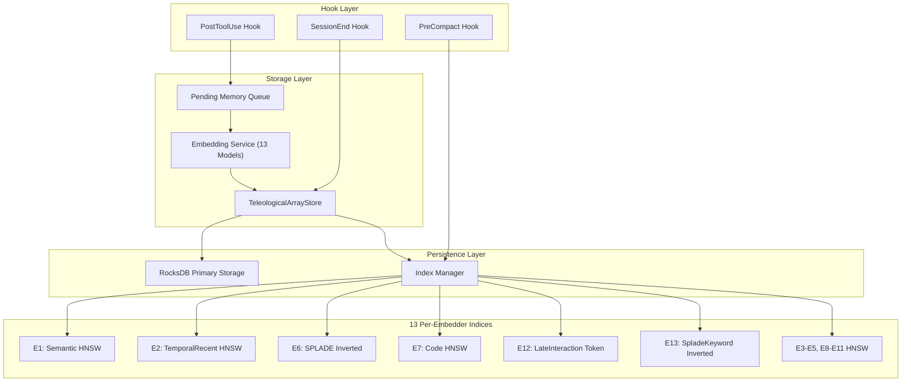

# Storage Technical Specification

```xml
<technical_spec id="TECH-STORAGE" version="1.0" implements="SPEC-TELEOLOGICAL-STORAGE">
<metadata>
  <title>Teleological Array Storage Implementation</title>
  <status>approved</status>
  <last_updated>2026-01-09</last_updated>
  <owner>ContextGraph Team</owner>
  <related_specs>
    <spec_ref>TECH-ARCHITECTURE</spec_ref>
    <spec_ref>TECH-SEARCH</spec_ref>
    <spec_ref>TECH-EMBEDDING</spec_ref>
  </related_specs>
</metadata>

<overview>
The storage layer provides atomic persistence and retrieval of TeleologicalArray instances
as complete 13-embedder units. This specification defines:

1. RocksDB schema design for teleological arrays
2. HNSW indexing configuration for each of 13 embedding spaces
3. Atomic storage guarantees (all 13 embedders or nothing)
4. Hook-triggered storage (PostToolUse, SessionEnd, PreCompact hooks)
5. Storage skills for batch operations and index management
6. Background storage agents for embedding and optimization
7. Key format and sparse vector storage specifications
8. Memory efficiency requirements

Design Principles:
- **Atomic Unit Storage**: A TeleologicalArray is always stored/retrieved as a single unit
- **Apples-to-Apples Indexing**: Each embedder has its own dedicated index
- **Separation of Storage and Index**: Raw data stored separately from indices
- **Hook-Driven Architecture**: Automatic memory capture via Claude Code hooks
</overview>

<architecture_diagram>

</architecture_diagram>

<data_models>
<!-- Primary Storage Schema -->
<model name="TeleologicalArray">
  <field name="id" type="UUID" constraints="primary_key"/>
  <field name="embeddings" type="[EmbedderOutput; 13]" constraints="not_null, all_present"/>
  <field name="source_content" type="Option<String>" constraints="max_length: 100KB"/>
  <field name="created_at" type="DateTime<Utc>" constraints="not_null, indexed"/>
  <field name="theta_to_purpose" type="f32" constraints="range: 0.0..=1.0"/>
  <field name="purpose_vector" type="[f32; 13]" constraints="normalized"/>
  <field name="metadata" type="Option<TeleologicalMetadata>" constraints=""/>
</model>

<model name="TeleologicalMetadata">
  <field name="session_id" type="String" constraints="indexed"/>
  <field name="tier" type="MemoryTier" constraints="enum: Hot|Warm|Cold|Archive"/>
  <field name="source" type="MemorySource" constraints="enum"/>
  <field name="conversation_id" type="Option<String>" constraints=""/>
  <field name="user_query" type="Option<String>" constraints=""/>
  <field name="tool_chain" type="Vec<String>" constraints=""/>
  <field name="access_count" type="u64" constraints="default: 0"/>
  <field name="last_accessed" type="Option<DateTime<Utc>>" constraints=""/>
</model>

<model name="ArrayMetadata">
  <field name="id" type="UUID" constraints="primary_key"/>
  <field name="created_at" type="DateTime<Utc>" constraints="not_null"/>
  <field name="tier" type="MemoryTier" constraints="not_null"/>
  <field name="session_id" type="Option<String>" constraints=""/>
  <field name="size_bytes" type="usize" constraints=""/>
  <field name="embedding_version" type="String" constraints=""/>
</model>

<model name="PendingMemory">
  <field name="id" type="UUID" constraints="primary_key"/>
  <field name="content" type="String" constraints="not_null"/>
  <field name="source" type="MemorySource" constraints="not_null"/>
  <field name="context" type="MemoryContext" constraints="not_null"/>
  <field name="priority" type="Priority" constraints="enum: Low|Normal|High|Critical"/>
  <field name="session_id" type="String" constraints="not_null"/>
  <field name="queued_at" type="DateTime<Utc>" constraints="not_null"/>
</model>

<!-- RocksDB Column Families -->
<model name="ColumnFamilies">
  <field name="cf_arrays" type="ColumnFamily" constraints="key: UUID, value: TeleologicalArray"/>
  <field name="cf_metadata" type="ColumnFamily" constraints="key: UUID, value: ArrayMetadata"/>
  <field name="cf_id_map" type="ColumnFamily" constraints="key: UUID, value: u64"/>
  <field name="cf_reverse_id_map" type="ColumnFamily" constraints="key: u64, value: UUID"/>
  <field name="cf_sessions" type="ColumnFamily" constraints="key: session_id, value: Vec<UUID>"/>
  <field name="cf_tiers" type="ColumnFamily" constraints="key: tier_byte, value: Vec<UUID>"/>
  <field name="cf_tombstones" type="ColumnFamily" constraints="key: UUID, value: timestamp"/>
</model>

<!-- Index Configuration Models -->
<model name="HnswConfig">
  <field name="m" type="usize" constraints="range: 8..=64, default varies by embedder"/>
  <field name="ef_construction" type="usize" constraints="range: 64..=512"/>
  <field name="ef_search" type="usize" constraints="range: 32..=256"/>
  <field name="metric" type="DistanceMetric" constraints="enum: Cosine|Euclidean|DotProduct|AsymmetricCosine"/>
  <field name="memory_tier" type="MemoryTier" constraints=""/>
</model>

<model name="InvertedIndexConfig">
  <field name="vocab_size" type="usize" constraints="~30000 for SPLADE"/>
  <field name="pruning_threshold" type="f32" constraints="default: 0.01"/>
  <field name="quantization_bits" type="u8" constraints="8 for compact storage"/>
</model>

<model name="TokenIndexConfig">
  <field name="token_dim" type="usize" constraints="128 for ColBERT"/>
  <field name="max_tokens_per_doc" type="usize" constraints="512"/>
  <field name="compression" type="bool" constraints="default: true"/>
</model>
</data_models>

<rocksdb_schema>
<!-- Key Format Specification -->
<key_format name="array_key">
  <pattern>memory:{uuid}:teleological_array</pattern>
  <example>memory:550e8400-e29b-41d4-a716-446655440000:teleological_array</example>
  <storage>cf_arrays column family</storage>
</key_format>

<key_format name="metadata_key">
  <pattern>memory:{uuid}:metadata</pattern>
  <storage>cf_metadata column family</storage>
</key_format>

<key_format name="session_index_key">
  <pattern>session:{session_id}:arrays</pattern>
  <storage>cf_sessions column family</storage>
  <value>Serialized Vec&lt;UUID&gt;</value>
</key_format>

<key_format name="tier_index_key">
  <pattern>tier:{tier_byte}</pattern>
  <storage>cf_tiers column family</storage>
  <value>Serialized Vec&lt;UUID&gt;</value>
</key_format>

<key_format name="id_mapping_key">
  <pattern>{uuid_bytes}</pattern>
  <storage>cf_id_map column family</storage>
  <value>u64 little-endian (internal HNSW ID)</value>
</key_format>

<!-- RocksDB Configuration -->
<rocksdb_config>
  <compression>LZ4</compression>
  <max_open_files>1000</max_open_files>
  <write_buffer_size>67108864</write_buffer_size> <!-- 64MB -->
  <max_write_buffer_number>4</max_write_buffer_number>
  <target_file_size_base>67108864</target_file_size_base> <!-- 64MB -->
  <max_background_jobs>4</max_background_jobs>
  <use_direct_reads>true</use_direct_reads>
  <use_direct_io_for_flush_and_compaction>true</use_direct_io_for_flush_and_compaction>
</rocksdb_config>

<!-- Storage Layout -->
<storage_layout>
  <directory path="/data/teleological/">
    <subdirectory path="arrays/" purpose="RocksDB primary storage">
      <column_family name="cf_arrays" purpose="Serialized TeleologicalArrays"/>
      <column_family name="cf_metadata" purpose="Array metadata"/>
      <column_family name="cf_id_map" purpose="UUID to internal ID"/>
      <column_family name="cf_sessions" purpose="Session to array mapping"/>
      <column_family name="cf_tiers" purpose="Tier to array mapping"/>
    </subdirectory>
    <subdirectory path="indices/" purpose="Per-embedder HNSW indices">
      <index_dir name="e01_semantic/" embedder="E1" type="HNSW" dim="1024"/>
      <index_dir name="e02_temporal_recent/" embedder="E2" type="HNSW" dim="512"/>
      <index_dir name="e03_temporal_periodic/" embedder="E3" type="HNSW" dim="512"/>
      <index_dir name="e04_temporal_pos/" embedder="E4" type="HNSW" dim="512"/>
      <index_dir name="e05_causal/" embedder="E5" type="HNSW" dim="768"/>
      <index_dir name="e06_splade/" embedder="E6" type="Inverted" vocab="30K"/>
      <index_dir name="e07_code/" embedder="E7" type="HNSW" dim="1536"/>
      <index_dir name="e08_graph/" embedder="E8" type="HNSW" dim="384"/>
      <index_dir name="e09_hdc/" embedder="E9" type="HNSW" dim="1024"/>
      <index_dir name="e10_multimodal/" embedder="E10" type="HNSW" dim="768"/>
      <index_dir name="e11_entity/" embedder="E11" type="HNSW" dim="384"/>
      <index_dir name="e12_late/" embedder="E12" type="TokenLevel" dim="128/token"/>
      <index_dir name="e13_keyword/" embedder="E13" type="Inverted" vocab="30K"/>
    </subdirectory>
    <subdirectory path="hooks/" purpose="Hook state and queues"/>
    <subdirectory path="agents/" purpose="Subagent state"/>
    <subdirectory path="snapshots/" purpose="Point-in-time snapshots"/>
    <subdirectory path="wal/" purpose="Write-ahead log"/>
  </directory>
</storage_layout>
</rocksdb_schema>

<hnsw_index_configuration>
<!-- Per-Embedder HNSW Configuration -->
<embedder_index embedder="E1" name="Semantic">
  <index_type>HNSW</index_type>
  <dimensions>1024</dimensions>
  <hnsw_m>32</hnsw_m>
  <ef_construction>256</ef_construction>
  <ef_search>128</ef_search>
  <distance_metric>Cosine</distance_metric>
  <memory_tier>Hot</memory_tier>
  <quantization>PQ-8 (optional)</quantization>
  <rationale>Primary semantic search, highest traffic - keep in memory</rationale>
</embedder_index>

<embedder_index embedder="E2" name="TemporalRecent">
  <index_type>HNSW</index_type>
  <dimensions>512</dimensions>
  <hnsw_m>24</hnsw_m>
  <ef_construction>200</ef_construction>
  <ef_search>100</ef_search>
  <distance_metric>Cosine</distance_metric>
  <memory_tier>Warm</memory_tier>
  <rationale>Recency-weighted temporal embeddings</rationale>
</embedder_index>

<embedder_index embedder="E3" name="TemporalPeriodic">
  <index_type>HNSW</index_type>
  <dimensions>512</dimensions>
  <hnsw_m>24</hnsw_m>
  <ef_construction>200</ef_construction>
  <ef_search>100</ef_search>
  <distance_metric>Cosine</distance_metric>
  <memory_tier>Warm</memory_tier>
  <rationale>Periodic temporal patterns (daily/weekly cycles)</rationale>
</embedder_index>

<embedder_index embedder="E4" name="TemporalPositional">
  <index_type>HNSW</index_type>
  <dimensions>512</dimensions>
  <hnsw_m>24</hnsw_m>
  <ef_construction>200</ef_construction>
  <ef_search>100</ef_search>
  <distance_metric>Cosine</distance_metric>
  <memory_tier>Warm</memory_tier>
  <rationale>Conversation position embeddings</rationale>
</embedder_index>

<embedder_index embedder="E5" name="Causal">
  <index_type>HNSW</index_type>
  <dimensions>768</dimensions>
  <hnsw_m>24</hnsw_m>
  <ef_construction>200</ef_construction>
  <ef_search>100</ef_search>
  <distance_metric>AsymmetricCosine</distance_metric>
  <memory_tier>Warm</memory_tier>
  <rationale>Cause-effect relationships, asymmetric distance for directionality</rationale>
</embedder_index>

<embedder_index embedder="E6" name="SpladePrimary">
  <index_type>Inverted</index_type>
  <dimensions>~30000 sparse</dimensions>
  <vocab_size>30522</vocab_size>
  <pruning_threshold>0.01</pruning_threshold>
  <quantization_bits>8</quantization_bits>
  <distance_metric>SparseDot</distance_metric>
  <memory_tier>Hot</memory_tier>
  <rationale>Sparse lexical matching for keyword/concept search</rationale>
  <storage_format>
    <posting_lists>Compressed posting lists per token</posting_lists>
    <term_weights>Quantized to 8-bit</term_weights>
    <doc_lengths>Stored for normalization</doc_lengths>
  </storage_format>
</embedder_index>

<embedder_index embedder="E7" name="Code">
  <index_type>HNSW</index_type>
  <dimensions>1536</dimensions>
  <hnsw_m>32</hnsw_m>
  <ef_construction>256</ef_construction>
  <ef_search>128</ef_search>
  <distance_metric>Cosine</distance_metric>
  <memory_tier>Hot</memory_tier>
  <rationale>Code embeddings for Claude Code context - high priority</rationale>
</embedder_index>

<embedder_index embedder="E8" name="Graph">
  <index_type>HNSW</index_type>
  <dimensions>384</dimensions>
  <hnsw_m>16</hnsw_m>
  <ef_construction>128</ef_construction>
  <ef_search>64</ef_search>
  <distance_metric>Cosine</distance_metric>
  <memory_tier>Cold</memory_tier>
  <rationale>Knowledge graph structure embeddings, less frequent access</rationale>
</embedder_index>

<embedder_index embedder="E9" name="HDC">
  <index_type>HNSW</index_type>
  <dimensions>1024</dimensions>
  <hnsw_m>32</hnsw_m>
  <ef_construction>256</ef_construction>
  <ef_search>128</ef_search>
  <distance_metric>Cosine</distance_metric>
  <memory_tier>Cold</memory_tier>
  <rationale>Hyperdimensional computing for compositional reasoning</rationale>
</embedder_index>

<embedder_index embedder="E10" name="Multimodal">
  <index_type>HNSW</index_type>
  <dimensions>768</dimensions>
  <hnsw_m>24</hnsw_m>
  <ef_construction>200</ef_construction>
  <ef_search>100</ef_search>
  <distance_metric>Cosine</distance_metric>
  <memory_tier>Warm</memory_tier>
  <rationale>Cross-modal embeddings (text/image/code unified)</rationale>
</embedder_index>

<embedder_index embedder="E11" name="Entity">
  <index_type>HNSW</index_type>
  <dimensions>384</dimensions>
  <hnsw_m>16</hnsw_m>
  <ef_construction>128</ef_construction>
  <ef_search>64</ef_search>
  <distance_metric>Cosine</distance_metric>
  <memory_tier>Warm</memory_tier>
  <rationale>Named entity embeddings for entity-centric retrieval</rationale>
</embedder_index>

<embedder_index embedder="E12" name="LateInteraction">
  <index_type>TokenLevel</index_type>
  <dimensions>128 per token</dimensions>
  <max_tokens>512</max_tokens>
  <distance_metric>MaxSim</distance_metric>
  <memory_tier>Cold</memory_tier>
  <rationale>ColBERT-style late interaction for fine-grained matching</rationale>
  <storage_format>
    <token_vectors>Per-token 128D embeddings</token_vectors>
    <doc_index>Document to token offset mapping</doc_index>
    <compression>Optional quantization</compression>
  </storage_format>
</embedder_index>

<embedder_index embedder="E13" name="SpladeKeyword">
  <index_type>Inverted</index_type>
  <dimensions>~30000 sparse</dimensions>
  <vocab_size>30522</vocab_size>
  <pruning_threshold>0.01</pruning_threshold>
  <quantization_bits>8</quantization_bits>
  <distance_metric>SparseDot</distance_metric>
  <memory_tier>Hot</memory_tier>
  <rationale>Secondary sparse representation for keyword emphasis</rationale>
</embedder_index>
</hnsw_index_configuration>

<sparse_vector_storage>
<!-- SPLADE Sparse Vector Storage Specification -->
<specification name="SparseVectorStorage">
  <description>
    Storage format for SPLADE embeddings (E6, E13) which produce sparse vectors
    with ~30K vocabulary but typically only 50-200 non-zero entries per document.
  </description>

  <storage_format name="CompactSparse">
    <structure>
      <field name="num_nonzero" type="u16" description="Count of non-zero entries"/>
      <field name="indices" type="Vec&lt;u16&gt;" description="Token indices (sorted)"/>
      <field name="values" type="Vec&lt;u8&gt;" description="Quantized weights (0-255)"/>
    </structure>
    <compression>
      <method>Delta encoding for indices</method>
      <quantization>8-bit linear quantization of weights</quantization>
      <typical_size>400-800 bytes per vector</typical_size>
    </compression>
  </storage_format>

  <inverted_index_format>
    <posting_list>
      <structure>
        <header>
          <token_id type="u16"/>
          <doc_count type="u32"/>
          <min_weight type="u8"/>
          <max_weight type="u8"/>
        </header>
        <entries>
          <doc_id type="u64"/>
          <weight type="u8"/>
        </entries>
      </structure>
      <compression>Variable-byte encoding for doc_ids</compression>
    </posting_list>
    <vocabulary>
      <size>30522 tokens (BERT vocabulary)</size>
      <storage>Memory-mapped file</storage>
    </vocabulary>
  </inverted_index_format>

  <query_processing>
    <step>Expand query through SPLADE model</step>
    <step>Retrieve posting lists for non-zero query terms</step>
    <step>Compute sparse dot product scores</step>
    <step>Return top-k by score</step>
  </query_processing>
</specification>
</sparse_vector_storage>

<component_contracts>
<!-- TeleologicalArrayStore Trait -->
<component name="TeleologicalArrayStore" path="src/storage/traits.rs">
  <description>Primary storage interface for teleological arrays</description>

  <method name="store">
    <signature>async fn store(&amp;self, array: TeleologicalArray) -> Result&lt;Uuid, StorageError&gt;</signature>
    <implements>REQ-STORAGE-01, REQ-STORAGE-02</implements>
    <behavior>
      1. Validate all 13 embedder outputs are present
      2. Serialize the array as a single blob
      3. Write to primary storage (RocksDB cf_arrays)
      4. Update all 13 per-embedder indices atomically
      5. Trigger PostStore hook (if configured)
    </behavior>
    <atomicity>All 13 indices updated or none (rollback on failure)</atomicity>
    <throws>StorageError::ValidationFailed, StorageError::IndexUpdateFailed</throws>
  </method>

  <method name="store_batch">
    <signature>async fn store_batch(&amp;self, arrays: Vec&lt;TeleologicalArray&gt;) -> Result&lt;Vec&lt;Uuid&gt;, StorageError&gt;</signature>
    <implements>REQ-STORAGE-03</implements>
    <behavior>
      1. Validate all arrays complete
      2. Use RocksDB WriteBatch for atomic write
      3. Update indices in parallel per-embedder
      4. Trigger PostBatchStore hook with stats
    </behavior>
    <performance>Amortized &lt;2ms per array for batches of 100</performance>
    <throws>StorageError::BatchTooLarge, StorageError::IndexUpdateFailed</throws>
  </method>

  <method name="retrieve">
    <signature>async fn retrieve(&amp;self, id: Uuid) -> Result&lt;Option&lt;TeleologicalArray&gt;, StorageError&gt;</signature>
    <implements>REQ-STORAGE-04</implements>
    <behavior>
      1. Check tombstone (soft delete)
      2. Read from cf_arrays
      3. Deserialize
      4. Update access tracker for tier migration
    </behavior>
    <performance>&lt;1ms point lookup</performance>
  </method>

  <method name="retrieve_batch">
    <signature>async fn retrieve_batch(&amp;self, ids: &amp;[Uuid]) -> Result&lt;Vec&lt;Option&lt;TeleologicalArray&gt;&gt;, StorageError&gt;</signature>
    <implements>REQ-STORAGE-05</implements>
    <behavior>Use RocksDB multi_get_cf for efficiency</behavior>
    <performance>&lt;20ms for 100 arrays</performance>
  </method>

  <method name="delete">
    <signature>async fn delete(&amp;self, id: Uuid) -> Result&lt;bool, StorageError&gt;</signature>
    <implements>REQ-STORAGE-06</implements>
    <behavior>
      1. Soft delete: add tombstone with timestamp
      2. Remove from all 13 indices
      3. Return true if existed, false otherwise
    </behavior>
  </method>

  <method name="list_by_session">
    <signature>async fn list_by_session(&amp;self, session_id: &amp;str) -> Result&lt;Vec&lt;TeleologicalArray&gt;, StorageError&gt;</signature>
    <implements>REQ-STORAGE-07</implements>
    <behavior>Query cf_sessions secondary index</behavior>
  </method>

  <method name="list_by_tier">
    <signature>async fn list_by_tier(&amp;self, tier: MemoryTier) -> Result&lt;Vec&lt;TeleologicalArray&gt;, StorageError&gt;</signature>
    <implements>REQ-STORAGE-08</implements>
    <behavior>Query cf_tiers secondary index</behavior>
  </method>

  <method name="migrate_tier">
    <signature>async fn migrate_tier(&amp;self, id: Uuid, target_tier: MemoryTier) -> Result&lt;(), StorageError&gt;</signature>
    <implements>REQ-STORAGE-09</implements>
    <behavior>
      1. Update metadata with new tier
      2. Update cf_tiers indices atomically
      3. Physical migration handled by tier migrator agent
    </behavior>
  </method>
</component>

<!-- EmbedderIndex Trait -->
<component name="EmbedderIndex" path="src/storage/index.rs">
  <description>Interface for individual embedder indices</description>

  <method name="add">
    <signature>async fn add(&amp;self, internal_id: u64, embedding: &amp;EmbedderOutput) -> Result&lt;(), IndexError&gt;</signature>
    <implements>REQ-INDEX-01</implements>
    <behavior>Add embedding to HNSW/Inverted/Token index</behavior>
  </method>

  <method name="remove">
    <signature>async fn remove(&amp;self, internal_id: u64) -> Result&lt;(), IndexError&gt;</signature>
    <implements>REQ-INDEX-02</implements>
  </method>

  <method name="search">
    <signature>async fn search(&amp;self, query: &amp;EmbedderOutput, top_k: usize) -> Result&lt;Vec&lt;(u64, f32)&gt;, IndexError&gt;</signature>
    <implements>REQ-INDEX-03</implements>
    <behavior>Return (internal_id, similarity) pairs sorted descending</behavior>
    <performance>&lt;2ms for HNSW, &lt;5ms for inverted</performance>
  </method>

  <method name="rebuild">
    <signature>async fn rebuild(&amp;self) -> Result&lt;IndexStats, IndexError&gt;</signature>
    <implements>REQ-INDEX-04</implements>
    <behavior>Full index rebuild from stored vectors</behavior>
  </method>

  <method name="update_config">
    <signature>async fn update_config(&amp;self, config: HnswConfig) -> Result&lt;(), IndexError&gt;</signature>
    <implements>REQ-INDEX-05</implements>
    <behavior>Update ef_search, ef_construction without rebuild</behavior>
  </method>
</component>

<!-- IndexWriter/IndexReader Interfaces -->
<component name="IndexWriter" path="src/storage/index_io.rs">
  <description>Low-level index write operations</description>

  <method name="begin_batch">
    <signature>fn begin_batch(&amp;mut self) -> Result&lt;BatchHandle, IndexError&gt;</signature>
    <behavior>Start a batch write operation</behavior>
  </method>

  <method name="add_to_batch">
    <signature>fn add_to_batch(&amp;mut self, handle: &amp;BatchHandle, id: u64, vector: &amp;[f32]) -> Result&lt;(), IndexError&gt;</signature>
  </method>

  <method name="commit_batch">
    <signature>async fn commit_batch(&amp;mut self, handle: BatchHandle) -> Result&lt;BatchStats, IndexError&gt;</signature>
    <behavior>Atomically commit all batched writes</behavior>
  </method>

  <method name="rollback_batch">
    <signature>fn rollback_batch(&amp;mut self, handle: BatchHandle) -> Result&lt;(), IndexError&gt;</signature>
  </method>
</component>

<component name="IndexReader" path="src/storage/index_io.rs">
  <description>Low-level index read operations</description>

  <method name="search_knn">
    <signature>fn search_knn(&amp;self, query: &amp;[f32], k: usize, ef: usize) -> Result&lt;Vec&lt;(u64, f32)&gt;, IndexError&gt;</signature>
    <behavior>K-nearest neighbor search with configurable ef</behavior>
  </method>

  <method name="get_vector">
    <signature>fn get_vector(&amp;self, id: u64) -> Result&lt;Option&lt;Vec&lt;f32&gt;&gt;, IndexError&gt;</signature>
  </method>

  <method name="contains">
    <signature>fn contains(&amp;self, id: u64) -> bool</signature>
  </method>

  <method name="count">
    <signature>fn count(&amp;self) -> usize</signature>
  </method>
</component>
</component_contracts>

<transaction_semantics>
<specification name="AtomicStorageGuarantees">
  <description>
    All storage operations maintain atomicity across the 13 embedder indices.
    Either all indices are updated successfully, or none are.
  </description>

  <guarantee name="StoreAtomicity">
    <description>Single array store is atomic across all 13 indices</description>
    <implementation>
      1. Write to RocksDB with WriteBatch (atomic)
      2. Add to all 13 indices in parallel
      3. If any index fails, rollback from succeeded indices
      4. Delete from RocksDB if rollback needed
    </implementation>
    <rollback_strategy>
      - Track which indices succeeded
      - On failure, remove from all succeeded indices
      - Delete from RocksDB
      - Return error with failed embedder list
    </rollback_strategy>
  </guarantee>

  <guarantee name="BatchAtomicity">
    <description>Batch store is atomic for RocksDB, best-effort for indices</description>
    <implementation>
      1. WriteBatch commits all arrays atomically to RocksDB
      2. Index updates proceed in parallel
      3. Index failures logged but don't fail the operation
      4. Index can be rebuilt from primary storage
    </implementation>
    <rationale>
      Primary storage is source of truth. Indices are derived and can be rebuilt.
      This allows batch operations to succeed even with transient index issues.
    </rationale>
  </guarantee>

  <guarantee name="DeleteAtomicity">
    <description>Delete removes from all indices and marks tombstone</description>
    <implementation>
      1. Add tombstone to cf_tombstones
      2. Remove from all 13 indices (best effort)
      3. Physical deletion during compaction
    </implementation>
  </guarantee>

  <guarantee name="TierMigrationAtomicity">
    <description>Tier migration updates metadata and indices atomically</description>
    <implementation>
      1. Update cf_metadata with new tier
      2. Update cf_tiers old and new indices
      3. All in single WriteBatch
    </implementation>
  </guarantee>
</specification>

<batch_operations>
  <operation name="store_batch">
    <max_batch_size>1000 arrays</max_batch_size>
    <optimal_batch_size>50-100 arrays</optimal_batch_size>
    <timeout>30 seconds</timeout>
    <retry_strategy>Exponential backoff, 3 retries</retry_strategy>
  </operation>

  <operation name="retrieve_batch">
    <max_batch_size>1000 UUIDs</max_batch_size>
    <parallel_reads>true</parallel_reads>
    <use_multiget>true</use_multiget>
  </operation>

  <operation name="index_batch">
    <parallel_embedders>4 concurrent</parallel_embedders>
    <per_embedder_batch>Batched inserts to same index</per_embedder_batch>
  </operation>
</batch_operations>
</transaction_semantics>

<hook_triggered_storage>
<!-- PostToolUse Hook -->
<hook name="PostToolUse" trigger="after_tool_complete">
  <description>Automatic memory capture after tool execution</description>

  <configuration>
    ```json
    {
      "hooks": {
        "PostToolUse": [
          {
            "matcher": { "tool_name": "Edit|Write|MultiEdit" },
            "hooks": [{
              "type": "command",
              "command": "npx contextgraph store-memory --type edit --file \"$FILE_PATH\" --session \"$SESSION_ID\"",
              "timeout": 5000,
              "run_in_background": true
            }]
          },
          {
            "matcher": { "tool_name": "Bash" },
            "hooks": [{
              "type": "command",
              "command": "npx contextgraph store-memory --type command --cmd \"$COMMAND\" --exit-code $EXIT_CODE",
              "timeout": 3000,
              "run_in_background": true
            }]
          },
          {
            "matcher": { "tool_name": "Read" },
            "hooks": [{
              "type": "command",
              "command": "npx contextgraph index-file --path \"$FILE_PATH\" --session \"$SESSION_ID\"",
              "timeout": 10000,
              "run_in_background": true
            }]
          }
        ]
      }
    }
    ```
  </configuration>

  <handler>PostToolUseStorageHook</handler>
  <actions>
    <action>Extract content from tool output</action>
    <action>Create PendingMemory with context</action>
    <action>Queue for batch embedding (non-blocking)</action>
    <action>Trigger batch flush if threshold reached</action>
  </actions>
  <priority_rules>
    <rule tool="Edit|Write|MultiEdit">High priority</rule>
    <rule tool="Bash" condition="exit_code=0">Normal priority</rule>
    <rule tool="Bash" condition="exit_code!=0">Low priority</rule>
    <rule tool="Read">Low priority</rule>
  </priority_rules>
</hook>

<!-- SessionEnd Hook -->
<hook name="SessionEnd" trigger="conversation_end">
  <description>Session consolidation and optimization</description>

  <configuration>
    ```json
    {
      "hooks": {
        "SessionEnd": [{
          "matcher": {},
          "hooks": [{
            "type": "command",
            "command": "npx contextgraph consolidate-session --session-id \"$SESSION_ID\" --export-metrics",
            "timeout": 60000
          }]
        }]
      }
    }
    ```
  </configuration>

  <handler>SessionEndConsolidationHook</handler>
  <actions>
    <action>Flush pending embeddings queue</action>
    <action>Consolidate related memories (merge similar)</action>
    <action>Update temporal indices (E2, E3, E4)</action>
    <action>Optimize memory tiers (promote hot, demote cold)</action>
    <action>Store session summary</action>
    <action>Export metrics if requested</action>
  </actions>
  <consolidation_stats>
    <metric>flushed_count</metric>
    <metric>merged_count</metric>
    <metric>linked_count</metric>
    <metric>promoted_count</metric>
    <metric>demoted_count</metric>
    <metric>session_duration_secs</metric>
  </consolidation_stats>
</hook>

<!-- PreCompact Hook -->
<hook name="PreCompact" trigger="before_rocksdb_compaction">
  <description>Purpose-aligned memory prioritization before compaction</description>

  <configuration>
    ```json
    {
      "hooks": {
        "PreCompact": [{
          "matcher": {},
          "hooks": [{
            "type": "command",
            "command": "npx contextgraph prioritize-memories --strategy purpose-aligned --start-key \"$START_KEY\" --end-key \"$END_KEY\"",
            "timeout": 30000
          }]
        }]
      }
    }
    ```
  </configuration>

  <handler>PreCompactPrioritizationHook</handler>
  <actions>
    <action>Get memories in compaction range</action>
    <action>Score by purpose alignment (theta_to_purpose)</action>
    <action>Combine with recency factor (exponential decay)</action>
    <action>Migrate to appropriate tier (Hot/Warm/Cold/Archive)</action>
  </actions>
  <tier_thresholds>
    <threshold tier="Hot" min_score="0.8"/>
    <threshold tier="Warm" min_score="0.5"/>
    <threshold tier="Cold" min_score="0.2"/>
    <threshold tier="Archive" min_score="0.0"/>
  </tier_thresholds>
  <recency_weight>0.3</recency_weight>
  <half_life>168 hours (1 week)</half_life>
</hook>
</hook_triggered_storage>

<storage_skills>
<!-- Skill 1: Batch Embedding -->
<skill name="batch-embed" id="SKILL-STORAGE-01">
  <description>Batch embed multiple contents into TeleologicalArrays using all 13 models</description>

  <triggers>
    <trigger>batch embed</trigger>
    <trigger>embed multiple</trigger>
    <trigger>bulk embedding</trigger>
    <trigger>embed files</trigger>
  </triggers>

  <parameters>
    <parameter name="contents" type="array" description="Array of content strings to embed"/>
    <parameter name="files" type="array" description="Array of file paths to embed"/>
    <parameter name="priority" type="enum" values="low|normal|high|critical" default="normal"/>
    <parameter name="wait_for_completion" type="boolean" default="false"/>
    <parameter name="parallel_embedders" type="integer" default="4"/>
  </parameters>

  <execution>
    <command>npx contextgraph batch-embed</command>
    <timeout>300000</timeout>
  </execution>

  <implementation>
    <behavior>
      1. Validate batch size (&lt;= 1000)
      2. Combine contents and file contents
      3. Create parallel embedding tasks with semaphore
      4. Await all 13 embedder outputs per content
      5. Store complete arrays atomically
      6. Return BatchEmbedResult with stats
    </behavior>
    <result>
      <field name="ids" type="Vec&lt;Uuid&gt;"/>
      <field name="embedded_count" type="usize"/>
      <field name="failed_count" type="usize"/>
      <field name="duration_ms" type="u64"/>
    </result>
  </implementation>
</skill>

<!-- Skill 2: Index Management -->
<skill name="index-manage" id="SKILL-STORAGE-02">
  <description>Manage HNSW indices for teleological storage</description>

  <triggers>
    <trigger>rebuild index</trigger>
    <trigger>optimize index</trigger>
    <trigger>index stats</trigger>
    <trigger>index health</trigger>
  </triggers>

  <subcommands>
    <subcommand name="rebuild">
      <description>Rebuild specific or all embedder indices</description>
      <parameter name="embedder" type="enum"
        values="semantic|temporal_recent|temporal_periodic|temporal_positional|causal|splade_primary|code|graph|hdc|multimodal|entity|late_interaction|splade_keyword|all"
        default="all"/>
      <command>npx contextgraph index rebuild --embedder=$embedder</command>
    </subcommand>

    <subcommand name="stats">
      <description>Get index statistics for all 13 embedders</description>
      <parameter name="format" type="enum" values="summary|detailed|json" default="summary"/>
      <command>npx contextgraph index stats --format=$format</command>
    </subcommand>

    <subcommand name="optimize">
      <description>Optimize index parameters based on workload</description>
      <parameter name="workload" type="enum" values="read_heavy|write_heavy|balanced" default="balanced"/>
      <command>npx contextgraph index optimize --workload=$workload</command>
      <behavior>
        - read_heavy: Increase ef_search by 1.5x
        - write_heavy: Decrease ef_construction by 0.75x
        - balanced: No change
      </behavior>
    </subcommand>

    <subcommand name="health">
      <description>Check index health and consistency</description>
      <parameter name="fix" type="boolean" default="false"/>
      <command>npx contextgraph index health --fix=$fix</command>
      <checks>
        <check type="EmptyIndex" severity="warning"/>
        <check type="HighLatency" severity="warning" threshold="10000us"/>
        <check type="Inconsistency" severity="critical"/>
      </checks>
    </subcommand>
  </subcommands>
</skill>

<!-- Skill 3: Storage Cleanup -->
<skill name="storage-cleanup" id="SKILL-STORAGE-03">
  <description>Clean up old memories and optimize storage</description>

  <triggers>
    <trigger>cleanup storage</trigger>
    <trigger>purge old memories</trigger>
    <trigger>storage maintenance</trigger>
    <trigger>deduplicate memories</trigger>
  </triggers>

  <parameters>
    <parameter name="older_than_days" type="integer" default="90" description="Delete memories older than this"/>
    <parameter name="min_purpose_score" type="number" default="0.2" description="Minimum purpose alignment to keep"/>
    <parameter name="deduplicate" type="boolean" default="true" description="Merge duplicate memories"/>
    <parameter name="dry_run" type="boolean" default="true" description="Preview without deleting"/>
  </parameters>

  <execution>
    <command>npx contextgraph cleanup</command>
    <timeout>600000</timeout>
  </execution>

  <implementation>
    <behavior>
      1. Find candidates older than cutoff date
      2. Score each by purpose alignment
      3. Identify duplicates using E1 (semantic) clustering at 0.85 threshold
      4. If dry_run, return preview counts
      5. Otherwise, delete low-purpose old memories
      6. Merge duplicate clusters
      7. Return CleanupResult with stats
    </behavior>
    <result>
      <field name="would_delete" type="usize" condition="dry_run"/>
      <field name="would_merge" type="usize" condition="dry_run"/>
      <field name="deleted" type="usize" condition="!dry_run"/>
      <field name="merged" type="usize" condition="!dry_run"/>
      <field name="bytes_freed" type="u64"/>
    </result>
  </implementation>
</skill>
</storage_skills>

<storage_agents>
<!-- Agent 1: Embedding Processor -->
<agent name="EmbeddingProcessorAgent" id="AGENT-STORAGE-01">
  <description>Background agent for processing embedding queues</description>
  <type>background</type>

  <spawn_on>
    <trigger>session_start</trigger>
    <trigger condition="pending_queue_threshold">10</trigger>
  </spawn_on>

  <configuration>
    <param name="batch_size" type="usize" default="50"/>
    <param name="idle_timeout_ms" type="u64" default="100"/>
    <param name="max_retries" type="usize" default="3"/>
    <param name="parallel_embedders" type="usize" default="4"/>
  </configuration>

  <resources>
    <memory_limit>2GB</memory_limit>
    <cpu_limit>2</cpu_limit>
  </resources>

  <behavior>
    <loop>
      1. Collect batch from pending queue (priority-sorted)
      2. If empty, sleep for idle_timeout_ms
      3. Process batch through all 13 embedders in parallel
      4. Create TeleologicalArray for each successful embedding
      5. Store batch atomically
      6. Update metrics (embedded_count, failures, latency)
      7. Repeat until shutdown signal
    </loop>
  </behavior>

  <health_check>
    <interval_secs>60</interval_secs>
    <timeout_secs>5</timeout_secs>
    <unhealthy_threshold>3</unhealthy_threshold>
  </health_check>

  <metrics>
    <metric name="embedded_count" type="counter"/>
    <metric name="embedding_failures" type="counter"/>
    <metric name="store_failures" type="counter"/>
    <metric name="avg_latency_ms" type="gauge"/>
    <metric name="queue_depth" type="gauge"/>
  </metrics>
</agent>

<!-- Agent 2: Index Optimizer -->
<agent name="IndexOptimizationAgent" id="AGENT-STORAGE-02">
  <description>Continuous index performance monitoring and optimization</description>
  <type>background</type>

  <spawn_on>
    <trigger>session_start</trigger>
    <trigger schedule="*/15 * * * *">Every 15 minutes</trigger>
  </spawn_on>

  <configuration>
    <param name="check_interval_secs" type="u64" default="300"/>
    <param name="max_p99_latency_us" type="u64" default="5000"/>
    <param name="min_ef_ratio" type="f32" default="3.0"/>
    <param name="improvement_threshold" type="f32" default="0.1"/>
  </configuration>

  <resources>
    <memory_limit>512MB</memory_limit>
    <cpu_limit>1</cpu_limit>
  </resources>

  <behavior>
    <loop>
      1. Collect stats for all 13 embedder indices
      2. For each embedder:
         a. Check if P99 latency exceeds threshold
         b. Check if ef_search/M ratio is too low
         c. If optimization needed, adjust parameters
      3. Sleep until next check interval
    </loop>
    <optimization_rules>
      <rule condition="p99_latency > max_p99_latency_us">
        Increase ef_search by 1.5x
      </rule>
      <rule condition="ef_ratio < min_ef_ratio">
        Set ef_search = M * min_ef_ratio
      </rule>
    </optimization_rules>
  </behavior>

  <health_check>
    <interval_secs>120</interval_secs>
    <timeout_secs>10</timeout_secs>
  </health_check>
</agent>

<!-- Agent 3: Tier Migrator -->
<agent name="TierMigrationAgent" id="AGENT-STORAGE-03">
  <description>Memory tier migration based on access patterns and purpose alignment</description>
  <type>background</type>

  <spawn_on>
    <trigger schedule="0 * * * *">Every hour</trigger>
  </spawn_on>

  <configuration>
    <param name="check_interval_secs" type="u64" default="3600"/>
    <param name="hot_threshold" type="f32" default="0.8"/>
    <param name="warm_threshold" type="f32" default="0.5"/>
    <param name="cold_threshold" type="f32" default="0.2"/>
    <param name="access_weight" type="f32" default="0.4"/>
    <param name="max_migrations_per_cycle" type="usize" default="100"/>
  </configuration>

  <resources>
    <memory_limit>256MB</memory_limit>
    <cpu_limit>0.5</cpu_limit>
  </resources>

  <behavior>
    <loop>
      1. Scan each tier (Hot, Warm, Cold) for migration candidates
      2. Calculate combined score: access_score * access_weight + purpose_score * (1 - access_weight)
      3. Determine target tier based on thresholds
      4. Sort candidates by urgency (biggest tier jumps first)
      5. Migrate up to max_migrations_per_cycle
      6. Log migration stats
      7. Sleep until next check interval
    </loop>
    <tier_calculation>
      combined_score >= 0.8 -> Hot
      combined_score >= 0.5 -> Warm
      combined_score >= 0.2 -> Cold
      combined_score < 0.2  -> Archive
    </tier_calculation>
  </behavior>

  <health_check>
    <interval_secs>300</interval_secs>
    <timeout_secs>30</timeout_secs>
  </health_check>
</agent>
</storage_agents>

<memory_efficiency>
<specification name="MemoryEfficiencyRequirements">
  <description>Memory usage targets for the storage layer</description>

  <array_storage>
    <uncompressed_size>~46KB per array (all 13 embeddings)</uncompressed_size>
    <quantized_size>~17KB per array (PQ-8 compression)</quantized_size>
    <compression_ratio>63%</compression_ratio>
    <breakdown>
      <embedder name="E1 Semantic">1024 * 4 = 4KB (or 1KB with PQ-8)</embedder>
      <embedder name="E2-E4 Temporal">512 * 4 * 3 = 6KB (or 1.5KB)</embedder>
      <embedder name="E5 Causal">768 * 4 = 3KB (or 768B)</embedder>
      <embedder name="E6 SPLADE">~800B sparse</embedder>
      <embedder name="E7 Code">1536 * 4 = 6KB (or 1.5KB)</embedder>
      <embedder name="E8 Graph">384 * 4 = 1.5KB (or 384B)</embedder>
      <embedder name="E9 HDC">1024 * 4 = 4KB (or 1KB)</embedder>
      <embedder name="E10 Multimodal">768 * 4 = 3KB (or 768B)</embedder>
      <embedder name="E11 Entity">384 * 4 = 1.5KB (or 384B)</embedder>
      <embedder name="E12 Late">128 * 512 * 4 = 256KB max (compressed ~8KB)</embedder>
      <embedder name="E13 SPLADE">~800B sparse</embedder>
    </breakdown>
  </array_storage>

  <index_memory>
    <hnsw_per_embedder>~1.5GB per 1M vectors (M=24, 512D average)</hnsw_per_embedder>
    <total_hnsw_memory>~18GB for 1M arrays (12 HNSW indices)</total_hnsw_memory>
    <inverted_index>~500MB per 1M docs (E6, E13)</inverted_index>
    <token_index>~2GB per 1M docs (E12)</token_index>
  </index_memory>

  <tiered_memory>
    <tier name="Hot">In-memory, ~40% of working set</tier>
    <tier name="Warm">Memory-mapped, ~40% of working set</tier>
    <tier name="Cold">Disk-resident, ~15% of working set</tier>
    <tier name="Archive">Compressed, ~5% of working set</tier>
  </tiered_memory>

  <optimization_strategies>
    <strategy name="ProductQuantization">
      <description>PQ-8 for dense vectors (8 bytes per subvector)</description>
      <reduction>4x for 4-byte floats</reduction>
      <recall_impact>~2-5% recall degradation</recall_impact>
    </strategy>
    <strategy name="ScalarQuantization">
      <description>SQ-8 for simpler compression</description>
      <reduction>4x</reduction>
      <recall_impact>~1-2% recall degradation</recall_impact>
    </strategy>
    <strategy name="SparsePruning">
      <description>Prune low-weight terms from SPLADE vectors</description>
      <threshold>0.01</threshold>
      <reduction>~50% fewer terms</reduction>
    </strategy>
    <strategy name="TokenCompression">
      <description>Compress E12 token embeddings with PQ</description>
      <reduction>~4x</reduction>
    </strategy>
  </optimization_strategies>
</specification>
</memory_efficiency>

<performance_targets>
<metrics>
  <metric name="single_array_store" target="<10ms">
    Includes all 13 index updates
  </metric>
  <metric name="batch_store_100" target="<200ms">
    Amortized &lt;2ms per array
  </metric>
  <metric name="single_embedder_search" target="<2ms">
    Per-embedder HNSW query
  </metric>
  <metric name="multi_embedder_search_13" target="<30ms">
    Parallel search + RRF fusion
  </metric>
  <metric name="array_retrieval" target="<1ms">
    RocksDB point lookup
  </metric>
  <metric name="batch_retrieval_100" target="<20ms">
    Multi-get optimization
  </metric>
  <metric name="hook_dispatch_latency" target="<1ms">
    Background execution
  </metric>
  <metric name="session_consolidation" target="<30s">
    End-of-session processing
  </metric>
</metrics>

<scalability>
  <target name="max_arrays">10 million arrays per instance</target>
  <target name="max_concurrent_writes">1000 writes/second</target>
  <target name="max_concurrent_reads">10000 reads/second</target>
  <target name="max_index_size">1M vectors per embedder</target>
</scalability>
</performance_targets>

<error_states>
<error id="ERR-STORAGE-01" code="VALIDATION_FAILED">
  <condition>Array missing embedder outputs</condition>
  <message>TeleologicalArray validation failed: missing embedder {embedder}</message>
  <recovery>Ensure all 13 embedder outputs are populated before storage</recovery>
</error>

<error id="ERR-STORAGE-02" code="INDEX_UPDATE_FAILED">
  <condition>One or more index updates failed</condition>
  <message>Index update failed for embedders: {embedder_list}</message>
  <recovery>Check index health, rebuild affected indices</recovery>
</error>

<error id="ERR-STORAGE-03" code="BATCH_TOO_LARGE">
  <condition>Batch size exceeds maximum</condition>
  <message>Batch size {actual} exceeds maximum {max}</message>
  <recovery>Split batch into smaller chunks</recovery>
</error>

<error id="ERR-STORAGE-04" code="NOT_FOUND">
  <condition>Array UUID not found or tombstoned</condition>
  <message>Array {id} not found</message>
  <recovery>Verify UUID is correct and array was not deleted</recovery>
</error>

<error id="ERR-STORAGE-05" code="SERIALIZATION_FAILED">
  <condition>Array serialization/deserialization error</condition>
  <message>Failed to serialize/deserialize array: {details}</message>
  <recovery>Check array format compatibility, upgrade serialization version</recovery>
</error>

<error id="ERR-STORAGE-06" code="ROCKSDB_ERROR">
  <condition>RocksDB operation failed</condition>
  <message>RocksDB error: {details}</message>
  <recovery>Check disk space, file permissions, run compaction</recovery>
</error>

<error id="ERR-STORAGE-07" code="HOOK_TIMEOUT">
  <condition>Hook execution exceeded timeout</condition>
  <message>Hook {hook_name} timed out after {timeout_ms}ms</message>
  <recovery>Increase timeout or investigate hook performance</recovery>
</error>
</error_states>

<implementation_notes>
<note category="atomicity">
  WriteBatch is used for all multi-key operations to ensure atomicity.
  Index updates use parallel execution with rollback on failure.
</note>

<note category="performance">
  Use direct I/O for RocksDB to bypass OS page cache for large value workloads.
  HNSW indices should use memory-mapped files for warm tier.
</note>

<note category="hook_integration">
  Hooks run in background by default to not block tool execution.
  SessionEnd hook is synchronous to ensure consolidation completes.
</note>

<note category="sparse_vectors">
  SPLADE vectors use inverted index, not HNSW.
  Pruning threshold of 0.01 reduces storage while maintaining recall.
</note>

<note category="tier_migration">
  Physical migration handled by TierMigrationAgent.
  Hot tier kept in memory, warm uses mmap, cold on disk.
</note>

<note category="recovery">
  WAL ensures crash recovery.
  Indices can be rebuilt from primary RocksDB storage.
  Tombstones prevent resurrection of deleted arrays.
</note>
</implementation_notes>

<test_plan>
<test_case id="TC-STORAGE-01" type="unit" req_ref="REQ-STORAGE-01">
  <description>Validate atomic storage of complete TeleologicalArray</description>
  <inputs>Valid TeleologicalArray with all 13 embeddings</inputs>
  <expected>Array stored, ID returned, all 13 indices updated</expected>
</test_case>

<test_case id="TC-STORAGE-02" type="unit" req_ref="REQ-STORAGE-02">
  <description>Reject incomplete TeleologicalArray</description>
  <inputs>TeleologicalArray missing E7 (Code) embedding</inputs>
  <expected>ValidationFailed error</expected>
</test_case>

<test_case id="TC-STORAGE-03" type="integration" req_ref="REQ-STORAGE-03">
  <description>Batch store 100 arrays atomically</description>
  <inputs>100 valid TeleologicalArrays</inputs>
  <expected>All stored within 200ms, indices consistent</expected>
</test_case>

<test_case id="TC-STORAGE-04" type="integration" req_ref="REQ-HOOK-01">
  <description>PostToolUse hook triggers memory capture</description>
  <inputs>Simulated Edit tool completion</inputs>
  <expected>PendingMemory added to queue</expected>
</test_case>

<test_case id="TC-STORAGE-05" type="integration" req_ref="REQ-HOOK-02">
  <description>SessionEnd hook performs consolidation</description>
  <inputs>Session with 50 pending memories</inputs>
  <expected>Memories flushed, consolidated, tiers optimized</expected>
</test_case>

<test_case id="TC-STORAGE-06" type="unit" req_ref="REQ-INDEX-01">
  <description>HNSW index search returns correct results</description>
  <inputs>Query vector for E1 (Semantic)</inputs>
  <expected>Top-k results within 2ms, recall > 0.95</expected>
</test_case>

<test_case id="TC-STORAGE-07" type="unit" req_ref="REQ-INDEX-02">
  <description>Inverted index search for SPLADE vectors</description>
  <inputs>Sparse query vector for E6</inputs>
  <expected>Correct lexical matches returned</expected>
</test_case>

<test_case id="TC-STORAGE-08" type="integration" req_ref="REQ-AGENT-01">
  <description>EmbeddingProcessorAgent processes queue</description>
  <inputs>10 pending memories in queue</inputs>
  <expected>All embedded and stored within 30s</expected>
</test_case>

<test_case id="TC-STORAGE-09" type="integration" req_ref="REQ-AGENT-02">
  <description>TierMigrationAgent promotes hot memories</description>
  <inputs>Memories with high access and purpose scores</inputs>
  <expected>Migrated to Hot tier</expected>
</test_case>

<test_case id="TC-STORAGE-10" type="performance">
  <description>Sustained write throughput</description>
  <inputs>1000 concurrent store operations</inputs>
  <expected>P99 latency < 50ms, no errors</expected>
</test_case>
</test_plan>
</technical_spec>
```

---

## References

### Internal Specifications
- [01-ARCHITECTURE.md](../01-ARCHITECTURE.md) - Core types and comparison architecture
- [03-SEARCH.md](../03-SEARCH.md) - Search layer specification
- [05-NORTH-STAR-REMOVAL.md](../05-NORTH-STAR-REMOVAL.md) - Removal of broken alignment code

### External Sources (2025 Best Practices)
- [Vespa Multi-Vector HNSW](https://blog.vespa.ai/semantic-search-with-multi-vector-indexing/) - Multi-field indexing
- [CoreNN with RocksDB](https://blog.wilsonl.in/corenn/) - RocksDB for vector storage
- [HNSW Fundamentals](https://qdrant.tech/course/essentials/day-2/what-is-hnsw/) - Index architecture
- [Amazon Keyspaces Batches](https://aws.amazon.com/blogs/database/amazon-keyspaces-now-supports-logged-batches-for-atomic-multi-statement-operations/) - Atomic batch operations
- [Vector Search Cloud Architecture](https://arxiv.org/html/2601.01937) - Tiered storage patterns
- [Claude Code Hooks](https://docs.anthropic.com/en/docs/claude-code/hooks) - Hook integration patterns
